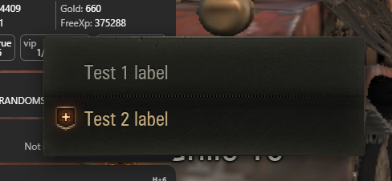

# How to Create a Context Menu {#how-to-create-context-menu}



A context menu is a pop-up menu that appears when the user right-clicks on a UI element.

## Imperative Approach {#imperative-way}

1. Subclass `AbstractContextMenuHandler`.
2. Initialize handler mapping using the schema ButtonName: function_name.
3. Implement `_generateOptions` (use `self._makeItem` and `self._makeSeparator` helpers).
4. Register your handler under a unique name.
5. Call it by that name from Python or Flash.

You can set custom text, text color, enabled state. Icon must be one of the built-in client icons (internally they are fetched by frame number from a large animation sheet).

```python
from gui.Scaleform.framework.managers import context_menu
from gui.Scaleform.framework.managers.context_menu import AbstractContextMenuHandler

DEMO_CONTEXT_MENU = 'DEMO_CONTEXT_MENU'

class BUTTONS(object):
    TEST1 = 'TEST1'
    TEST2 = 'TEST2'

class DemoContextMenuHandler(AbstractContextMenuHandler):

  def __init__(self, cmProxy, ctx=None):
    super(WidgetContextMenuHandler, self).__init__(cmProxy, ctx, {
      BUTTONS.TEST1: 'onClickTest1',
      BUTTONS.TEST2: 'onClickTest2'
    })

  @staticmethod
  def register():
    context_menu.registerHandlers(*[(DEMO_CONTEXT_MENU, DemoContextMenuHandler)])

  def _generateOptions(self, ctx=None):
    options = []
    options.append(self._makeItem(BUTTONS.TEST1, 'Test 1 label'))
    options.append(self._makeSeparator())
    options.append(self._makeItem(BUTTONS.TEST2, 'Test 2 label', {
      'textColor': 13347959,
      'iconType': 'addToSquad',
      'enabled': True
    }))

    return options

  def onClickTest1(self):
    print('onClickTest1')

  def onClickTest2(self):
    print('onClickTest2')


DemoContextMenuHandler.register()
```

### Call from Python {#call-from-python}
```python
from helpers import dependency
from skeletons.gui.app_loader import IAppLoader
appLoader = dependency.instance(IAppLoader) # type: IAppLoader
app = appLoader.getApp()
if app:
  app.contextMenuManager.show('DEMO_CONTEXT_MENU', None)
```

### Call from Flash {#call-from-flash}
```actionscript-3
App.contextMenuMgr.show('DEMO_CONTEXT_MENU');
```

## Declarative Approach {#declarative-way}

Inherit from `ContextMenu` and use the `@option(order, 'Label')` decorator on handler methods.

```python
from gui.Scaleform.daapi.view.lobby.shared.cm_handlers import ContextMenu, option

class DemoContextMenuHandler(ContextMenu):
  @option(1, 'Test1')
  def onClickTest1(self):
    print('onClickTest1')

  @option(2, 'Test2')
  def onClickTest2(self):
    print('onClickTest2')
```

:::tip TODO
This section can be expanded with invocation examples and extra parameters, if available.
:::
