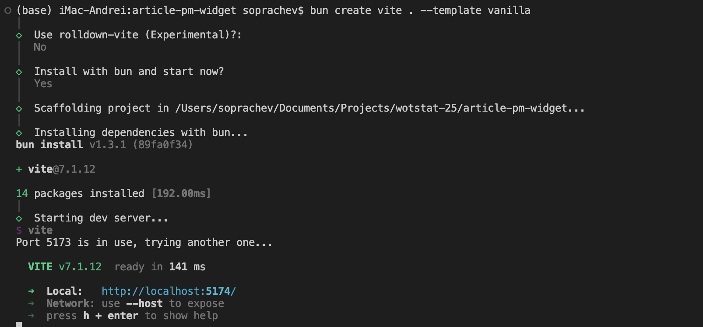
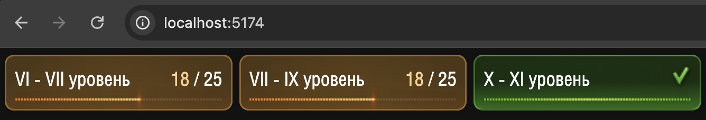
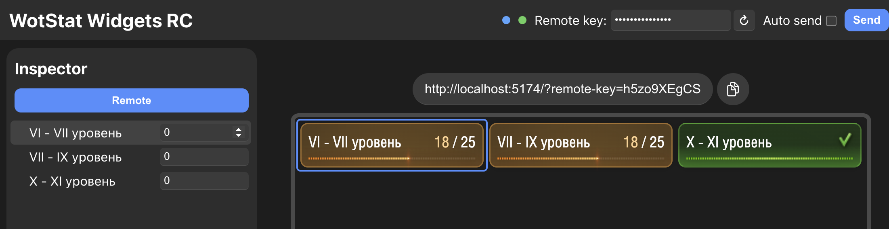
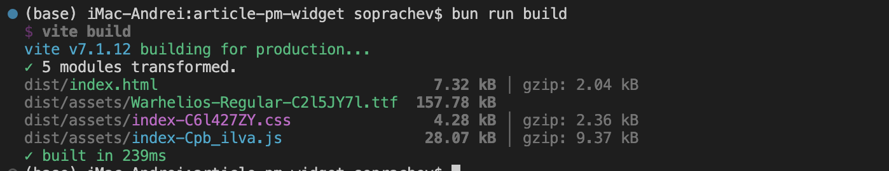

# How to create a widget for streams with remote control {#how-to-create-remote-control-widget}

In this article, we’ll go **step by step** to create a stream widget with remote control. You can follow along and end up with a working widget.

<video autoplay loop playsinline><source src="./assets/hero-widget.mp4" type="video/mp4"></source></video>

## Preparation {#preparation}

All widgets are regular websites that run in the built-in browser of `OBS Studio`. Therefore, to create a widget you’ll need a standard web-development toolset.

To keep things simple, we won’t use any web frameworks and will implement everything with plain `HTML`, `CSS`, and `JavaScript`. However, we’ll still use `Vite` (a tool that simplifies development and bundling for publication).

### BunJS {#bunjs}
Install `BunJS` — a modern package manager and JavaScript runtime. You can find installation instructions on the [official website](https://bun.sh/).

::: code-group
```powershell [Windows]
powershell -c "irm bun.sh/install.ps1 | iex"
```

```bash [Linux/MacOS]
curl -fsSL https://bun.sh/install | bash
```
:::

### Visual Studio Code {#vscode}
You’ll also need `VSCode` — the code editor we’ll use for development. Download it from the [official website](https://code.visualstudio.com/).

### Project creation {#project-creation}
Create a new folder for your project and open it in `VSCode`. Then open the terminal in `VSCode` (`Terminal` → `New Terminal`) and run:

```bash
bun create vite . --template vanilla
```

Press `Enter` a few times to accept the defaults.

::: details Terminal output after running the command

:::

Your project will be set up, dependencies installed, and a local development server started (usually at `http://localhost:5174/`).

Open that address in your browser—you should see the `Hello Vite!` starter page.

Clean up the starter page: in `VSCode`, delete the `public` folder and the files `src/counter.js` and `src/javascript.svg`.

Edit the `src/main.js` file, removing everything except the stylesheet import:

```javascript [src/main.js]
import './style.css'
```

Also completely clear the `src/style.css` file, leaving it empty.

Done! Thanks to `Vite`, every change in your files will be automatically reflected in the browser. You should now see a blank white page.

## Creating the widget {#widget-creation}
Development will consist of two stages:
- Create the widget’s visual design
- Add remote-control functionality

### Visual design of the widget {#widget-visual-creation}
The widget’s design is completely up to you and depends on your task; the process is no different from building a regular website. In this article, we’ll create a simple LBZ (Personal Missions) counter. It consists of three blocks, each with a progress bar and the number of completed LBZ.

The only difference from a regular website is the widget’s dimensions. We’ll make it automatically fit the screen width so the streamer can use it at any resolution. To do this, we’ll set the font size to `1%` of the viewport width and specify all sizes in `em`.

```css [src/style.css]
:root {
  /* Transparent background */
  color-scheme: dark;
  background: transparent;
}

body {
  /* Set font size based on window width */
  font-size: 1vw;

  /* Remove margin and hide scrollbars */
  margin: 0;
  overflow: hidden;
}
```

Now create the general structure of the widget in `index.html`:
```html [index.html]
...
<div id="app">
  <div class="item item-1">
    <header>
      <h2>VI - VII уровень</h2>
      <p><span class="current">18</span> / 25</p>
      
    </header>
    <div class="progress-bar">
      <div class="progress-bar-background"></div>
      <div class="progress-bar-pattern"></div>
      <div class="progress-bar-blink"></div>
    </div>
  </div>
</div>
...
```

Duplicate the `div.item` block twice, change the `h2` heading text, and add the `completed` class to the last `div.item`.

We’ll need some assets from the game, which you can find in the `gui.pkg` package or in the [Kurzdor/wot.assets](https://github.com/Kurzdor/wot.assets/tree/Lesta) repository.

- The font can be found at [`gui/gameface/fonts/Warhelios-Regular.ttf`](https://github.com/Kurzdor/wot.assets/tree/Lesta/gui/gameface/fonts/Warhelios-Regular.ttf)
- Progress-bar parts at [`/gui/maps/icons/components/progress_bar`](https://github.com/Kurzdor/wot.assets/tree/Lesta/gui/maps/icons/components/progress_bar)
- The checkmark for a completed stage at [`/gui/maps/icons/personalMissions3/QuestsView/complete.png`](https://github.com/Kurzdor/wot.assets/tree/Lesta/gui/maps/icons/personalMissions3/QuestsView/complete.png)

Copy the required assets into the `src/assets` folder of your project.

Adjust the styles in `style.css` to achieve the following result:

::: details Full `style.css` source
<<< ./assets/style.css [src/style.css]
:::

::: details Full `index.html` source
<<< ./assets/index.html [src/index.html]
:::

As a result, you’ll get the following widget:


### Remote-control functionality {#widget-remote-control-functionality}
Now let’s add remote control. To do this, install the [`wotstat-widgets-sdk`](https://www.npmjs.com/package/wotstat-widgets-sdk) library and declare the widget’s remote parameters.

Run this command in the terminal:

::: code-group
```powershell [Windows]
bun add wotstat-widgets-sdk
```

```bash [Linux/MacOS]
bun add wotstat-widgets-sdk
```
:::

In the `src/main.js` file, import the library and declare the widget parameters:

```javascript [src/main.js]
import './style.css'
import { WidgetsRemote } from 'wotstat-widgets-sdk';

const remote = new WidgetsRemote();

remote.defineState('VI - VII уровень', 0, { elementHelper: '.item-1' });
remote.defineState('VII - IX уровень', 0, { elementHelper: '.item-2' });
remote.defineState('X - XI уровень', 0, { elementHelper: '.item-3' });
```

Now you can open your link in the widget control panel at [ru.widgets.wotstat.info/remote-control](https://ru.widgets.wotstat.info/remote-control) and make sure the widget parameters appear in the list; when you hover over a parameter, the corresponding widget block is outlined:


The outline works thanks to the `elementHelper` property, where we specified the CSS selector of the desired block.

Next, we need to handle parameter changes. Create an `updateState` function and subscribe to changes for each parameter using the `watch` method:
```javascript [src/main.js]
...
function updateState(selector, value) {
  const element = document.querySelector(selector);

  // Set the counter value
  element.querySelector('.current').textContent = value;

  // Toggle the completed stage class
  if (value >= 25) element.classList.add('completed');
  else element.classList.remove('completed');

  // Add a CSS variable for the progress bar
  element.style.setProperty('--progress', `${100 * value / 25}%`);
}

remote.defineState('VI - VII уровень', 0, { elementHelper: '.item-1' })
  .watch((v) => updateState('.item-1', v));

remote.defineState('VII - IX уровень', 0, { elementHelper: '.item-2' })
  .watch((v) => updateState('.item-2', v));

remote.defineState('X - XI уровень', 0, { elementHelper: '.item-3' })
  .watch((v) => updateState('.item-3', v));
```

Done! Now, when the parameters change in the control panel, the widget updates automatically.

## Publishing the widget {#widget-publication}
The final step is to publish the widget so it’s available for use over the internet.

First, build the project. In the terminal, run:

::: code-group
```powershell [Windows]
bun run build
```

```bash [Linux/MacOS]
bun run build
```
:::

As a result, a `dist` folder will be created containing the site ready for publication.



You can host this site on any static hosting, for example:
- [wasmer.io](https://wasmer.io) — free after registration (you can sign in with Google)
- [Yandex Cloud](https://cloud.yandex.ru/) in S3 hosting mode — free, but registration is complicated
- [GitHub Pages](https://docs.github.com/en/pages/quickstart/) — free, but requires registration and creating a repository on GitHub

### Adding to OBS {#adding-to-obs-studio}

After publishing, paste the widget link into the [remote control panel](https://ru.widgets.wotstat.info/remote-control), generate an access key, and add the widget to `OBS Studio` as a `Browser Source`, specifying the generated link.

> Don’t forget to choose `Blending Method` → `SRGB off`. You can study this in more detail in the [guide](/guide/widgets/stream/#widget-adding).

## Source code {#source-code}

All widget source code is available in the repository on [GitHub](https://github.com/SoprachevAK/mt-pm3-progress-widget). The result is published on GitHub Pages at: [soprachevak.github.io/mt-pm3-progress-widget](https://soprachevak.github.io/mt-pm3-progress-widget/) and in the control panel at [ru.widgets.wotstat.info/remote-control](https://ru.widgets.wotstat.info/remote-control?widget-url=aHR0cHM6Ly9zb3ByYWNoZXZhay5naXRodWIuaW8vbXQtcG0zLXByb2dyZXNzLXdpZGdldC8/cmVtb3RlLWtleT1oNXpvOVhFZ0NT)
