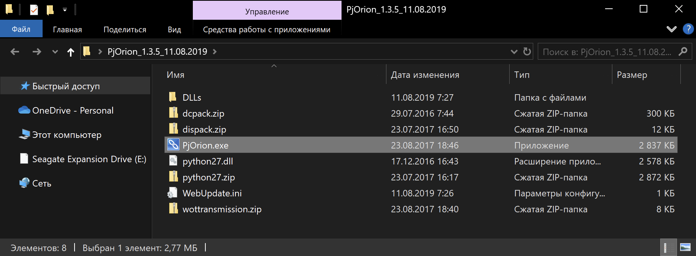
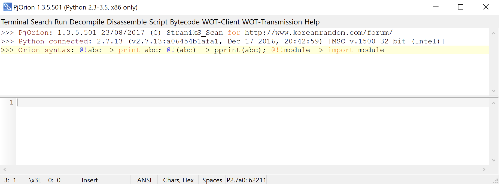
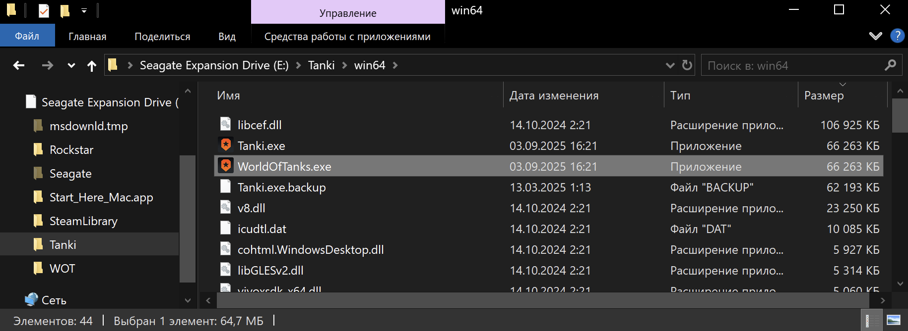
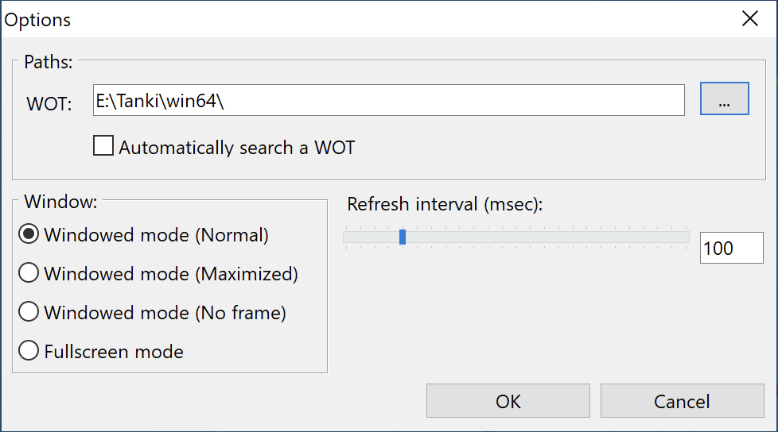

# Знакомство с PjOrion

Программа `PjOrion` – *Project "ORION"* – это инструмент упрощающий разработку модификаций для игры Мир&nbsp;Танков.

Наиболее полезная функция `PjOrion` – это `REPL` (Read-Eval-Print Loop) для `Python` скриптов игры. Она позволяет в реальном времени изменять и отлаживать скрипты игры, без необходимости перезапуска клиента.

## Установка
1. Скачайте последнюю версию `PjOrion` из официальной [темы на форуме](https://koreanrandom.com/forum/topic/15280-pjorion-редактирование-компиляция-декомпиляция-обфускация-модов-версия-135-дата-11082019/). Нас интересует `PjOrion_1.3.5_11.08.2019.zip (архив с DLLs)`.

2. Распакуйте архив в любую папку. Должно получиться так:

3. Запустите `PjOrion.exe`. Появится окно программы:

4. В папке игры переименуйте `/win64/Tanki.exe` в `/win64/WorldOfTanks.exe`. Это нужно для того, чтобы `PjOrion` мог найти исполняемый файл игры.

5. В `PjOrion` нажмите `WOT-Transmission -> Options...`, во всплывающем окне уберите галочку с `Automatically search a WOT`, после чего выберите путь к папку с игрой и подпапку `win64`:
{width=400}

6. Запустите игру через `PjOrion`, нажав `WOT-Transmission -> Run WOT-Client -> WorldOfTank`. Игра запустится, а в консоли `PjOrion` должен появиться лог игры: