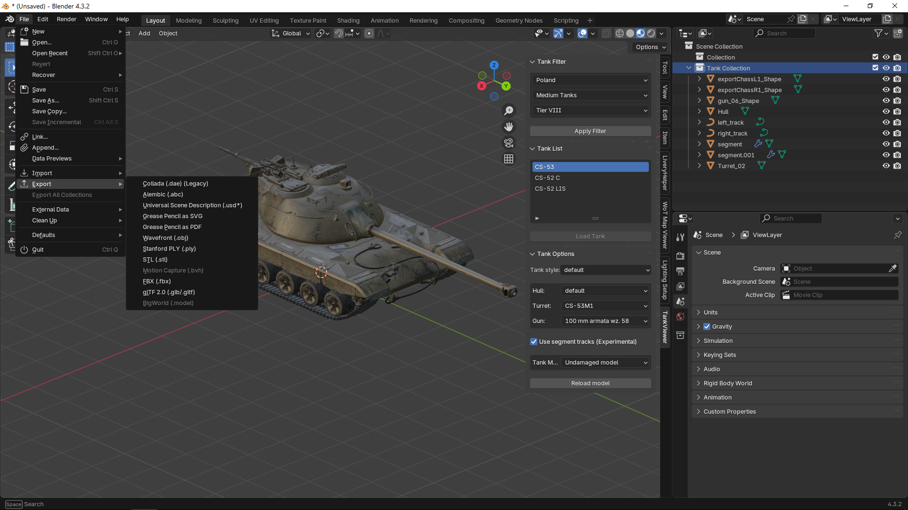

# Моделирование в Blender {#blender}

[Blender3D](https://www.blender.org/) – бесплатный и открытый редактор 3D графики. Поддерживает весь цикл создания 3D контента: моделирование, риггинг, анимация, симуляция, рендеринг, композитинг и отслеживание движения, видеоредактирование и создание игр.

В Мире Танков с помощью пользовательского плагина для Blender можно импортировать модели танков из игры для последующего редактирования и рендеринга с хорошим качеством.

::: tip TODO
Дописать инструкцию как пользоваться

https://bitbucket.org/SkepticalFox/bigworld-blender-tools-wot-wowp-wows/src/master/
:::
