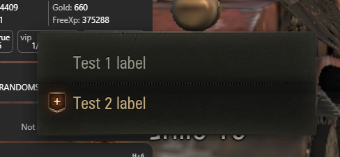

# Как создать контекстное меню {#how-to-create-context-menu}



Контекстное меню — это всплывающее меню, которое появляется при нажатии правой кнопки мыши на элемент интерфейса.

## Императивный подход {#imperative-way}

1. Наследуем класс от `AbstractContextMenuHandler`.
2. Инициализируем хендлеры функций по схеме ИмяКнопки: имя_функции.
3. Реализуем `_generateOptions` (используем `self._makeItem` и `self._makeSeparator` для удобства).
4. Регистрируем наш хендлер по уникальному названию.
5. Вызываем по названию из Python или Flash.


Кнопке можно передать произвольный текст, его цвет, состояние включенности. Но иконку можно установить только одну из доступных в клиенте; свою нельзя (в глубине реализации они берутся по номеру кадра из одной большой анимации).

```python
from gui.Scaleform.framework.managers import context_menu
from gui.Scaleform.framework.managers.context_menu import AbstractContextMenuHandler

DEMO_CONTEXT_MENU = 'DEMO_CONTEXT_MENU'

class BUTTONS(object):
    TEST1 = 'TEST1'
    TEST2 = 'TEST2'

class DemoContextMenuHandler(AbstractContextMenuHandler):

  def __init__(self, cmProxy, ctx=None):
    super(WidgetContextMenuHandler, self).__init__(cmProxy, ctx, {
      BUTTONS.TEST1: 'onClickTest1',
      BUTTONS.TEST2: 'onClickTest2'
    })

  @staticmethod
  def register():
    context_menu.registerHandlers(*[(DEMO_CONTEXT_MENU, DemoContextMenuHandler)])

  def _generateOptions(self, ctx=None):
    options = []
    options.append(self._makeItem(BUTTONS.TEST1, 'Test 1 label'))
    options.append(self._makeSeparator())
    options.append(self._makeItem(BUTTONS.TEST2, 'Test 2 label', {
      'textColor': 13347959,
      'iconType': 'addToSquad',
      'enabled': True
    }))

    return options

  def onClickTest1(self):
    print('onClickTest1')

  def onClickTest2(self):
    print('onClickTest2')


DemoContextMenuHandler.register()
```

### Вызываем из питона {#call-from-python}
```python
from helpers import dependency
from skeletons.gui.app_loader import IAppLoader
appLoader = dependency.instance(IAppLoader) # type: IAppLoader
app = appLoader.getApp()
if app:
  app.contextMenuManager.show('DEMO_CONTEXT_MENU', None)
```

### Вызываем из флеша {#call-from-flash}
```actionscript-3
App.contextMenuMgr.show('DEMO_CONTEXT_MENU');
```

## Декларативный подход {#declarative-way}

Наследоваться от `ContextMenu` и использовать декоратор `@option(order, 'Label')` для методов-обработчиков кнопок.

```python
from gui.Scaleform.daapi.view.lobby.shared.cm_handlers import ContextMenu, option

class DemoContextMenuHandler(ContextMenu):
  @option(1, 'Test1')
  def onClickTest1(self):
    print('onClickTest1')

  @option(2, 'Test2')
  def onClickTest2(self):
    print('onClickTest2')
```

:::tip TODO
Этот способ можно расписать подробнее, с примерами вызова и определением дополнительных параметров, если это возможно.
:::
