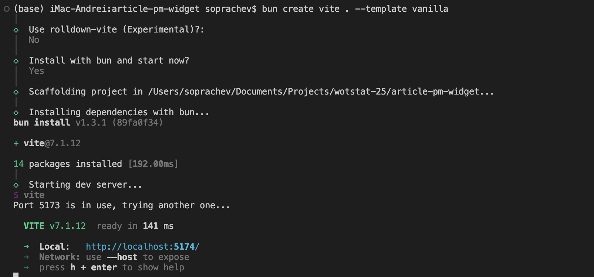
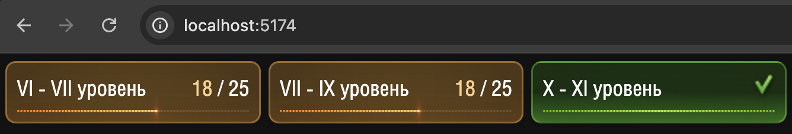
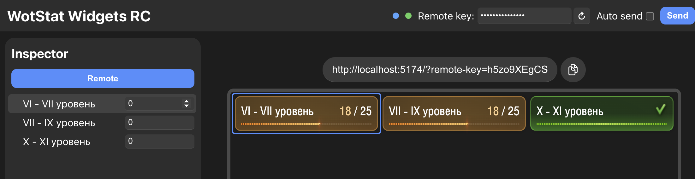
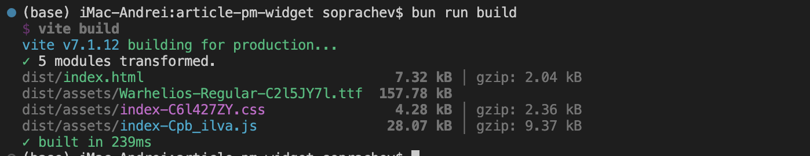

# Как создать виджет для стримов с удалённым управлением {#how-to-create-remote-control-widget}

В этой статье мы рассмотрим как **по шагам** создать виджет для стримов с удалённым управлением. Вы сможете повторить эту статью и получить рабочий виджет.

<video autoplay loop playsinline><source src="./assets/hero-widget.mp4"></source></video>

## Подготовка {#preparation}

Все виджеты являются обычными веб-сайтами, которые работают во встроенном браузере `OBS Studio`. Поэтому для создания виджета вам понадобится стандартный набор инструментов для веб-разработки. 

Для упрощения статьи мы не будет использовать никакие веб-фреймворки и реализуем всё на чистом `HTML`, `CSS` и `JavaScript`. Однако, всё ещё будет использовать сборку с помощью `Vite` (это такая программа, которая упрощает разработку и сборку проектов для последующей публикации).

### BunJS {#bunjs}
Установите `BunJS` - современный менеджер пакетов и среду выполнения `JavaScript`. Инструкции по установке можно найти на [официальном сайте](https://bun.sh/).

::: code-group
```powershell [Windows]
powershell -c "irm bun.sh/install.ps1 | iex"
```

```bash [Linux/MacOS]
curl -fsSL https://bun.sh/install | bash
```
:::

### Visual Studio Code {#vscode}
Так же вам понадобится `VSCode` - программа для редактирования кода, в которой мы будет разрабатывать, скачать можно на [официальном сайте](https://code.visualstudio.com/).

### Создание проекта {#project-creation}
Создайте новую папку для вашего проекта и откройте её в `VSCode`. Затем откройте терминал в `VSCode` (меню `Terminal` → `New Terminal`) и выполните команду:

```bash
bun create vite . --template vanilla
```

После чего несколько раз нажмите `Enter`, чтобы принять значения по умолчанию.

::: details Вывод терминала после выполнения команды

:::

У вас будет настроен проект, установленные зависимости и запущен локальный сервер для разработки (обычно по адресу `http://localhost:5174/`).

Откройте этот адрес в браузере, вы должны увидеть стартовую страницу `Hello Vite!`.

Очистить стартовую страницу, для этого, в `VSCode` удалим папку `public` со всем её содержимым, а так же файлы `src/counter.js` и `src/javascript.svg`. 

Отредактируем файл `src/main.js`, удалив из него всё содержимое кроме подключения стилей:

```javascript [src/main.js]
import './style.css'
```

А так же, полностью очистим файл `src/style.css`, оставив его пустым.

Готово! Каждое изменение в файлах будет автоматически отображаться в браузере благодаря `Vite`. Теперь мы видим пустую белую страницу.

## Создание виджета {#widget-creation}
Разработка виджета будет состоять из двух этапов:
- Создадим визуальное оформление виджета
- Добавим функционал удалённого управления

### Визуальное оформление виджета {#widget-visual-creation}
Оформление виджета максимально индивидуально и зависит от вашей задачи, процесс совершенно ничем не отличается от создания обычного веб-сайта. В этой статье мы создадим простой счётчик ЛБЗ. Он состоит их трёх блоков, в каждом из которых есть прогресс-бар и число выполненных ЛБЗ.

Единственное отличие от обычного веб-сайта - это размеры виджета. Мы будем делать автоматическую подгонку под ширину экрана, это позволит стримеру использовать виджет на на любых разрешениях. Для этого мы установим размер шрифта равным `1%` от ширины экрана, а все стили будем указывать в `em`. 

```css [src/style.css]
:root {
  /* Прозрачный фон */
  color-scheme: dark;
  background: transparent;
}

body {
  /* Устанавливаем размер шрифта в зависимости от ширины окна */
  font-size: 1vw;

  /* Убираем отступ и скрываем скролл */
  margin: 0;
  overflow: hidden;
}
```

Теперь создадим общую структуру виджета в файле `index.html`:
```html [index.html]
...
<div id="app">
  <div class="item item-1">
    <header>
      <h2>VI - VII уровень</h2>
      <p><span class="current">18</span> / 25</p>
      
    </header>
    <div class="progress-bar">
      <div class="progress-bar-background"></div>
      <div class="progress-bar-pattern"></div>
      <div class="progress-bar-blink"></div>
    </div>
  </div>
</div>
...
```

И дважды продублируем блок `div.item`, изменив текст заголовка `h2`, на последний `div.item` добавим класс `completed`.

Для оформления нам понадобятся некоторые аасеты из игры, найти их можно в пакете `gui.pkg` или в репозитории [Kurzdor/wot.assets](https://github.com/Kurzdor/wot.assets/tree/Lesta)

- Шрифт можно найти по пути [`gui/gameface/fonts/Warhelios-Regular.ttf`](https://github.com/Kurzdor/wot.assets/tree/Lesta/gui/gameface/fonts/Warhelios-Regular.ttf)
- Детали проггресс бара по пути [`/gui/maps/icons/components/progress_bar`](https://github.com/Kurzdor/wot.assets/tree/Lesta/gui/maps/icons/components/progress_bar)
- Галочка о выполненном этапе по пути [`/gui/maps/icons/personalMissions3/QuestsView/complete.png`](https://github.com/Kurzdor/wot.assets/tree/Lesta/gui/maps/icons/personalMissions3/QuestsView/complete.png)

Скопируйте нужные ассеты в папку `src/assets` вашего проекта.

Настройте стили в файле `style.css`, чтобы получить следующий результат:

::: details Полный код файла `style.css`
<<< ./assets/style.css [src/style.css]
:::

::: details Полный код файла `index.html`
<<< ./assets/index.html [src/index.html]
:::

В результате получаем следующий виджет:


### Функционал удалённого управления {#widget-remote-control-functionality}
Теперь добавим функционал удалённого управления. Для этого установим библиотеку [`wotstat-widgets-sdk`](https://www.npmjs.com/package/wotstat-widgets-sdk), и объявим в ней удалённые параметры нашего виджета.

В терминале выполните команду:

::: code-group
```powershell [Windows]
bun add wotstat-widgets-sdk
```

```bash [Linux/MacOS]
bun add wotstat-widgets-sdk
```
:::

В файле `src/main.js` подключим библиотеку и объявим параметры виджета:

```javascript [src/main.js]
import './style.css'
import { WidgetsRemote } from 'wotstat-widgets-sdk';

const remote = new WidgetsRemote();

remote.defineState('VI - VII уровень', 0, { elementHelper: '.item-1' });
remote.defineState('VII - IX уровень', 0, { elementHelper: '.item-2' });
remote.defineState('X - XI уровень', 0, { elementHelper: '.item-3' });
```

Теперь можем открыть нашу ссылку в панели управления виджетами на сайте [ru.widgets.wotstat.info/remote-control](https://ru.widgets.wotstat.info/remote-control) и убедиться, что параметры виджета появились в списке, а при наведение мышки обводится нужный блок виджета:


Обводка работает благодаря свойству `elementHelper`, в котором мы указали CSS-селектор нужного блока.

Далее нам нужно добавить обработку изменения параметров. Для создадим функцию `updateState`, и подпишемся на изменения каждого параметра с помощью метода `watch`:
```javascript [src/main.js]
...
function updateState(selector, value) {
  const element = document.querySelector(selector);

  // Устанавливаем значение счетчика
  element.querySelector('.current').textContent = value;

  // Переключаем класс завершенного этапа
  if (value >= 25) element.classList.add('completed');
  else element.classList.remove('completed');

  // Добавляем CSS-переменную для прогресс-бара
  element.style.setProperty('--progress', `${100 * value / 25}%`);
}

remote.defineState('VI - VII уровень', 0, { elementHelper: '.item-1' })
  .watch((v) => updateState('.item-1', v));

remote.defineState('VII - IX уровень', 0, { elementHelper: '.item-2' })
  .watch((v) => updateState('.item-2', v));

remote.defineState('X - XI уровень', 0, { elementHelper: '.item-3' })
  .watch((v) => updateState('.item-3', v));
```

Готово! Теперь при изменении параметров в панели управления, виджет будет обновляться автоматически.

## Публикация виджета {#widget-publication}
Остался последний шаг - публикация виджета, что бы он был доступен для использования через интернет.

Для начала нужно скомпилировать проект. В терминале выполните команду:

::: code-group
```powershell [Windows]
bun run build
```

```bash [Linux/MacOS]
bun run build
```
:::

В результате чего будет создана папка `dist`, в которой будет находиться готовый к публикации сайт.



Этот сайт можно разместить на любом хостинге статических сайтов, например:
- [wasmer.io](https://wasmer.io) бесплатно после регистрации (можно через Google аккаунт)
- [Яндекс Облако](https://cloud.yandex.ru/) в режиме S3 хостига, бесплатно, но регистрация сложная
- [GitHub Pages](https://docs.github.com/en/pages/quickstart/) бесплатно, но требует регистрации и создания репозитория на GitHub

### Добавление в OBS {#adding-to-obs-studio}

После публикации, вставьте ссылку на виджет в [панель удалённого управления](https://ru.widgets.wotstat.info/remote-control), сгенерируйте ключ доступа и добавьте виджет в `OBS Studio` как `Browser Source`, указав сгенерированную ссылку.

> Не забудьте выбрать `Blending Method` -> `SRGB off`, подробнее можно изучить [руководстве](/guide/widgets/stream/#widget-adding)

## Исходный код {#source-code}

Весь исходный код виджета доступен в репозитории на [GitHub](https://github.com/SoprachevAK/mt-pm3-progress-widget), а результат опубликован в GitHub Pages по ссылке: [soprachevak.github.io/mt-pm3-progress-widget](https://soprachevak.github.io/mt-pm3-progress-widget/) и в панели управления [ru.widgets.wotstat.info/remote-control](https://ru.widgets.wotstat.info/remote-control?widget-url=aHR0cHM6Ly9zb3ByYWNoZXZhay5naXRodWIuaW8vbXQtcG0zLXByb2dyZXNzLXdpZGdldC8/cmVtb3RlLWtleT1oNXpvOVhFZ0NT)