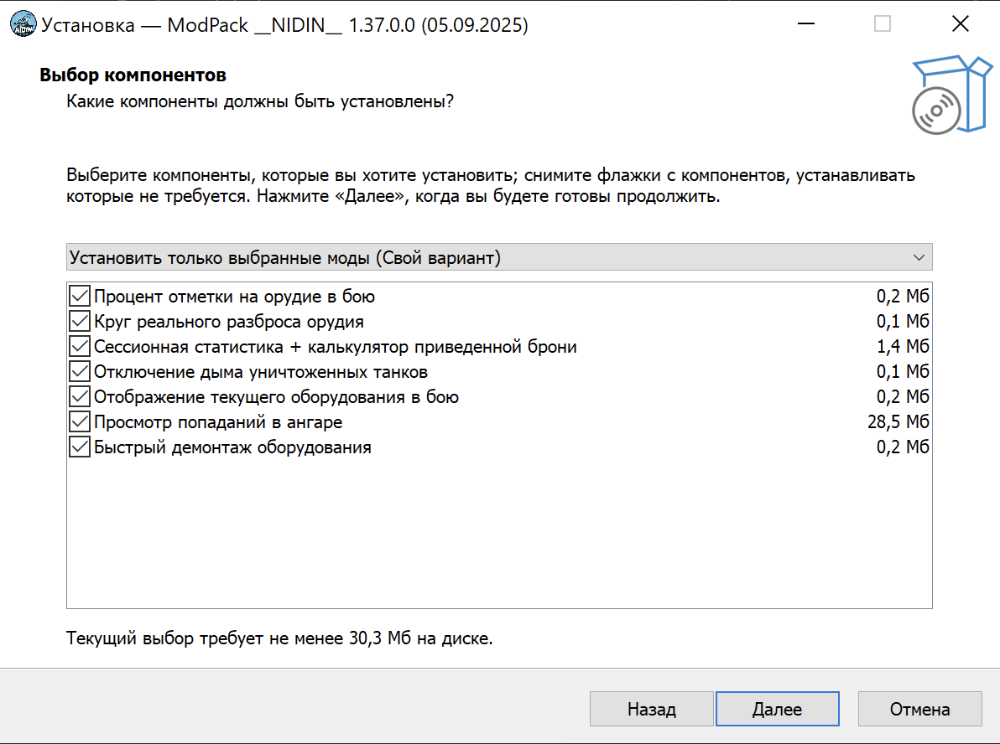

# Создание собственного модпака

Одним из способов распространения своих модов является создание модпака — приложения, содержащего несколько модов, которые автоматически устанавливаются в клиент игры.

Создать базовый модпаки не очень сложно, потому что для этого его готовые инструменты, самый распространённый из которых — Inno Setup.

{width=400}

:::tip TODO
Я ничего не знаю про Inno Setup, поэтому если вы знаете, как с его помощью создать модпак, то можете написать инструкцию сюда.

Ещё есть вот такая штука чтоб находить куда установлен клиент https://github.com/Kurzdor/wot.clientdetection
:::

