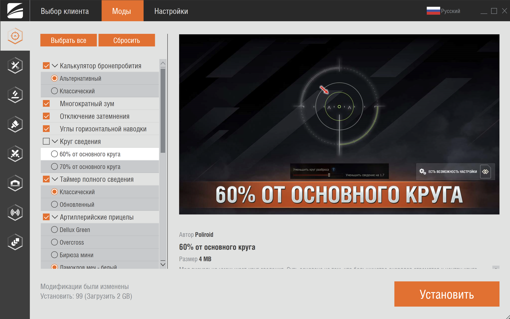

# Форум

Официальным местом для размещения ваших модификаций является [форум «Мир Танков»](http://forum.tanki.su/index.php?/forum/173-моды-и-софт/), раздел с модами.

Здесь вы можете найти существующие актуальные моды, задавать вопросы их разработчикам и обсудить с другими игроками. Кроме того, вы можете свободно публиковать свои моды, делиться ими с сообществом и получать отзывы.

Перед публикацией убедитесь, что мод соответствует [правилам форума](http://forum.tanki.su/index.php?/forum/969-правила-разделаинформация/).

Если вы разместите мод в подходящем разделе и будете актуализировать его по мере выхода новых версий игры, вы можете получить специальную роль `Мододел`, которая даст вам некоторые преимущества (возможно, в будущем; пока никаких).

## МОСТ

МОСТ – это [официальный модпак](http://forum.tanki.su/index.php?/topic/2205036-all-мост/) от разработчиков игры, его особенностью является автоматическое обновление модов без необходимости скачивать новую версию модпака.

Если ваш мод окажется востребованным в сообществе, то вы можете претендовать на включение его в МОСТ. Это откроет вам доступ к широкой аудитории игроков и повысит популярность вашего мода.

