# Автоматизация сборки модов

Автоматизация сборки позволяет избавить вас от рутинных задач и значительно упростить процесс дистрибуции модов.

Для автоматизации нужно создать репозиторий с исходным кодом и настроить CI/CD‑пайплайн, который будет компилировать вашу модификацию при установке тега в системе контроля версий.

## Необходимые инструменты
- Настроенное окружение для `Python`‑модов (см. [инструкцию по настройке окружения для Python](../environment/python/))
- [Git](https://git-scm.com/) — система контроля версий, с помощью которой будет загружен исходный код игры.

Весь процесс полностью бесплатен.

## Создание репозитория системы контроля версий

В качестве хранилища исходного кода можно использовать любой популярный сервис, однако наиболее распространён — [GitHub](https://github.com/). На его примере рассмотрим процесс автоматизации сборки.

Если у вас ещё нет аккаунта на GitHub — создайте его.

GitHub позволяет бесплатно создавать как публичные, так и приватные репозитории с исходным кодом и отслеживанием изменений.

1. На главной странице GitHub нажмите на свой профиль и выберите `Repositories`.
::: details Меню профиля
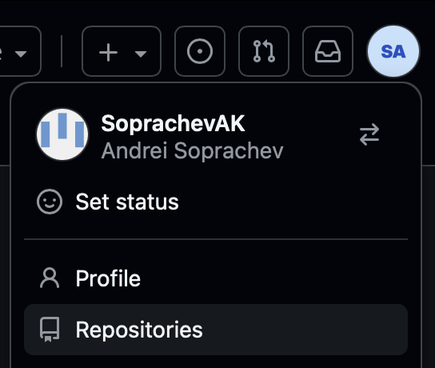{width=400}
:::
2. Нажмите на кнопку `New` для создания нового репозитория.
  - Придумайте название репозитория, например `my-first-mod`.
  - Выберите `Public` или `Private` в зависимости от того, хотите ли вы, чтобы ваш мод был доступен всем или только вам.
  - Не меняйте остальные настройки и нажмите на кнопку `Create repository`.

### Связывание локального проекта с репозиторием
После создания репозитория вам будет показана страница с инструкцией по связыванию локального проекта с удалённым репозиторием. Но перед этим необходимо подготовить локальный проект.

В корне вашего проекта создайте файл `.gitignore` со следующим содержимым:
``` [.gitignore]
*.pyc
*.wotmod
*.mtmod

wot-src/
as3/bin
```
Этот файл указывает Git, какие файлы и папки не нужно отслеживать. Мы исключаем скомпилированные файлы, архивы модов и папки с исходным кодом игры.

После этого откройте терминал в VSCode (`` Ctrl+` `` или `Terminal -> New Terminal`) и выполните команды, чтобы связать локальный проект с удалённым репозиторием.

Инициализируйте локальный репозиторий:
```powershell
git init
```

Задайте имя основной ветки:
```powershell
git branch -M main
```

Привяжите удалённый репозиторий, заменив `<your-username>` и `<your-repo>` на свои значения:
```powershell
git remote add origin https://github.com/<your-username>/<your-repo>.git
```
> Ссылку на репозиторий можно найти на странице репозитория в GitHub, она будет выглядеть примерно так: `https://github.com/SoprachevAK/my-first-mod.git`.


### Отправка первого коммита
Коммит (commit) — зафиксированное изменение в проекте. Коммиты позволяют отслеживать историю, возвращаться к предыдущим версиям и работать над проектом совместно.

Чтобы отправить первый коммит, откройте в VSCode вкладку `Source Control` и в подразделе `Changes` у вас будут отображаться все файлы, которые были изменены или добавлены в вашем проекте.
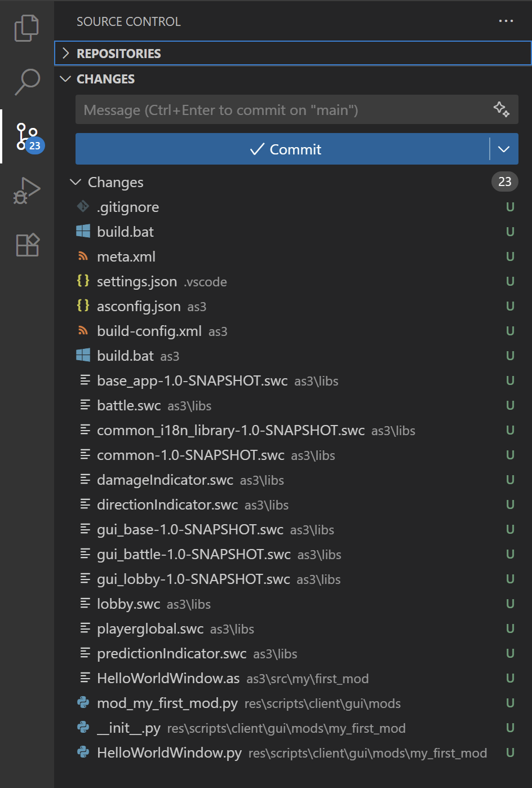{width=400}

Наведите курсор на `Changes` и нажмите на иконку `+`, чтобы отметить все файлы как готовые к коммиту (Staged Changes). Введите сообщение, например `Initial commit`, и нажмите `Commit`.
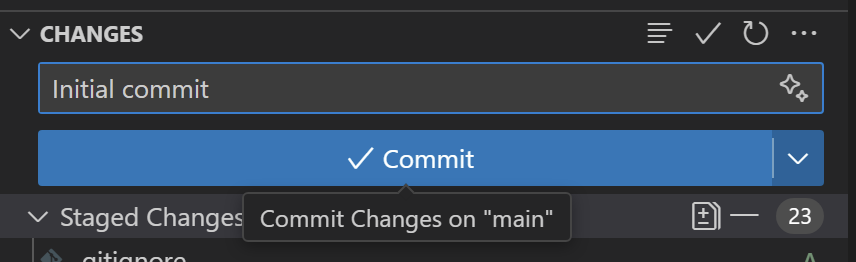{width=400}

::: details Если вылезла ошибка
Если вы раньше не настраивали имя пользователя и email в Git, при попытке сделать коммит может появиться ошибка.

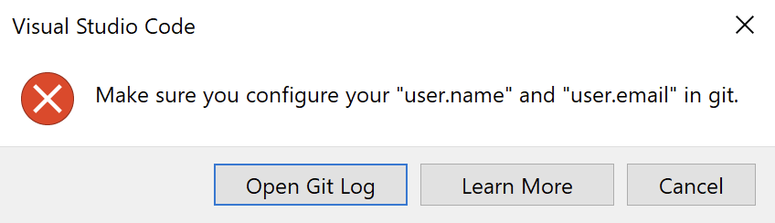{width=400}


В этом случае откройте терминал в VSCode (`` Ctrl+` `` или `Terminal -> New Terminal`) и выполните следующие команды, заменив `<your-name>` и `<your-email>` на ваши значения:
```powershell
git config --global user.name "<your-name>"
git config --global user.email "<your-email>"
```
Это установит имя и email для всех будущих коммитов. Затем повторите попытку.

Если не хотите раскрывать email, используйте служебный адрес GitHub: перейдите в [Настройки профиля GitHub -> Emails](https://github.com/settings/emails), включите `Keep my email addresses private` и используйте адрес вида `<your-username>@users.noreply.github.com`.
:::

После того, как вы сделали коммит, вам нужно отправить его в удалённый репозиторий. Для этого в том же месте нажмите на кнопку `Publish branch`.

> Если это первый пуш в репозиторий, потребуется авторизация через GitHub‑аккаунт.

Готово! Вы успешно отправили первый коммит в удалённый репозиторий. Теперь вы можете обновить страницу вашего репозитория на GitHub и увидеть там ваши файлы.

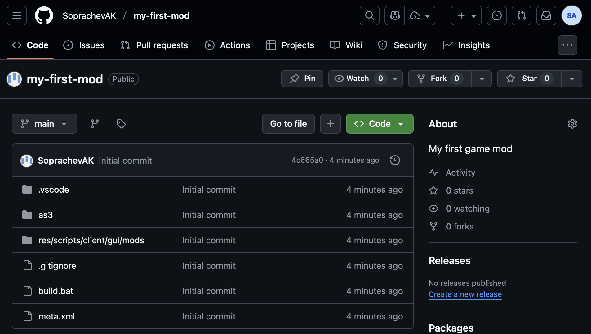

## Настройка автоматической сборки
Автоматизация в GitHub осуществляется с помощью GitHub Actions. Это инструмент, который предоставляет виртуальную машину для выполнения скриптов. На ней мы запускаем `build`‑скрипт, а результат (архив с модом) загружается в релизы репозитория.

Для настройки автоматической сборки создайте папку `.github/workflows`, скачайте [файл release.yaml](/download/mod-build/release.yaml){target=_blank download} и поместите его туда.

Так как в GitHub Actions используется `Ubuntu`, а наш скрипт сборки написан для `Windows`, нужно создать аналогичный `build.sh` для `Linux`.

Скачайте [файл build.sh](/download/mod-build/build.sh){target=_blank download} и поместите его в корень вашего проекта (рядом с `build.bat`).
На первых строках есть раздел с настройками, которые вам нужно изменить под ваш мод:
```bash [build.sh]:line-numbers=3
# Настройки
MOD_NAME="my.first-mod"
MOD_ENTRY=mod_myFirstMod.py
```

### Если у вас есть `AS3` часть
Если в моде есть `AS3`‑часть, создайте `as3/build.sh` по аналогии с `build.bat` для сборки на `Linux`. Если нет — пропустите шаг.

```sh [as3/build.sh]:line-numbers
mxmlc -load-config+=build-config.xml --output=bin/my.first_mod.HelloWorldWindow.swf src/my/first_mod/HelloWorldWindow.as
```

Команды в файле должны соответствовать тем, что в `as3/build.bat` для сборки `AS3`‑части. Если несколько `SWF`‑файлов — добавьте команды `mxmlc` для каждого.

### Отправка изменений в репозиторий
Отправьте изменения в репозиторий:
- На вкладке `Source Control` нажмите `+`, чтобы отметить все файлы как готовые (Staged Changes).
- Введите сообщение, например `Setup CI/CD`, и нажмите `Commit`.
- Нажмите `Sync Changes`, чтобы отправить изменения.

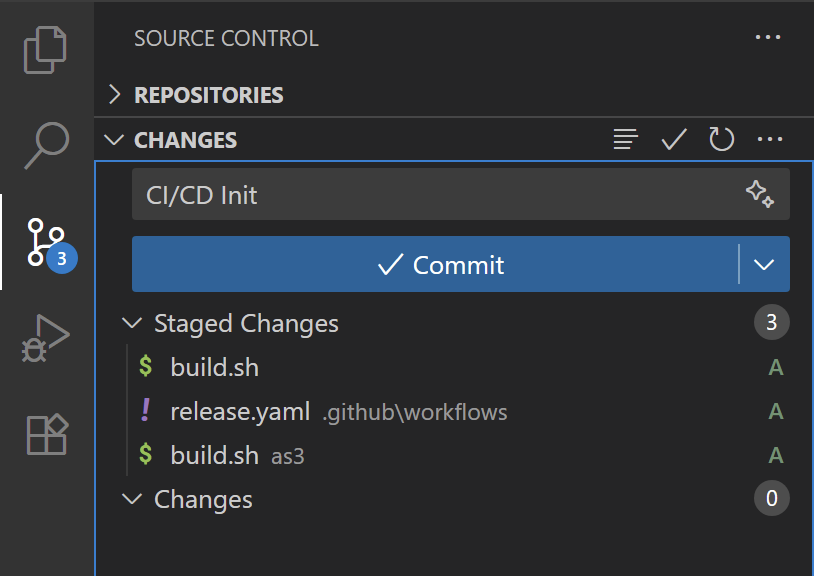{width=400}

### Запуск сборки
Чтобы запустить сборку, создайте тег. Тег — метка, указывающая на конкретный коммит. Он используется как версия вашего мода.

1. Откройте терминал в VSCode (`` Ctrl+` `` или `Terminal -> New Terminal`) и выполните команду, заменив `1.0.0` на версию вашего мода:
```powershell
git tag 1.0.0
```
2. Отправьте тег в удалённый репозиторий:
```powershell
git push --tags
```
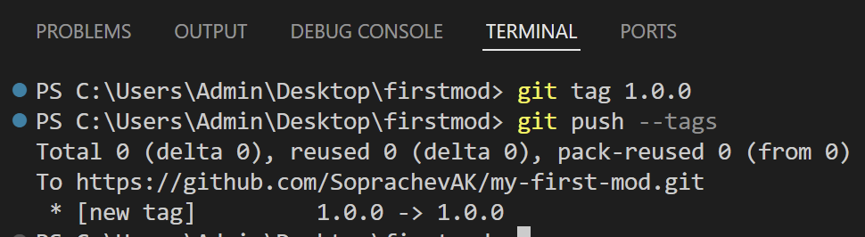{width=400}

::: tip Совет
Если отправили неправильный тег и хотите удалить:
```powershell
git tag -d 1.0.0
git push origin :refs/tags/1.0.0
```
:::


#### Проверка `Actions`
Откройте вкладку `Actions`. Вы увидите запущенный workflow `release`. Нажмите, чтобы посмотреть детали.

Дождитесь завершения. При успехе — зелёная галочка.

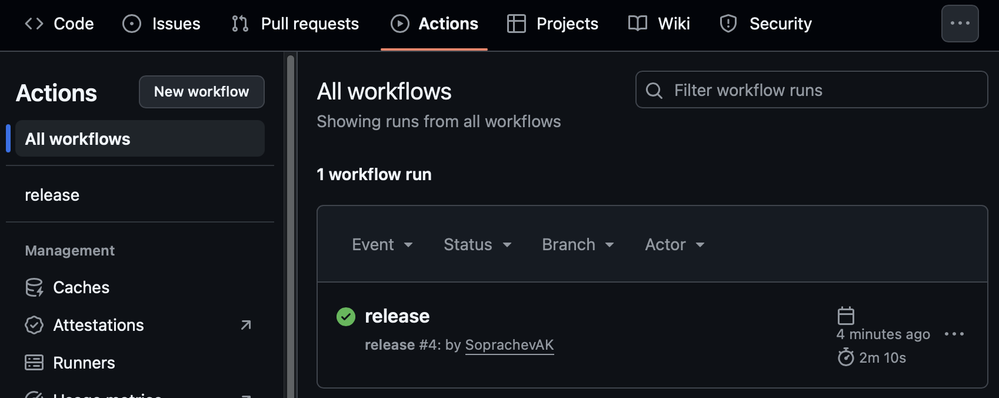

Если ошибка — красный крестик. Нажмите, чтобы посмотреть логи и причину.

#### Информация о релизе
После успешной сборки перейдите во вкладку `Releases`. Там появится релиз с версией тега и вложением `.mtmod`.

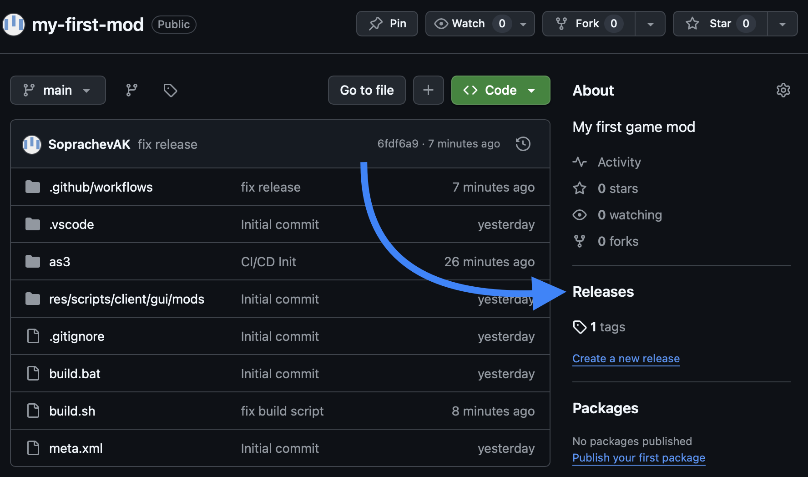

Нажмите иконку карандаша, чтобы добавить описание.

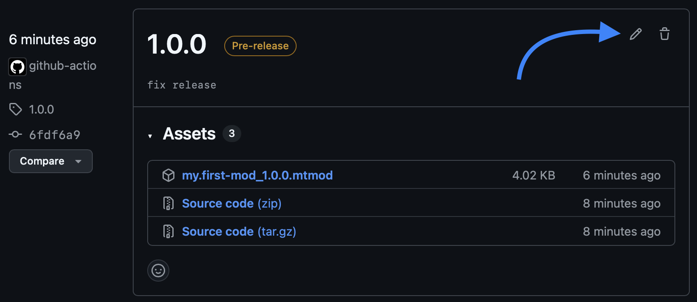

#### Редактирование релиза
Добавьте описание изменений и уберите галочку `This is a pre-release`, если хотите сделать релиз актуальным. Затем нажмите `Update release`.

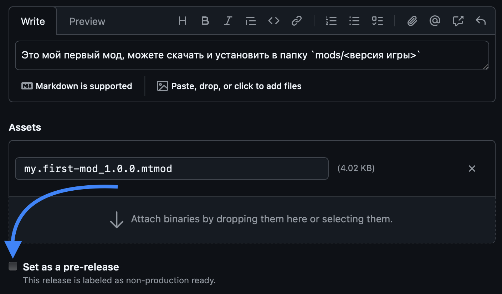

## Результат
Поздравляем! Автоматическая сборка настроена. Каждый раз при создании тега сборка запускается автоматически, а результат появляется в релизах.

Другие пользователи смогут скачать актуальную версию мода во вкладке `Releases` вашего репозитория.

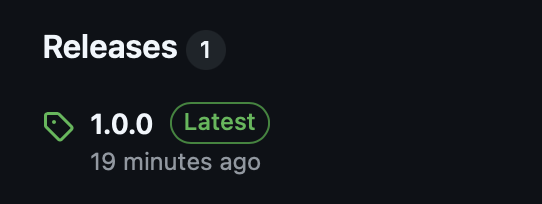
