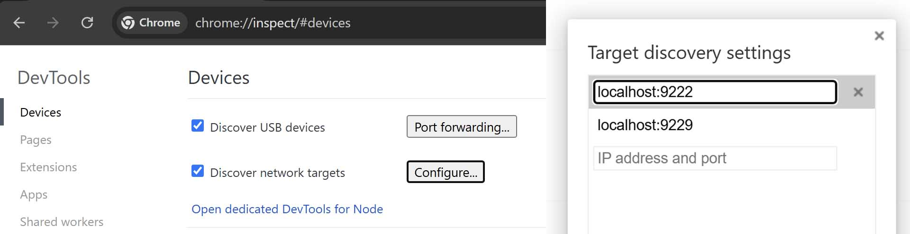

# Знакомство с Chrome DevTools {#devtools}

`Chrome DevTools` — это набор инструментов разработчика, встроенных в браузер `Google Chrome` для отладки веб-приложений. Они предоставляют возможность в реальном времени просматривать и изменять HTML, CSS на веб-страницах и выполнять отладку `JavaScript`-кода.

Новая система интерфейса игры «Мир Танков» построена с использованием [`Coherent Gameface`](https://docs.coherent-labs.com/cpp-gameface/) на основе веб-технологий (`HTML`, `CSS`, `JavaScript`). Благодаря этому, к интерфейсу игры можно подключить `Chrome DevTools`.

<video autoplay loop playsinline><source src="./assets/hero-wg.mp4" type="video/mp4"></source></video>

## Подключение DevTools к игре {#connecting-devtools}
Официальная поддержка `DevTools` в игре отключена, но можно воспользоваться модификацией [`wotstat.chrome-devtools-protocol`](https://github.com/wotstat/wotstat-chrome-devtools-protocol), которая реализует протокол удалённой отладки `Chrome DevTools`.

### Установка модификации {#installing-devtools-mod}
1. Скачайте и установите мод [wotstat.chrome-devtools-protocol](https://github.com/wotstat/wotstat-chrome-devtools-protocol/releases/latest)
2. Скачайте и установите мод `net.openwg.gameface`, он необходим для работы всех `Gameface`-модов:
   - Для `WG` из официального [репозитория](https://gitlab.com/openwg/wot.gameface/-/releases)
   - Для `Lesta` нужна пропатченная версия из [репозитория wotstat](https://github.com/wotstat/wotstat-chrome-devtools-protocol/releases/latest)
3. Запустите игру (при первом запуске игра один раз перезагрузится для инициализации модов, [подробнее...](/guide/scripting/gameface-theory/))

### Подключение DevTools {#devtools-setup}
1. Запустите `Google Chrome`
2. В адресной строке введите `chrome://inspect` и нажмите `Enter`
3. Убедитесь, что у вас стоит галочка `Discover network targets`
4. Нажмите кнопку `Configure...` и убедитесь, что в списке указан адрес `localhost:9222` (если нет, добавьте его)
::: details Настройки DevTools

:::
5. Спустя несколько секунд в разделе `Remote Target` появятся все активные вкладки игры
> На одном экране игры может быть сразу несколько окон (вкладок), каждое из которых независимое и ведёт себя как отдельная веб-страница
6. Нажмите кнопку `inspect` напротив нужной вкладки, чтобы открыть `DevTools` для этой вкладки

## Обзор возможностей DevTools {#devtools-features}
Модификация не полностью реализует протокол DevTools, но основные возможности для отладки интерфейса игры доступны:
- Вкладка `Elements` — просмотр HTML и CSS страницы
  - Поддерживается функционал `Overlay`, который обводит в игре выбранный в DevTools элемент, а так же позволяет выбирать элементы на странице кликом по ним в игре
- Вкладка `Console` — просмотр логов и выполнение JavaScript-кода в среде страницы
- Вкладка `Sources` (частично) – предоставляет доступ к редактированию специального `override.css` файла для внесения изменений в стили страницы

Учтите, что для подключения доступны только те страницы, которые фактически присутствуют на экране игры, если вы перейдёте в другое окно интерфейса, то существующие вкладки будут уничтожены, а новые появятся в списке `Remote Target`.

::: warning Внимание!
Функционал DevTools используется только для просмотра и отладки интерфейса, он не предоставляет возможности "сохранить" сделанные изменения или сгенерировать мод автоматически. Все изменения, внесённые через DevTools, будут потеряны после перезагрузки страницы или игры.
:::
