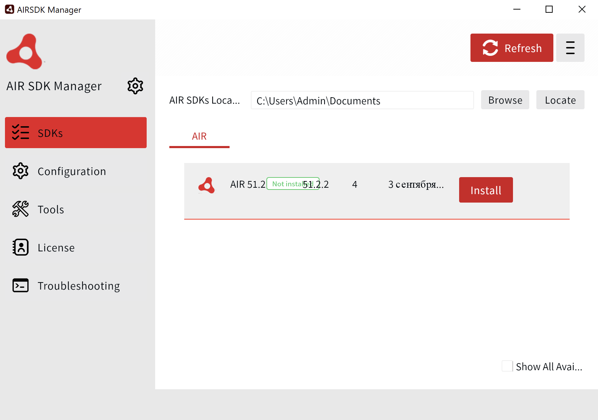
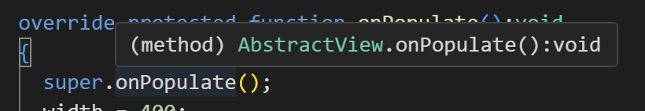
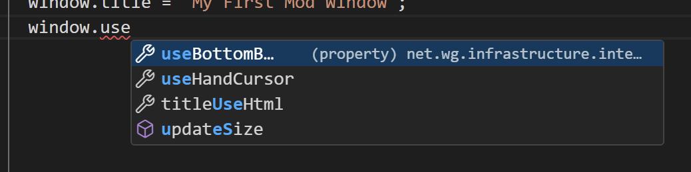
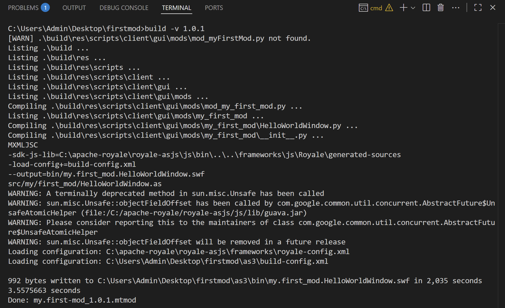
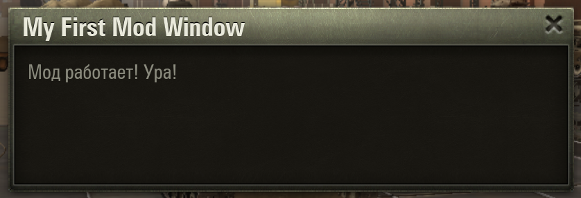

# Настройка окружения для AS3-мода (с графической частью) {#as3-setup}

Чисто `AS3`‑моды возможны, однако в большинстве случаев вам понадобится вспомогательный `Python`‑скрипт, который будет взаимодействовать с игрой и управлять графической частью мода.

Поэтому подразумевается, что у вас уже настроено окружение для `Python`‑модов. Если это не так, сначала настройте его, следуя [инструкции по настройке окружения для Python](../python/).

## Необходимые инструменты {#tools}
- Полностью настроенное окружение для `Python`‑модов (см. [инструкцию по настройке окружения для Python](../python/))
- [ActionScript & MXML](https://marketplace.visualstudio.com/items?itemName=bowlerhatllc.vscode-as3mxml) – расширение для VSCode, которое добавляет поддержку ActionScript
  - [Java JDK 11+](https://www.oracle.com/java/technologies/downloads/#jdk24-windows) – последняя версия `JDK`, необходима для работы расширения
  - `AIRSDK` – набор инструментов для компиляции `AS3`, необходим для работы расширения. Устанавливается через [AIR SDK Manager](https://airsdk.harman.com/download)
{width=400}
- [Apache Royale](https://royale.apache.org/download/) – компилятор `AS3` в `SWF`. Нужно скачать архив `APACHE ROYALE JS/SWF` и распаковать его в удобное место на диске, например `C:\apache-royale`.

::: warning ВАЖНО
При загрузке `Apache Royale` не перепутайте версии `JS-ONLY` и `JS/SWF`, необходима именно версия с `JS/SWF`.
:::

## Организация проекта {#project-structure}
Мы расширим структуру проекта, описанную в [инструкции по настройке окружения для Python](../python/).
`AS3`‑часть мода полностью независима от `Python`‑части, поэтому её исходный код не нужно помещать в папку `res`. Создайте в корне проекта папку `as3`, в которой разместим папки:
- `src/my/first_mod` – корневая папка вашего `AS3`‑мода, в которой будет находиться весь исходный код.
- `lib` – здесь будут находиться сторонние библиотеки, которые понадобятся для компиляции
- `bin` – здесь будет находиться скомпилированный файл `SWF`

Также создайте конфигурационный файл `asconfig.json`, в котором будут указаны настройки для расширения, и `build-config.xml` для настроек компиляции `SWF`, а также файл `build.bat`, который будет запускать компиляцию.

```
my-first-mod/
└── as3/
    ├── bin/
    ├── lib/
    │   └── ... (сторонние библиотеки)
    ├── src/
    │   └── my/
    │       └── first_mod/
    │           └── ... (исходный код AS3 мода)
    ├── build-config.xml
    ├── asconfig.json
    └── build.bat
```

### Библиотеки игры SWC {#game-swc}
Для того, чтобы мод мог взаимодействовать с компонентами игры, необходимо подключить к проекту внешние библиотеки игры в формате `SWC`.

Эти библиотеки поставляются вместе с игрой и находятся в пакетах `res/packages/gui-part.pkg/gui/flash/swc` относительно корня игры. Формат `.pkg` нужно открыть с помощью архиватора, например `7-Zip`.

::: warning ВАЖНО
Пакет `gui-part` разбит на два отдельных архива: `gui-part1.pkg` и `gui-part2.pkg`; часть нужных библиотек находится в первом, часть — во втором.
:::

Перенесите эти `SWC`‑файлы в папку с модом `as3/lib/`. Должно получиться 11 файлов:
- `base_app-1.0-SNAPSHOT.swc`
- `battle.swc`
- `common_i18n_library-1.0-SNAPSHOT.swc`
- `common-1.0-SNAPSHOT.swc`
- `damageIndicator.swc`
- `directionIndicator.swc`
- `gui_base-1.0-SNAPSHOT.swc`
- `gui_battle-1.0-SNAPSHOT.swc`
- `gui_lobby-1.0-SNAPSHOT.swc`
- `lobby.swc`
- `predictionIndicator.swc`

В дополнение к игровым библиотекам вам необходима ещё основная библиотека `playerglobal.swc`. [Скачайте](/download/playerglobal.swc){target="_blank"} её и поместите в папку `as3/lib/`.

### Конфигурация компиляции AS3 {#as3-config}
Заполните файлы `asconfig.json` и `build-config.xml` следующим содержимым:
::: code-group
<<< ./assets/asconfig.json{json :line-numbers}
<<< ./assets/build-config.xml{xml :line-numbers}
:::

В `build-config.xml` на 38-й строке указывается путь к выходному файлу `SWF`; измените его при необходимости.
```xml:line-numbers=38
<output>bin/my.first_mod.swf</output>
```

### Скрипт сборки {#build-script}
Заполните файл `as3/build.bat` следующим содержимым:
```bat [build.bat]:line-numbers
@echo off

rem ==== настройки ====
set "MXML_PATH=C:\apache-royale"

rem ==== компиляция ====
set "MXMLC=%MXML_PATH%\royale-asjs\bin\mxmlc"

call "%MXMLC%" -load-config+=build-config.xml --output=bin/my.first_mod.HelloWorldWindow.swf src/my/first_mod/HelloWorldWindow.as
```

На 7-й строке команда, с помощью которой мы компилируем `SWF`:
- `-load-config+=build-config.xml` – указывает файл с настройками компиляции
- `--output=bin/my.first_mod.swf` – путь к выходному `SWF`‑файлу
- `src/my/first_mod/HelloWorldWindow.as` – файл с исходным кодом

Если вам в модификации понадобится несколько `SWF`‑файлов, просто добавьте в `build.bat` ещё одну команду для компиляции с другими параметрами.

В разделе `настройки` укажите путь к папке, в которую распаковали `Apache Royale`.

#### Обновление основного скрипта сборки {#update-build-script}
Обновление основного скрипта не требуется, если вы настроили по инструкции [окружение для Python](../python/), то можете убедиться, что там есть блок, который запускает `as3/build.bat`:
```bat:line-numbers=44 {4}
if exist ".\as3\build.bat" (
  pushd ".\as3"
  del /Q /F ".\bin\*.swf"
  call build.bat
  xcopy ".\bin\*.swf" "..\build\res\gui\flash\" /Y /I >nul
  popd
)
```

## Подготовка тестового мода {#test-mod}
Для проверки работоспособности отобразим в ангаре игровое окно.

Создадим в папке `as3/src/my/first_mod/` файл `HelloWorldWindow.as` со следующим содержимым:
```actionscript-3 [HelloWorldWindow.as]
package my.first_mod
{
  import net.wg.infrastructure.base.AbstractWindowView;
  import flash.text.TextField;

  public class HelloWorldWindow extends AbstractWindowView
  {
    public function HelloWorldWindow()
    {
      super();
    }

    override protected function onPopulate():void
    {
      super.onPopulate();
      width = 400;
      height = 100;
      window.title = 'My First Mod Window';
      window.useBottomBtns = false;

      var text:TextField = new TextField();
      text.width = 384;
      text.height = 84;
      text.x = 8;
      text.y = 8;
      text.htmlText = "<font face='$FieldFont' size='14' color='#8C8C7E'>Мод работает! Ура!</font>";

      addChild(text);
    }
  }
}
```

### Отображение окна из Python {#show-window}
Чтобы окно появилось в игре, нужно из `Python`‑скрипта добавить его на экран. Для этого создадим управляющий `Python`‑класс (подробнее в [теории AS3](../../../scripting/as3-theory/)).

Создайте файл `res/scripts/client/gui/mods/my_first_mod/HelloWorldWindow.py` со следующим содержимым:

```python [HelloWorldWindow.py]
from frameworks.wulf.gui_constants import WindowLayer
from gui.Scaleform.framework.entities.abstract.AbstractWindowView import AbstractWindowView
from gui.Scaleform.framework import g_entitiesFactories, ScopeTemplates, ViewSettings
from gui.Scaleform.framework.managers.loaders import SFViewLoadParams
from helpers import dependency
from skeletons.gui.app_loader import IAppLoader
from gui.Scaleform.framework.application import AppEntry

class HelloWorldWindow(AbstractWindowView):
  def onWindowClose(self):
    self.destroy()

HELLO_WORLD_WINDOW = "MY_MOD_HELLO_WORLD_WINDOW"

def setup():
  settingsViewSettings = ViewSettings(
    HELLO_WORLD_WINDOW,
    HelloWorldWindow,
    "my.first_mod.HelloWorldWindow.swf",
    WindowLayer.TOP_WINDOW,
    None,
    ScopeTemplates.VIEW_SCOPE,
  )
  g_entitiesFactories.addSettings(settingsViewSettings)


def show():
  appLoader = dependency.instance(IAppLoader) # type: IAppLoader
  app = appLoader.getApp() # type: AppEntry
  app.loadView(SFViewLoadParams(HELLO_WORLD_WINDOW))
```

Функция `setup()` регистрирует `SWF`‑файл в системе, а функция `show()` отображает окно в интерфейсе.

Аналогично с `Python` у вас должны быть всплывающие подсказки по наведению мыши:
{width=400}

И автодополнение по нажатию `.` (точка):
{width=400}

В основном файле вашего мода (`res/scripts/client/gui/mods/mod_myFirstMod.py`) добавьте следующий код:

```python [mod_myFirstMod.py]
from gui import SystemMessages
from helpers import dependency
from skeletons.gui.shared.utils import IHangarSpace
from .my_first_mod.HelloWorldWindow import setup, show # [!code ++]

MOD_VERSION = '{{VERSION}}'

# получаем ссылку на IHangarSpace
hangarSpace = dependency.instance(IHangarSpace) # type: IHangarSpace

# Мод загрузился
def init():
  print("[MY_FIRST_MOD] Hello, World! Mod version is %s" % MOD_VERSION)
  # Регистрируем SWF файл
  setup() # [!code ++]

  # Подписываемся на загрузку ангара
  hangarSpace.onSpaceCreate += onHangarSpaceCreate

def onHangarSpaceCreate():
  # Отписываемся от загрузки ангара
  hangarSpace.onSpaceCreate -= onHangarSpaceCreate

  # Выводим уведомление в ангаре
  SystemMessages.pushMessage(
    text='Привет мир! Версия мода: %s' % MOD_VERSION,
    type=SystemMessages.SM_TYPE.InformationHeader,
    messageData={ 'header': 'MY_FIRST_MOD' }
  )

  # Отображаем окно в интерфейсе
  show() # [!code ++]
```

## Проверочный запуск {#test-run}
Скомпилируйте мод с помощью `build.bat` из корня проекта:
```cmd
build -v 1.0.1
```

:::tip СОВЕТ
Обратите внимание, что должна использоваться оболочка `CMD`. Если у вас используется `PowerShell`, вы можете переключиться на `CMD`, нажав на стрелочку рядом с кнопкой `+` в окне терминала и выбрать `Command Prompt`.
:::

В случае успешной компиляции вы увидите следующий вывод:


А так же файл мода `my.first-mod_1.0.1.mtmod`, перенесите его в папку с игрой `/mods/<актуальная версия игры>/`. И запустите игру.

После загрузки ангара вы увидите своё первое графическое окно :tada:

{width=400}


## Итоговая структура проекта {#final-structure}
В результате, после выполнения всех шагов, структура вашего проекта должна выглядеть так:
```
my-first-mod/
├── .vscode
│   └── settings.json
├── wot-src
│   └── ... (исходный код игры)
├── build.bat
├── meta.xml
├── as3/
│   ├── bin/
│   ├── lib/
│   │   └── ... (.swc библиотеки игры 11 штук + playerglobal.swc)
│   ├── src/
│   │   └── my/
│   │       └── first_mod/
│   │           └── HelloWorldWindow.as
│   ├── build-config.xml
│   ├── asconfig.json
│   └── build.bat
└── res
    └── scripts
        └── client
            └── gui
                └── mods
                    ├── mod_myFirstMod.py
                    └── my_first_mod
                        ├── __init__.py
                        └── HelloWorldWindow.py
```
Теперь на основе этого тестового проекта вы можете создавать свои моды как с графической частью, так и без.

## Советы {#tips}

- У ActionScript есть автоформатирование, рекомендуется включить в настройках VSCode опцию `Editor: Format On Save` (Форматировать при сохранении)
