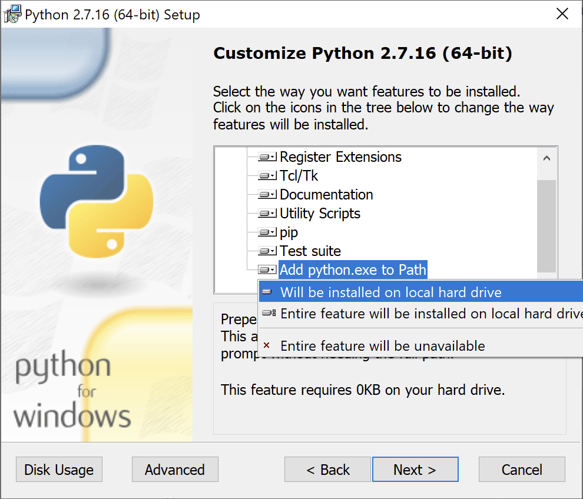
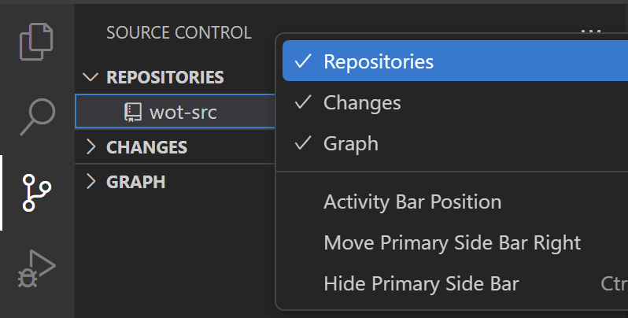
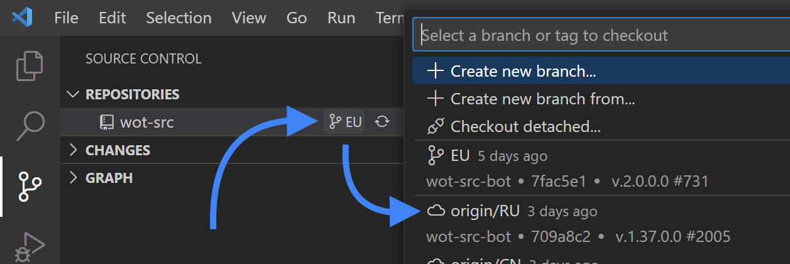
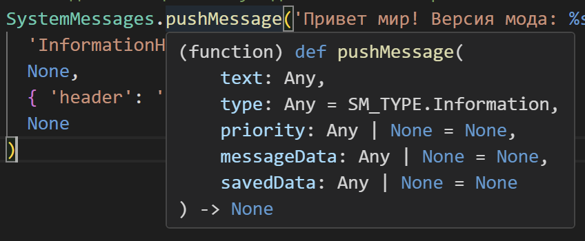
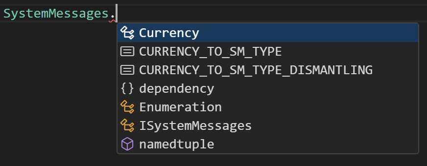
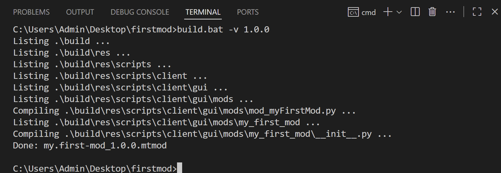
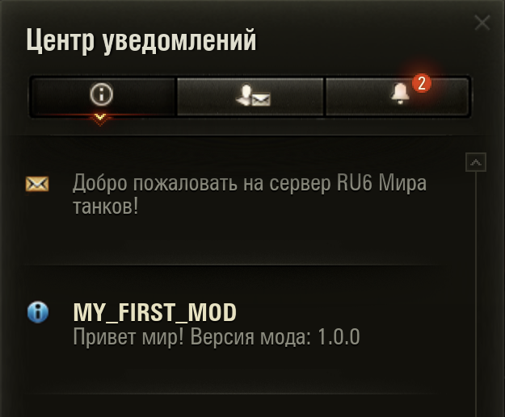

# Настройка окружения для Python-мода (без графической части) {#python-setup}

Python-моды наиболее просты в разработке и являются хорошей отправной точкой для новичков. В этом руководстве мы рассмотрим, как настроить ваше окружение для наиболее **комфортной** разработки Python-модов.

## Необходимые инструменты {#tools}

Перед началом разработки убедитесь, что у вас установлены следующие инструменты:
- [Python 2.7](https://www.python.org/downloads/release/python-2716/) - интерпретатор Python, который будет использоваться для компиляции скриптов.
- [7-Zip](https://www.7-zip.org/) - архиватор, который будет использоваться для упаковки модов в формат `.mtmod`.
- [Git](https://git-scm.com/) - система контроля версий, с помощью которой будет загружен исходный код игры.
- [VSCode](https://code.visualstudio.com/) - редактор кода, который будет использоваться для написания кода.
  - [Python extension for VSCode](https://marketplace.visualstudio.com/items?itemName=ms-python.python) - расширение для VSCode, которое добавляет поддержку Python.

:::warning ВАЖНО
Исполняемый файл Python должен быть доступен из командной строки. Для этого при установке Python необходимо включить `Add python.exe to Path`. Установите значение `Will be installed on local hard drive`, по умолчанию оно отключено.

{width=400}

Если вы его уже установили, то можете переустановить или поискать в интернете, как добавить Python в PATH вручную. После добавления перезапустите VSCode.
:::

## Организация проекта {#project-structure}

Создайте папку для вашего проекта (один проект = один мод) и откройте её в `VSCode`.

### Исходный код игры {#wot-src}
Для подсветки синтаксиса, автодополнений, переходов по коду и удобного поиска по исходному коду игры в папке с проектом необходимо иметь копию исходного кода игры. Скачаем её из [неофициального репозитория GitHub](https://github.com/izeberg/wot-src).

Для этого откройте терминал в VSCode (`` Ctrl+` `` или `Terminal -> New Terminal`) и выполните команду:
```shell
git clone https://github.com/izeberg/wot-src.git
```
В корне вашего проекта появится папка `wot-src` с исходным кодом игры.

Перейдите во вкладку `Source Control` (или нажмите `Ctrl+Shift+G`), нажмите на кнопку `...` и поставьте галочку на `Repositories`
{width=400}

После чего выберите репозиторий `wot-src` в списке, нажмите на кнопку с веткой `EU` и во всплывающем списке выберите ветку `origin/RU` — это переключит исходный код на версию для `Мира Танков`.
{width=600}

::: tip СОВЕТ
Репозиторий большой — скачивание и переключение веток может занять некоторое время, наберитесь терпения.
:::

#### Настройка VSCode {#vscode-setup}
Чтобы `VSCode` мог работать с исходным кодом игры, установите расширение [Python extension for VSCode](https://marketplace.visualstudio.com/items?itemName=ms-python.python).

После установки необходимо указать, где именно находятся скрипты игры. Для этого создайте в корне проекта папку `.vscode`, а в ней файл `settings.json` со следующим содержимым:
```json [settings.json] :line-numbers
{
  "python.autoComplete.extraPaths": [
    "wot-src/sources/res/scripts/client",
    "wot-src/sources/res/scripts/common",
    "wot-src/sources/res/scripts/client_common",
  ],
  "python.analysis.extraPaths": [
    "wot-src/sources/res/scripts/client",
    "wot-src/sources/res/scripts/common",
    "wot-src/sources/res/scripts/client_common",
  ],
  "python.analysis.userFileIndexingLimit": 20000,
}
```

### Файл метаданных `meta.xml` {#meta}
В корне вашего проекта создайте файл `meta.xml` со следующим содержимым:
```xml [meta.xml] :line-numbers
<mod>
  <name>my.first-mod</name>
  <description>My First Mod Description</description>
  <version>{{VERSION}}</version>
  <author>Your Name</author>
</mod>
```

Обратите внимание на <span v-pre>`{{VERSION}}`</span> на 4 строке кода — это специальный маркер, который будет заменён на актуальную версию мода при упаковке.

### Точка входа {#entry-point}
Поскольку игра автоматически запускает скрипты с префиксом `mod_` из папки `res/scripts/client/gui/mods/`, такую структуру папок и следует использовать в вашем проекте.

Создайте файл вашего мода `mod_myFirstMod.py` по пути `res/scripts/client/gui/mods/mod_myFirstMod.py`.

:::tip СОВЕТ
Вы можете нажать в VSCode кнопку создания нового файла, вписать туда полный путь до этого файла `res/scripts/client/gui/mods/mod_myFirstMod.py`, и VSCode сам создаст все необходимые подпапки.
:::

Напишите в этом файле следующий код:
::: code-group
```python [mod_myFirstMod.py]
from gui import SystemMessages
from helpers import dependency
from skeletons.gui.shared.utils import IHangarSpace

MOD_VERSION = '{{VERSION}}'

# Получаем ссылку на IHangarSpace
hangarSpace = dependency.instance(IHangarSpace) # type: IHangarSpace

# Мод загрузился
def init():
  print("[MY_FIRST_MOD] Hello, World! Mod version is %s" % MOD_VERSION)

  # Подписываемся на загрузку ангара
  hangarSpace.onSpaceCreate += onHangarSpaceCreate

def onHangarSpaceCreate():
  # Отписываемся от загрузки ангара
  hangarSpace.onSpaceCreate -= onHangarSpaceCreate

  # Выводим уведомление в ангаре
  SystemMessages.pushMessage(
    text='Привет мир! Версия мода: %s' % MOD_VERSION,
    type=SystemMessages.SM_TYPE.InformationHeader,
    messageData={ 'header': 'MY_FIRST_MOD' }
  )
```
:::


Обратите внимание, что у вас в редакторе должна быть подсветка синтаксиса. Наведите мышку на `SystemMessages.pushMessage` и увидите всплывающую подсказку с описанием функции и её параметров.

{width=400}

А если вы начнёте печатать, по после символа `.` (точка) появятся подсказки с атрибутами и методами объекта.

{width=400}

Если вы видите в окошке `Loading...` то надо немного подождать, пока `VSCode` проиндексирует исходный код игры.

### Скрипты и ресурсы {#resources}
Кроме файла точки входа в вашем моде могут быть и другие скрипты и ресурсы (изображения, файлы конфигурации и т. д.). Хорошим подходом является создание корневой папки вашего мода рядом с точкой входа, например `my_first_mod`, и размещение всех дополнительных файлов там. Это необходимо для минимизации конфликтов имён файлов с другими модами.

По пути `res/scripts/client/gui/mods/` создайте папку `my_first_mod` и добавьте туда пустой файл `__init__.py`.

### Компиляция скриптов `build.bat` {#compile}
Скачайте [файл build.bat](/download/mod-build/build.bat){target=_blank download} и поместите его в корень вашего проекта.

#### Блок настроек в начале файла {#settings}
```bat :line-numbers=4
rem ==== настройки ====
set "SEVENZIP=C:\Program Files\7-Zip\7z.exe"
set "MOD_NAME=my.first-mod"
set "MOD_ENTRY=mod_myFirstMod.py"
```
- `SEVENZIP` - путь до исполняемого файла 7-Zip. Если вы установили 7-Zip в другое место, то измените этот путь.
- `MOD_NAME` - имя вашего мода. Используйте формат `автор.название`, который будет автоматически подставлен при упаковке `автор.название_версия.mtmod`.
- `MOD_ENTRY` - имя файла точки входа вашего мода. Обычно это `mod_<имя_вашего_мода>.py`.

:::details Как работает build.bat
Если вам интересно, как работает этот скрипт, ниже приведено подробное описание каждого блока.

---
  <!-- @include: ./how-it-works.md -->
:::

### Итоговая структура проекта {#final-structure}
  В итоге у вас должна получиться следующая структура проекта:
```
my-first-mod/
├── .vscode
│   └── settings.json
├── wot-src
│   └── ... (исходный код игры)
├── build.bat
├── meta.xml
└── res
    └── scripts
        └── client
            └── gui
                └── mods
                    ├── mod_myFirstMod.py
                    └── my_first_mod
                        ├── __init__.py
                        └── ... (другие файлы вашего мода)
```

## Компиляция и упаковка {#build-process}
  Для запуска сборки откройте терминал в VSCode (`` Ctrl+` `` или `Terminal -> New Terminal`) и выполните команду:
```cmd
build -v 1.0.0
```

:::details Вывод сборки
  
:::

  В корне проекта появится файл `my.first-mod_1.0.0.mtmod` — это и есть ваш упакованный мод :tada:.

:::tip СОВЕТ
  Обратите внимание, что должна использоваться оболочка `CMD`. Если у вас используется `PowerShell`, вы можете переключиться на `CMD`, нажав на стрелочку рядом с кнопкой `+` в окне терминала и выбрать `Command Prompt`.
:::

:::warning ВАЖНО
  В `build.bat` используется команда `python -m compileall` — ожидается, что у вас в `PATH` доступен `Python 2.7`.
  Проверить, какая версия Python используется по умолчанию, можно командой в этом же терминале:
```bat
python --version
```
  Вывод должен быть таким: `Python 2.7.16`.

  Если версия отличается, замените строку в `build.bat` на путь до вашего `python.exe`, например:

```bat:line-numbers=41
c:\Python27\python.exe -m compileall ".\build"
```
:::


## Проверочный запуск {#test}
  В корневой папке игры очистите файл `python.log` (откройте любым текстовым редактором и удалите всё его содержимое, затем сохраните).

  Перенесите файл `my.first-mod_1.0.0.mtmod` в папку с игрой `/mods/<версия_игры>/`, запустите игру и дождитесь входа в ангар.

  В центре уведомлений должно появиться сообщение от вашего мода:
  {width=400}

  Откройте файл `python.log` и убедитесь, что там есть вывод вашего мода:
```log
/------------------------------------------------------------------------------------------\
Tanki(x64) Build: 1.37.0.10 #2189918 starting on Mon Sep  8 04:43:39 2025
...
INFO: [PY_DEBUG] Mod package 'e:/tanki/mods/1.37.0.0/my.first-mod_1.0.0.mtmod' loaded
...
INFO: [MY_FIRST_MOD] Hello, World! Mod version is 1.0.0
...
```

  Логов будет много; можете воспользоваться поиском по файлу (`Ctrl+F`) и найти `MY_FIRST_MOD`, чтобы убедиться, что ваш мод успешно загрузился и выполнился.

