# Первый реальный мод {#first-real-mod}

В этом руководстве пройдём все этапы создания реального Python‑мода. В качестве примера будет повторён мод [Быстрый демонтаж оборудования 2.0](http://forum.tanki.su/index.php?/topic/2204705-13700-quick-demount-20-быстрый-демонтаж-оборудования-20/). Этот мод позволяет быстро демонтировать оборудование с танка, находясь в меню установки оборудования на другой танк.

Разберём не только необходимые для разработки шаги, но и принцип, как до них догадаться.

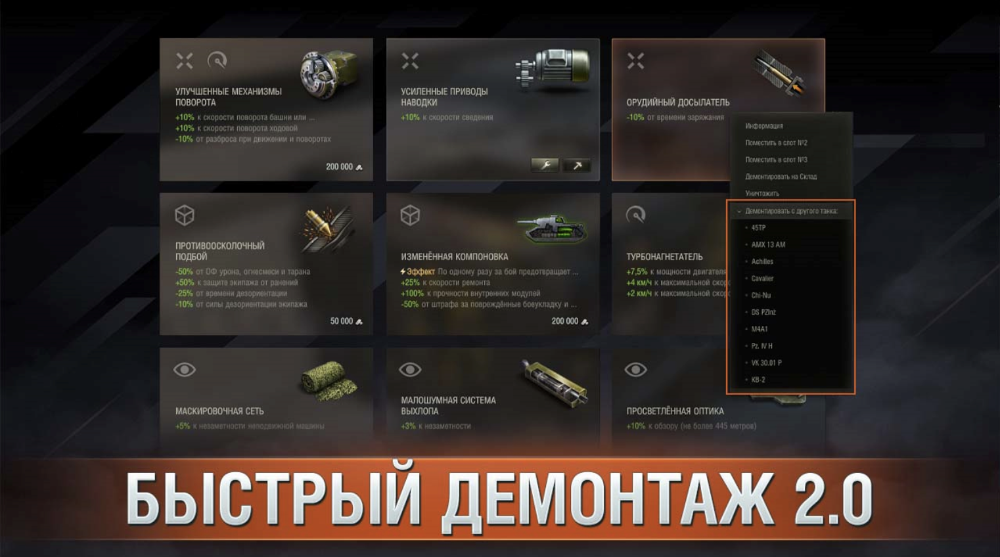

Мод является крайне полезным и не очень сложным в разработке, что делает его отличным примером для изучения.

## Философия {#philosophy}

Основной подход к разработке модов заключается в подмене существующих методов на свои реализации.

Благодаря языку Python и его динамическим возможностям мы можем в рантайме (во время работы программы) заменить любой метод на свой, добавив нужную логику.

Например:
```python
# сохраним оригинальный метод
original_method = SomeClass.some_method

# определим свою реализацию
def my_method(self, *a, **k):
  # тут может быть любая наша логика
  ...
  # вызовем оригинальный метод
  return original_method(self, *a, **k)

# заменим метод на наш
SomeClass.some_method = my_method

```

После замены, когда игра вызовет `SomeClass().some_method()`, фактически будет выполнена наша реализация `my_method`, в которой мы можем делать всё что угодно и при необходимости вызвать оригинал.

## Идея мода {#mod-idea}

Перед разработкой мода нужно чётко понимать, что именно он должен делать.
В нашем случае, мод должен из меню установки оборудования на танк позволять демонтировать оборудование с других танков.

## Шаги для реализации {#implementation-steps}

Перед полноценной разработкой имеет смысл разбить задачу на мелкие шаги и попробовать каждый через `PjOrion`.

Необходимые шаги:
- Понять, как отобразить интерфейс для выбора танка, с которого нужно демонтировать оборудование
- Понять, как получить список танков с установленным оборудованием
- Научиться вызывать демонтирование оборудования программно, с танка, который не выбран в данный момент

## Интерфейс цели демонтажа {#demount-target-ui}
Первое, что приходит в голову, — добавить кнопку «Демонтаж» рядом с «Установить» в окне установки оборудования. Однако интерфейс выбора оборудования сделан на `CGF`, который крайне тяжело модифицируется.

::: details Как понять на чём сделан интерфейс
Отличить CGF‑интерфейс можно просто: в файле `res/packages/gui-part.pkg/gui/gameface/styles/default.css` добавьте в конце стиль:
```css [default.css]
* {
  border: 1px solid rgba(30, 247, 70, 0.4);
}
```

Он добавит зелёную рамку ко всем элементам CGF‑интерфейса, что позволит увидеть, какие элементы к нему относятся.

Учтите, что пакет `gui-part.pkg` может быть разбит на несколько архивов, нужный файл `default.css` может находиться в любом из них.

В результате видно, что весь интерфейс демонтажа — это CGF.

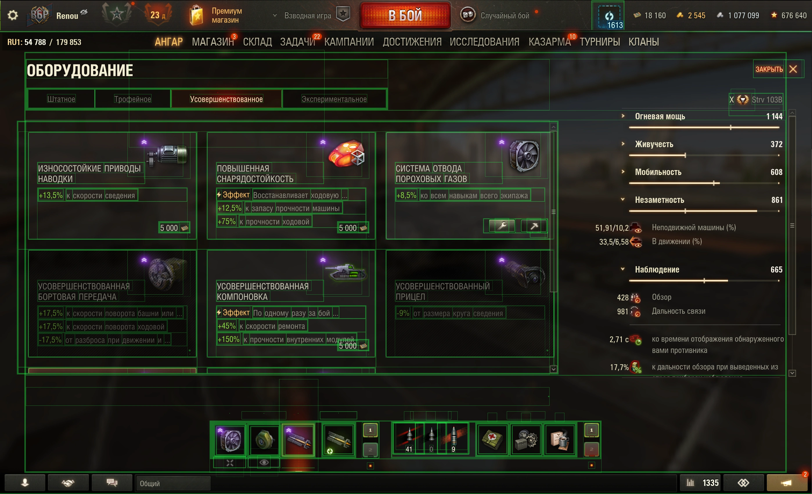
:::

Поэтому наиболее простой способ отображения интерфейса выбора танка для демонтажа — модифицировать существующее контекстное меню.

### Как найти контекстное меню {#find-context-menu}
Контекстное меню в игре вызывается через `Python` и обычно реализуется контролирующим классом, наследующимся от `AbstractContextMenuHandler`.

Попробуем найти в исходном коде игры контекстное меню для оборудования в интерфейсе выбора. Скорее всего, в названии контролирующего класса есть слово `ContextMenu`, и можно предположить, что там будет `Equipment`, так как это меню оборудования.

Воспользуемся поиском в VSCode по регулярному выражению `class .*Equipment.*ContextMenu`, здесь `.*` означает любое число произвольных символов.

::: details Результат поиска по регулярному выражению
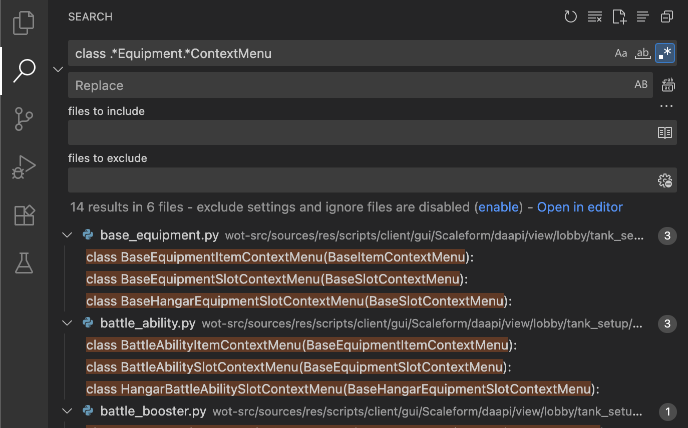
:::

::: tip Совет
Учтите, что поиск по регулярным выражениям нужно включить кнопкой `.*` рядом с полем ввода.

Если используете `Git` и у вас есть `.gitignore`, то по умолчанию поиск не проходит по игнорируемым файлам. Чтобы искать везде, нажмите `...` рядом с полем ввода в `files to exclude` и отключите `Use Exclude Settings and Ignore Files`.
:::

Первый результат поиска — класс `BaseEquipmentItemContextMenu` по пути `.../tank_setup/context_menu/base_equipment.py`, где папка `tank_setup` подтверждает, что это именно нужное нам меню в интерфейсе настройки танка.

Префикс `Base` в названии говорит, что это базовый класс. Посмотрим, кто его наследует. Введём в поиск `class .*\(BaseEquipmentItemContextMenu`.
::: details Результат поиска наследников `BaseEquipmentItemContextMenu`
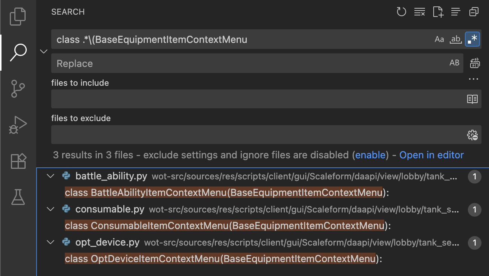
:::
Нашлось три класса:
- `BattleAbilityItemContextMenu` – что‑то связанное с боевыми умениями
- `ConsumableItemContextMenu` – что‑то связанное с расходниками
- `OptDeviceItemContextMenu` – то, что нам нужно


### Как модифицировать контекстное меню {#modify-context-menu}

Класс `OptDeviceItemContextMenu` реализует меню декларативно (подробнее — [как создать контекстное меню](/articles/how-to-create-context-menu/#high-level-way)) через наследование от `ContextMenu` и декоратор `@option`. Такой способ удобен для фиксированного числа кнопок, но у нас число танков меняется, поэтому нужен императивный подход через переопределение базовой функции `_generateOptions`.

Эта функция определена в цепочке предков: `OptDeviceItemContextMenu` -> `BaseEquipmentItemContextMenu` -> `BaseItemContextMenu` -> `BaseTankSetupContextMenu` -> `ContextMenu` -> `AbstractContextMenuHandler`.

Проверим так ли это через `PjOrion`. Для начала сохраним оригинальный метод:
```python [PjOrion]
from gui.Scaleform.daapi.view.lobby.tank_setup.context_menu.opt_device import OptDeviceItemContextMenu
orig_generateOptions = OptDeviceItemContextMenu._generateOptions

print('Original _generateOptions:', orig_generateOptions)
```
После выполнения кода в консоли `PjOrion` увидим, что оригинальный метод найден.
```
*** ('Original _generateOptions:', <unbound method OptDeviceItemContextMenu._generateOptions>)
```
::: warning Важно
После выполнения кода обязательно сотрите или закомментируйте сохранение, чтобы случайно не перезаписать `orig_generateOptions` в дальнейшем.
:::

Теперь можно переопределить `OptDeviceItemContextMenu._generateOptions` своей реализацией. Для начала просто выведем сообщение. Внутри новой функции нужно вернуть результат `orig_generateOptions`, чтобы не сломать логику.

```python [PjOrion]
from gui.Scaleform.daapi.view.lobby.tank_setup.context_menu.opt_device import OptDeviceItemContextMenu
#orig_generateOptions = OptDeviceItemContextMenu._generateOptions

def new_generateOptions(obj, *a, **k):
  print('new generate options')
  return orig_generateOptions(obj, *a, **k)

OptDeviceItemContextMenu._generateOptions = new_generateOptions
```

После выполнения кода, перейдите в игру и вызовите это контекстное меню, в консоли PjOrion появится сообщение `new generate options`, что подтверждает успешное переопределение.

#### Добавление своих пунктов меню {#add-custom-menu-items}

Теперь посмотрим, что возвращает оригинальный метод, для этого сохраним результат оригинального метода и выведем его в консоль.

```python [PjOrion]
from gui.Scaleform.daapi.view.lobby.tank_setup.context_menu.opt_device import OptDeviceItemContextMenu
#orig_generateOptions = OptDeviceItemContextMenu._generateOptions

def new_generateOptions(obj, *a, **k):
  orig_result = orig_generateOptions(obj, *a, **k)
  print('new generate options', orig_result)
  return orig_result

OptDeviceItemContextMenu._generateOptions = new_generateOptions
```

После вызова контекстного меню получим массив элементов:
```python
[
  {'submenu': None, 'linkage': None, ..., label: 'Информация' },
  {'submenu': None, 'linkage': None, ..., label: 'Поместить в слот 1' },
  ....
]
```

Для нашей реализации нужно в конец списка добавить подменю `Демонтировать с другого танка` с перечислением танков. Пока добавим три тестовых.

```python [PjOrion]
from gui.Scaleform.daapi.view.lobby.tank_setup.context_menu.opt_device import OptDeviceItemContextMenu
#orig_generateOptions = OptDeviceItemContextMenu._generateOptions

def new_generateOptions(obj, *a, **k):
  orig_result = orig_generateOptions(obj, *a, **k)

  submenuItems = [
    obj._makeItem('demountFrom:veh_1', 'Tank 1'),
    obj._makeItem('demountFrom:veh_2', 'Tank 2'),
    obj._makeItem('demountFrom:veh_3', 'Tank 3')
  ]

  orig_result.append(obj._makeSeparator()) # разделитель
  orig_result.append(obj._makeItem('demount', 'Demount from:', optSubMenu=submenuItems))
  return orig_result

OptDeviceItemContextMenu._generateOptions = new_generateOptions
```

Готово. Теперь в контекстном меню есть пункт `Demount from:` с подменю из трёх танков.

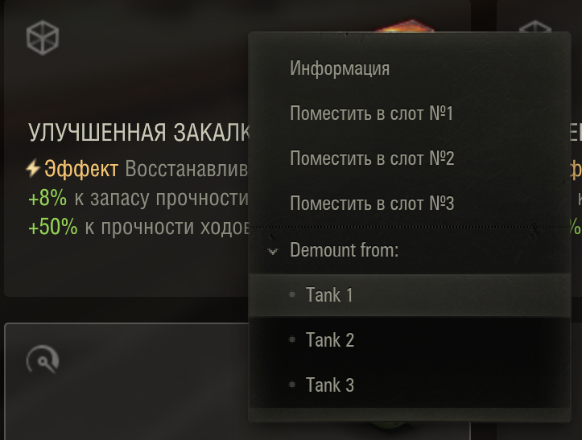{width=400}

#### Определение действий по нажатию на пункты меню {#handle-menu-actions}

Первый аргумент `obj._makeItem` — уникальный идентификатор пункта (`optionId`), по нему можно идентифицировать нажатие.

Для этого в базовом классе `AbstractContextMenuHandler` есть метод `onOptionSelect(optionId)`, вызываемый при нажатии на любой пункт меню.

Сохраним его известным способом, затем закомментируем сохранение, чтобы не перезаписать.
```python [PjOrion]
from gui.Scaleform.daapi.view.lobby.tank_setup.context_menu.opt_device import OptDeviceItemContextMenu
orig_onOptionSelect = OptDeviceItemContextMenu.onOptionSelect
```

Теперь определим свою реализацию, в которой мы будем обрабатывать наши пункты меню.
```python [PjOrion]
from gui.Scaleform.daapi.view.lobby.tank_setup.context_menu.opt_device import OptDeviceItemContextMenu
#orig_onOptionSelect = OptDeviceItemContextMenu.onOptionSelect

def new_onOptionSelect(obj, optionId):
  if optionId.startswith('demountFrom:'):
    veh_id = optionId.split(':')[1]
    print('Demount from vehicle:', veh_id)
    # тут будет логика демонтажа с танка veh_id
    return
  return orig_onOptionSelect(obj, optionId)

OptDeviceItemContextMenu.onOptionSelect = new_onOptionSelect
```

Готово. Теперь при нажатии на `Tank 1`, `Tank 2`, `Tank 3` в консоли выводится соответствующий идентификатор.

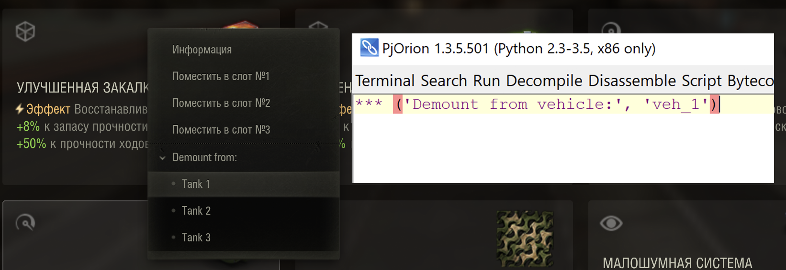


## Получение списка танков с оборудованием {#get-tanks-with-equipment}
Теперь нужно научиться получать список танков с установленным оборудованием.

Для начала нужно понять, на каком оборудовании вызвано контекстное меню (чтоб понять что именно надо демонтировать). Скорее всего, эта информация уже есть в `OptDeviceItemContextMenu`, нужно найти её.

### Исследуем OptDeviceItemContextMenu {#explore-game-objects}
Для этого модифицируем `new_generateOptions`, чтобы записать объект `obj` (экземпляр `OptDeviceItemContextMenu`) в глобальную область PjOrion и исследовать его.

```python [PjOrion]
def new_generateOptionsSaveObj(obj, *a, **k):
  global last_OptDeviceItemContextMenu
  last_OptDeviceItemContextMenu = obj
  return orig_generateOptions(obj, *a, **k)

OptDeviceItemContextMenu._generateOptions = new_generateOptionsSaveObj
```

После вызова контекстного меню, в `PjOrion` появится глобальная переменная `last_OptDeviceItemContextMenu`, которая содержит объект `OptDeviceItemContextMenu`.

Теперь можно исследовать его: по нажатию ПКМ после `last_OptDeviceItemContextMenu.` выбрать `Show attributes`.

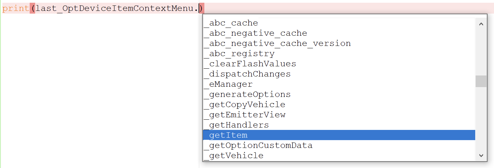

Среди атрибутов есть метод `_getItem`. Выведем его в консоль `print(last_OptDeviceItemContextMenu._getItem())` и получим `OptionalDevice`:
```
OptionalDevice<intCD:23801, type:optionalDevice, nation:15>
```

Дальнейшее проставление символа `.` после `last_OptDeviceItemContextMenu._getItem()` и выбор `Show attributes` покажет все атрибуты объекта `OptionalDevice`. Одним из которых будет `getInstalledVehicles`, который по названию явно говорит о том, что он возвращает список танков с установленным оборудованием.

Попробуем вызвать `last_OptDeviceItemContextMenu._getItem().getInstalledVehicles()` и получим ошибку о том, что методу нужны **два аргумента**, первый это `self`, а второй необходимо передавать.

### Понимание getInstalledVehicles {#understand-get-installed-vehicles}
Воспользовавшись поиском по `getInstalledVehicles` можно найти множество примеров, где аргументом передают `vehicles` (массив танков).

Например в `InventoryBlockConstructor`:
```python [.../gui/shared/tooltips/module.py]
...
def _getInstalledVehicles(self, module, inventoryVehicles):
  return module.getInstalledVehicles(inventoryVehicles.itervalues()) # [!code highlight]
...
items = self.itemsCache.items
inventoryVehicles = items.getVehicles(REQ_CRITERIA.INVENTORY)
installedVehicles = self._getInstalledVehicles(module, inventoryVehicles)
...
```

Сделаем точно так же, получим список всех танков, которые есть в ангаре через `itemsCache` и `REQ_CRITERIA.INVENTORY` и передадим их в `getInstalledVehicles`.
```python [PjOrion]
from helpers import dependency
from skeletons.gui.shared import IItemsCache
from gui.shared.utils.requesters import REQ_CRITERIA

itemsCache = dependency.instance(IItemsCache) # type: IItemsCache
inventoryVehicles = itemsCache.items.getVehicles(REQ_CRITERIA.INVENTORY)
print(last_OptDeviceItemContextMenu._getItem().getInstalledVehicles(inventoryVehicles.itervalues()))
```

::: tip Совет
Как работать с `dependency` и `IItemsCache` можно почитать в статье [Как работать с Dependency Injections](/articles/how-to-work-with-di/)
:::

В результате в консоли появится множество (`set`) танков с установленным оборудованием.
```
set([
    Vehicle<id:548, intCD:62241, nation:2, lock:(0, 0)>,
    ...
    Vehicle<id:516, intCD:6977, nation:4, lock:(0, 0)>
])
```

Преобразуем его в массив (`intCD`, `shortUserName`) и выведем.
```python [PjOrion]
from helpers import dependency
from skeletons.gui.shared import IItemsCache
from gui.shared.utils.requesters import REQ_CRITERIA

itemsCache = dependency.instance(IItemsCache) # type: IItemsCache
inventoryVehicles = itemsCache.items.getVehicles(REQ_CRITERIA.INVENTORY)
installedVehicles = last_OptDeviceItemContextMenu._getItem().getInstalledVehicles(inventoryVehicles.itervalues())
print([(v.intCD, v.userName) for v in installedVehicles])
```

В игре `intCD` это уникальный идентификатор танка, а `shortUserName` это короткое название танка.
> В консоли `PjOrion` русские буквы отображаются как их Unicode коды, но в игре всё будет работать нормально.

### Обновление контекстного меню {#update-context-menu}
Обновим контекстное меню, чтобы показывать реальные танки.

```python [PjOrion]
itemsCache = dependency.instance(IItemsCache) # type: IItemsCache
inventoryVehicles = itemsCache.items.getVehicles(REQ_CRITERIA.INVENTORY)

def new_generateOptionsRealVehicles(obj, *a, **k):
  original_result = orig_generateOptions(obj, *a, **k)

  installedVehicles = obj._getItem().getInstalledVehicles(inventoryVehicles.itervalues())

  submenuItems = [
    obj._makeItem('demountFrom:%d' % v.intCD, v.userName) for v in installedVehicles
  ]

  original_result.append(obj._makeSeparator())
  original_result.append(obj._makeItem('demount', 'Demount from:', optSubMenu=submenuItems))
  return original_result

OptDeviceItemContextMenu._generateOptions = new_generateOptionsRealVehicles
```
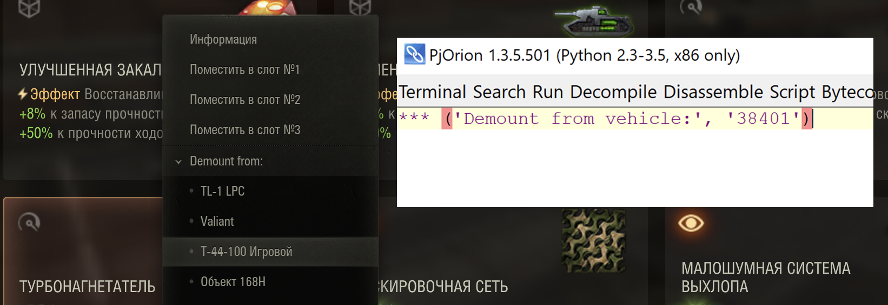

## Вызов демонтажа оборудования {#call-demount-equipment}
Остался последний шаг, нужно научиться программно демонтировать оборудование с танка, который сейчас не выбран.

В игре демонтаж происходит через `CGF`‑кнопку. Найти, что она вызывает, непросто. Можно попробовать поиск по `demount`, однако он даёт много лишнего.

### Поиск демонтажа по контекстному меню {#find-demount-by-context-menu}
Можно вспомнить, что демонтаж доступен из контекстного меню в ангаре:
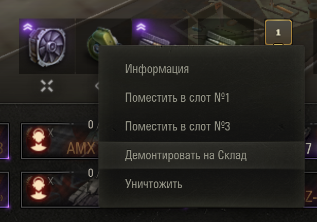{width=400}

Можно искать другие `...OptDevice...ContextMenu`, но нам повезло, и `HangarOptDeviceSlotContextMenu` находится рядом в том же файле который мы уже находили `.../tank_setup/context_menu/opt_device.py`.

В этом классе находим опцию `demountFromSetup`, которая вызывает `_demountProcess`.

```python [opt_device.py]
from gui.shared.gui_items.items_actions import factory as ActionsFactory

@option(_sqGen.next(), TankSetupCMLabel.DEMOUNT_FROM_SETUP)
def demountFromSetup(self):
  self._demountProcess(isDestroy=False, everywhere=False)

@adisp_process
def _demountProcess(self, isDestroy=False, everywhere=True):
  item = self._itemsCache.items.getItemByCD(self._intCD)
  action = ActionsFactory.getAction(
    ActionsFactory.REMOVE_OPT_DEVICE,
    self._getVehicle(),
    item,
    self._installedSlotId,
    isDestroy,
    forFitting=False,
    everywhere=everywhere
  )
  result = yield ActionsFactory.asyncDoAction(action)
  ...
```

::: tip Совет
Как работать с `adisp_process` можно почитать в статье [Асинхронное программирование](/articles/adisp/)
:::

Как видно из кода, нужно вызвать действие `REMOVE_OPT_DEVICE` через `ActionsFactory`, передав:
- танк, с которого нужно демонтировать оборудование (объект `self._getVehicle()`)
- оборудование, которое нужно демонтировать (объект `self._itemsCache.items.getItemByCD(self._intCD)`)
- ID слота, с которого нужно демонтировать оборудование (`self._installedSlotId`)

Как получить танк и оборудование, мы знаем, осталось получить ID слота.

### Понимание ID слота {#understand-slot-id}
Что это за ID — неясно. Переопределим `_demountProcess` и выведем параметры.

Сохраняем оригинальный метод
```python [PjOrion]
from gui.Scaleform.daapi.view.lobby.tank_setup.context_menu.opt_device import HangarOptDeviceSlotContextMenu
orig_demountProcess = HangarOptDeviceSlotContextMenu._demountProcess
```
Переопределяем его
```python [PjOrion]
from gui.Scaleform.daapi.view.lobby.tank_setup.context_menu.opt_device import HangarOptDeviceSlotContextMenu
#orig_demountProcess = HangarOptDeviceSlotContextMenu._demountProcess

def new_demountProcess(obj, *a, **k):
  item = obj._itemsCache.items.getItemByCD(obj._intCD)
  print('OnDemount:', obj._getVehicle(), item, obj._installedSlotId)

  return orig_demountProcess(obj, *a, **k)

HangarOptDeviceSlotContextMenu._demountProcess = new_demountProcess
```

После этого можно поэкспериментировать с демонтажом из разных комплектов и понять, что именно передаётся в `self._installedSlotId`.

По экспериментам видно, что это порядковый номер слота, начиная с нуля, в том числе и для дополнительного комплекта.

### Пробуем демонтировать {#try-demount}
Теперь можно реализовать демонтаж оборудования с выбранного танка.

Нужны `intCD` танка и `intCD` оборудования. Возьмём текущую технику (`g_currentVehicle`), получим её `intCD` и оборудование из например второго слота:
```python [PjOrion]
from CurrentVehicle import g_currentVehicle
print(g_currentVehicle.intCD)
print(g_currentVehicle.item.optDevices.installed[1].intCD)
```

::: tip Совет
Подробнее исследовать что есть в `g_currentVehicle` можно через `PjOrion` изучая подсказки по нажатию `.`.
:::

В моём случае:
- `intCD` техники `4737` (Strv 103B)
- `intCD` оборудования `25593` (Турбонагнетатель)
- `id` слота `1` (второй слот, так как нумерация с нуля)

Вызовем демонтаж, как в примере из `HangarOptDeviceSlotContextMenu._demountProcess`, но с нашими параметрами.
```python [PjOrion]
from gui.shared.gui_items.items_actions import factory as ActionsFactory
from helpers import dependency
from skeletons.gui.shared import IItemsCache
from adisp import adisp_process

@adisp_process
def demount(vehicleCD, deviceCD, slotId):
  itemsCache = dependency.instance(IItemsCache) # type: IItemsCache
  item = itemsCache.items.getItemByCD(deviceCD)
  vehicle = itemsCache.items.getItemByCD(vehicleCD)

  action = ActionsFactory.getAction(
    ActionsFactory.REMOVE_OPT_DEVICE,
    vehicle,
    item,
    slotId,
    False,
    forFitting=False,
    everywhere=True
  )
  result = yield ActionsFactory.asyncDoAction(action)

demount(4737, 25593, 1) # подставьте свои значения
```

::: details Результат

:::


Получили зависший экран с размытием. Такое бывает. Поможет `ESC` -> `Сменить сервер` (что приведёт к перезагрузке интерфейса ангара). Иногда может потребоваться полная перезагрузка игры.

Если код верный, но не работает, проблема может быть в способе запуска. Возможно, в `PjOrion` код выполняется не в главном потоке, из-за чего интерфейс не может инициализироваться.

Можно применить трюк с отложенным вызовом. С помощью метода движка `BigWorld.callback(time, callback)`, который откладывает выполнение функции `callback` на указанное время. Спустя это время функция будет вызвана в основном потоке от имени движка. Отложим на `0` секунд, чтобы вызвать в следующий кадр.

```python [PjOrion]
BigWorld.callback(0, lambda: demount(4737, 25593, 1))
```
::: details Результат
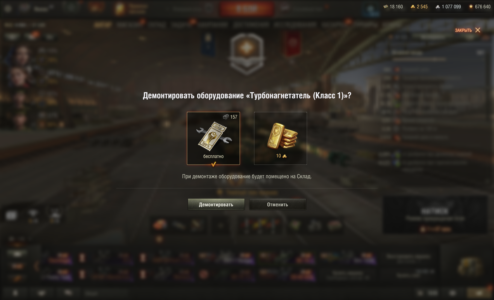
:::

Теперь всё работает, даже если выбрать другой танк.

### Получение индекса слота {#get-slot-id}
Остаётся автоматически определять `slotId` по оборудованию и танку.
Проще всего перебрать `optDevices.installed`, как делали выше для `g_currentVehicle`:
```python [PjOrion]
from helpers import dependency
from skeletons.gui.shared import IItemsCache

def getInstalledSlotIdx(vehicleCD, moduleIntCD):
  itemsCache = dependency.instance(IItemsCache) # type: IItemsCache

  # Получаем танк по intCD
  vehicle = itemsCache.items.getItemByCD(vehicleCD)

  # Перебираем установленное оборудование
  for idx, op in enumerate(vehicle.optDevices.installed):
    if op is not None and moduleIntCD == op.intCD:
      return idx
  return -1

print(getInstalledSlotIdx(4737, 25593)) # подставьте свои значения
```
Этот способ работает, но если оборудование в дополнительном комплекте, то оно не будет найдено (`vehicle.optDevices.installed` только текущий комплект). Список из дополнительного комплекта нельзя получить без переключения комплектов.

У `ActionsFactory` которую мы используем для демонтажа, есть и другие действия, среди которых можно найти `CHANGE_SETUP_EQUIPMENTS_INDEX`, название говорит само за себя. Теперь можно выполнить поиск по проекту и найти где такая команда используется.

Например, в `LoadoutPresenter` (`.../lobby/hangar/presenters/loadout_presenter.py`) есть метод `__doChangeSetupIndex`, вызывающий это действие.

```python [loadout_presenter.py] {4}
@adisp.adisp_process
def __doChangeSetupIndex(self, groupId, currentIndex):
  action = ActionsFactory.getAction(
    ActionsFactory.CHANGE_SETUP_EQUIPMENTS_INDEX,
    self.__getVehicle(),
    groupId,
    currentIndex
  demountFromSetup, который вызывает)
  ...
```

Применим это к нашей функции `getInstalledSlotIdx`, чтобы находить оборудование в любом комплекте. Проверяем текущий, если ничего не нашли, то переключаем на противоположный и проверяем снова.

> Для переключения необходимо использовать асинхронность: `@adisp_process` позволяет ждать результат (`yield`), а `@adisp_async` позволяет вернуть асинхронный результат через `callback`.

```python [PjOrion]
from adisp import adisp_process, adisp_async
from helpers import dependency
from skeletons.gui.shared import IItemsCache
from post_progression_common import TankSetupGroupsId
from gui.shared.gui_items.items_actions import factory as ActionsFactory


@adisp_async
@adisp_process
def getInstalledSlotIdx(vehicleCD, moduleIntCD, callback):
  itemsCache = dependency.instance(IItemsCache) # type: IItemsCache

  # Функция проверки текущего комплекта, если наши, вызываем callback и возвращаем True
  def checkDevices():
    vehicle = itemsCache.items.getItemByCD(vehicleCD)
    for idx, op in enumerate(vehicle.optDevices.installed):
      if op is not None and moduleIntCD == op.intCD:
        callback(idx)
        return True
    return False

  # Проверяем текущий комплект, если True, значит нашли и можно выйти из фукнции
  if checkDevices(): return

  # Меняем комплект на противоположный
  vehicle = itemsCache.items.getItemByCD(vehicleCD)
  targetIndex = 1 if vehicle.optDevices.setupLayouts.layoutIndex == 0 else 0
  action = ActionsFactory.getAction(
    ActionsFactory.CHANGE_SETUP_EQUIPMENTS_INDEX,
    vehicle,
    TankSetupGroupsId.OPTIONAL_DEVICES_AND_BOOSTERS,
    targetIndex
  )
  # Дожидаемся смены
  result = yield ActionsFactory.asyncDoAction(action)

  # Проверяем новый текущий комплект
  if checkDevices(): return

  # Ничего не нашли
  callback(-1)

@adisp_process
def getSlot():
  res = yield getInstalledSlotIdx(4737, 25593) # подставьте свои значения
  print(res)

getSlot()
```

::: details Откуда взялся `TankSetupGroupsId`
  Поиск по проекту позволяет изучить примеры использования `CHANGE_SETUP_EQUIPMENTS_INDEX`, в которых он получают аргументом `groupId`. На практике это `2` для комплекта оборудования и `1` для снарядов.

  В том же самом файле `loadout_presenter.py` есть функция `def _getEquipmentsPairs(self, groupID))` которая принимает `groupID` и обрабатывает его значения.

  ```python [loadout_presenter.py]
  from post_progression_common import TankSetupGroupsId
  ...
  def _getEquipmentsPairs(self, groupID):
    ...
    if groupID == TankSetupGroupsId.EQUIPMENT_AND_SHELLS:
    elif groupID == TankSetupGroupsId.OPTIONAL_DEVICES_AND_BOOSTERS:
    ...
  ```
  Отсюда берём `TankSetupGroupsId.OPTIONAL_DEVICES_AND_BOOSTERS` (равно `2`).
:::

Теперь можно проверить `getInstalledSlotIdx`, он должен находить слот в любом комплекте.

```python [PjOrion]
from adisp import adisp_process

@adisp_process
def test():
  res = yield getInstalledSlotIdx(4737, 25593) # подставьте свои значения
  print(res)

test()
```

## Реализация мода {#mod-implementation}
Теперь, когда мы научились делать каждый шаг по отдельности, можно собрать всё вместе и сделать полноценный мод.

Сделаем на основе `my.first_mod` из обучения по [настройке Python окружения](../environment/python/). Весь функционал разобьём на разные файлы, чтобы было проще ориентироваться в коде.


### Логика демонтажа {#demount-logic}
В отдельный файл `my_first_mod/demount.py` вынесем логику демонтажа.

Вынесем `itemsCache` на уровень модуля. В `def demount` получаем `slotId` через `getInstalledSlotIdx`, затем вызываем демонтаж.

```python [my_first_mod/demount.py]
from adisp import adisp_process, adisp_async
from helpers import dependency
from skeletons.gui.shared import IItemsCache
from post_progression_common import TankSetupGroupsId
from gui.shared.gui_items.items_actions import factory as ActionsFactory

itemsCache = dependency.instance(IItemsCache) # type: IItemsCache

@adisp_async
@adisp_process
def getInstalledSlotIdx(vehicleCD, moduleIntCD, callback):

  def checkDevices():
    vehicle = itemsCache.items.getItemByCD(vehicleCD)
    for idx, op in enumerate(vehicle.optDevices.installed):
      if op is not None and moduleIntCD == op.intCD:
        callback(idx)
        return True
    return False

  # Проверяем текущий комплект
  if checkDevices(): return

  # Меняем комплект на противоположный
  vehicle = itemsCache.items.getItemByCD(vehicleCD)
  targetIndex = 1 if vehicle.optDevices.setupLayouts.layoutIndex == 0 else 0
  action = ActionsFactory.getAction(
    ActionsFactory.CHANGE_SETUP_EQUIPMENTS_INDEX,
    vehicle,
    TankSetupGroupsId.OPTIONAL_DEVICES_AND_BOOSTERS,
    targetIndex
  )
  # Дожидаемся смены
  result = yield ActionsFactory.asyncDoAction(action)

  # Проверяем новый текущий комплект
  if checkDevices(): return

  # Ничего не нашли
  callback(-1)


@adisp_process
def demount(vehicleCD, deviceCD):
  item = itemsCache.items.getItemByCD(deviceCD)
  vehicle = itemsCache.items.getItemByCD(vehicleCD)

  slotId = yield getInstalledSlotIdx(vehicleCD, deviceCD)
  if slotId == -1:
    print('Device not found on vehicle')
    return

  action = ActionsFactory.getAction(
    ActionsFactory.REMOVE_OPT_DEVICE,
    vehicle,
    item,
    slotId,
    False,
    forFitting=False,
    everywhere=True
  )
  result = yield ActionsFactory.asyncDoAction(action)
```

### Контекстное меню {#context-menu}

Логику контекстного меню вынесем в `my_first_mod/contextMenuOverride.py`, переопределив `_generateOptions` и `onOptionSelect`. Из `onOptionSelect` вызываем `demount`.

```python [my_first_mod/contextMenuOverride.py]
from helpers import dependency
from skeletons.gui.shared import IItemsCache
from gui.Scaleform.daapi.view.lobby.tank_setup.context_menu.opt_device import OptDeviceItemContextMenu

from .demount import demount

itemsCache = dependency.instance(IItemsCache) # type: IItemsCache

# ==== Переопределение _generateOptions ====
orig_generateOptions = OptDeviceItemContextMenu._generateOptions

def new_generateOptionsRealVehicles(obj, *a, **k):
  original_result = orig_generateOptions(obj, *a, **k)

  inventoryVehicles = itemsCache.items.getVehicles(REQ_CRITERIA.INVENTORY)
  installedVehicles = obj._getItem().getInstalledVehicles(inventoryVehicles.itervalues())

  submenuItems = [
    obj._makeItem('demountFrom:%d' % v.intCD, v.userName) for v in installedVehicles
  ]

  if len(submenuItems) == 0: return original_result

  original_result.append(obj._makeSeparator())
  original_result.append(obj._makeItem('demount', 'Демонтировать с танка:', optSubMenu=submenuItems))
  return original_result

OptDeviceItemContextMenu._generateOptions = new_generateOptionsRealVehicles


# ==== Переопределение onOptionSelect ====
orig_onOptionSelect = OptDeviceItemContextMenu.onOptionSelect

def new_onOptionSelect(obj, optionId):
  if optionId.startswith('demountFrom:'):
    veh_id = optionId.split(':')[1]
    demount(int(veh_id), obj._getItem().intCD) # вызов демонтажа
    return

  return orig_onOptionSelect(obj, optionId)

OptDeviceItemContextMenu.onOptionSelect = new_onOptionSelect
```

### Инициализация мода {#mod-initialization}
Осталось инициализировать мод, для этого в `mod_myFirstMod.py` добавим импорт `contextMenuOverride.new_onOptionSelect`, просто чтобы инициализировать переопределение методов.

```python [mod_myFirstMod.py]
from .my_first_mod.contextMenuOverride import new_onOptionSelect
...
```

## Результат {#result}
Готово. Теперь можно скомпилировать мод и протестировать в игре.

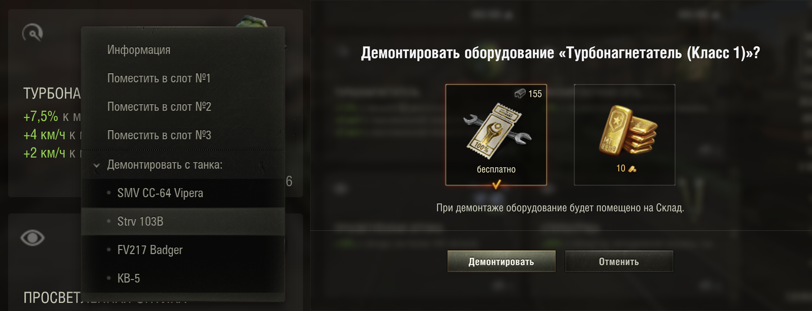

## Улучшения {#conclusion}
В результате получился рабочий мод, позволяющий демонтировать оборудование с других танков прямо из меню установки. Параллельно вы научились работать с исходным кодом игры и поняли процесс разработки.

Мод можно улучшить, например:
- Добавить опцию докупки оборудования как в оригинальном моде (искать по `ActionsFactory.BUY_MODULE`).
- Если список танков длинный, то его можно разбить на подменю по уровню техники.
- Добавить настройку мода, которая позволит автоматически демонтировать оборудование без показа диалогового окна (`ActionsFactory.doAction(ActionsFactory.REMOVE_OPT_DEVICE, vehicle, item, slotId, skipConfirm = True`).