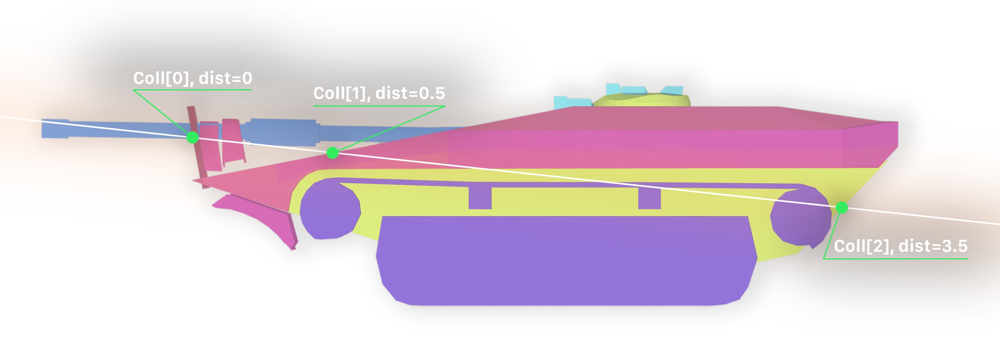
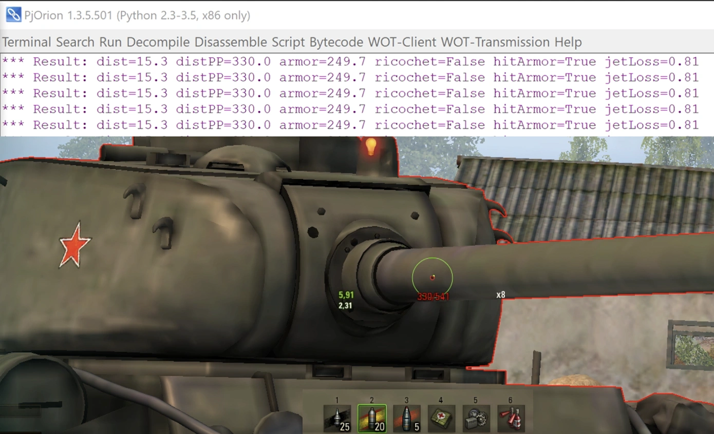

# Первый графический мод {#first-ui-mod}

В этом руководстве мы пройдём все этапы создания реального AS3-мода — в качестве примера будет повторён мод **калькулятор бронепробития**.

Этот мод повышает информативность игрового "светофора", отображая в прицеле информацию о текущем бронепробитии с учётом расстояния до цели, а также о приведённой броне танка в точке, в которую вы целитесь.


Мод является крайне полезным и не очень сложным в разработке, что делает его отличным примером для изучения.

## Идея мода {#mod-idea}

Мод должен выводить в прицеле информацию о текущем бронепробитии с учётом расстояния до цели, а также о приведённой броне танка в точке, в которую вы целитесь.

## Шаги для реализации {#implementation-steps}
- Добавить на экран интерфейс вывода информации (текстовое поле в прицеле)
- В момент перемещения прицела определять, на какую цель он наведён и сколько брони в этой точке


## Вычисление брони и пробития {#calculate-armor-penetration}

Для тестирования функции вычисления брони вам потребуется запустить тренировочную комнату. Позовите друга или воспользуйтесь [мультизапуском](/articles/multilaunch/).

В Мир Танков уже реализован механизм вычисления брони в точке прицеливания (цветовая индикация в прицеле о вероятности пробития). Нам нужно воспользоваться этим же механизмом. Реализовано это посредством класса `_CrosshairShotResults`.

В нём присутствуют функции:
- `_shouldRicochet` — проверяет, отрикошетит ли снаряд от брони
- `getShotResult` - вычисляет о вероятности пробития (низкая, средняя, высокая). В процессе определения вычисления фактическая толщина брони с учётом типа снаряда.
  - `__shotResultModernHE` – для осколочно-фугасных снарядов
  - `__shotResultDefault` – для всех остальных типов снарядов

Нам потребуется реализовать похожий механизм, но с вычислением фактической толщины брони, а не вероятности пробития.

За цветовую индикацию в прицеле отвечает класс `ShotResultIndicatorPlugin`, в нём можно подсмотреть в какой момент происходит перерасчёт брони.
```python [ShotResultIndicatorPlugin.py]
from skeletons.gui.battle_session import IBattleSessionProvider
from helpers import dependency
...
sessionProvider = dependency.descriptor(IBattleSessionProvider)

def start(self):
  ...
  ctrl = self.sessionProvider.shared.crosshair
  ctrl.onGunMarkerStateChanged += self.__onGunMarkerStateChanged

def __onGunMarkerStateChanged(self, markerType, position, direction, collision):
  ...
```

Отсюда мы видим, что необходимо подписаться на событие `onGunMarkerStateChanged` из `IBattleSessionProvider.shared.crosshair`.

### Тестирование через PjOrion {#testing-with-pjorion}
Во время тестов мы будем часто менять код обработчика события, если каждый раз подписываться заново, то будет накапливаться всё больше и больше подписок, что приведёт к множественному срабатыванию обработчика.

Чтобы переопределить обработчик, сделаем обёртку:

```python [PjOrion]
from skeletons.gui.battle_session import IBattleSessionProvider
from helpers import dependency

sessionProvider = dependency.instance(IBattleSessionProvider) # type: IBattleSessionProvider

def onGunMarkerStateChanged(markerType, hitPoint, direction, collision):
  print("onGunMarkerStateChanged", markerType, hitPoint, direction, collision)

def wrapper(*a, **k):
  onGunMarkerStateChanged(*a, **k)

sessionProvider.shared.crosshair.onGunMarkerStateChanged += wrapper
```

Запустите тренировочную комнату и в `PjOrion` выполните этот код. После этого закомментируйте строку с подпиской.
```python [PjOrion]
# sessionProvider.shared.crosshair.onGunMarkerStateChanged += wrapper
```
Теперь вы можете изменить функцию `onGunMarkerStateChanged` и выполнять её в `PjOrion`, не боясь, что будет накапливаться количество подписок.
```python [PjOrion]
def onGunMarkerStateChanged(markerType, hitPoint, direction, collision):
  print("onGunMarkerStateChanged_new", markerType, hitPoint, direction, collision)
```

Вместо старой функции теперь будет вызываться новая.

### Реализация вычислений {#calculate-penetration}

Создадим функцию `computeResult(hitPoint, direction, collision)`, в которой будут выполняться все вычисления.

```python [PjOrion]
def computeResult(hitPoint, direction, collision):
  print("computeResult", hitPoint, direction, collision)

def onGunMarkerStateChanged(markerType, hitPoint, direction, collision):
  print("onGunMarkerStateChanged_new", markerType, hitPoint, direction, collision) # [!code --]
  computeResult(hitPoint, direction, collision) # [!code ++]
```

Будем работать только с ней. Добавим базовые проверки и получим информацию о снаряде и игроке.

```python [PjOrion]
from Vehicle import Vehicle as VehicleEntity
from DestructibleEntity import DestructibleEntity

def computeResult(hitPoint, direction, collision):
  if not collision: return

  entity = collision.entity
  if not isinstance(entity, (VehicleEntity, DestructibleEntity)): return

  player = BigWorld.player()
  if player is None: return

  vDesc = player.getVehicleDescriptor()
  shell = vDesc.shot.shell
  shellKind = shell.kind
  ppDesc = vDesc.shot.piercingPower
  maxDist = vDesc.shot.maxDistance
  piercingPowerRandomization = shell.piercingPowerRandomization
  dist = (hitPoint - player.getOwnVehiclePosition()).length
```

Получим ссылку на `_CrosshairShotResults` и вызовем его методы для вычисления брони.

```python [PjOrion]
from AvatarInputHandler import gun_marker_ctrl
shotResultResolver = gun_marker_ctrl.createShotResultResolver()

def computeResult(hitPoint, direction, collision):
  ...
  # Актуальное пробитие на дистанции
  distPiercingPower = shotResultResolver._computePiercingPowerAtDist(ppDesc, dist, maxDist, 1)

  # Список всех столкновений с колиженом танка
  collisionsDetails = shotResultResolver._getAllCollisionDetails(hitPoint, direction, entity)
  if collisionsDetails is None: return
```

`collisionsDetails` это список всех `EntityCollisionData` на пути снаряда. В каждом из них есть информация о дистанции от референсной `hitPoint`, косинус угла попадания, типе брони и её толщине.



Причём в этом списке будет и входное, и выходное столкновение с бронёй танка.

Сделаем функцию, которая будет вычислять суммарную приведённую броню до первого столкновения с танком (`vehicleDamageFactor == 1`). Дополнительно, на каждом шаге будет проверяться, не отрикошетит ли снаряд от брони.

Также не забудем учесть потери кумулятивной струи в воздухе (`jetLoss`: после выхода из первого слоя брони струя начинает терять 50% пробития за каждый метр).

```python [PjOrion]
def computeTotalEffectiveArmor(hitPoint, collision, direction, shell):
  # type: (Math.Vector3, typing.Optional[EntityCollisionData], Math.Vector3, Shell) -> (float, Boolean)

  if collision is None: return (0.0, False, False, 0.0)

  entity = collision.entity
  collisionsDetails = shotResultResolver._getAllCollisionDetails(hitPoint, direction, entity) # type: typing.List[SegmentCollisionResultExt]
  if not collisionsDetails: return (0.0, False, False, 0.0)

  totalArmor = 0.0
  ignoredMaterials = set()
  isRicochet = False
  hitArmor = False
  jetStartDist = None
  jetLoss = 0.0
  jetLossPPByDist = shotResultResolver._SHELL_EXTRA_DATA[shell.kind].jetLossPPByDist # сколько теряет кумулятивная струя в воздухе на метр

  for c in collisionsDetails:
    if not shotResultResolver._CrosshairShotResults__isDestructibleComponent(entity, c.compName): break

    material = c.matInfo # type: MaterialInfo
    if material is None or material.armor is None: continue

    key = (c.compName, material.kind)
    if key in ignoredMaterials: continue

    hitAngleCos = c.hitAngleCos if material.useHitAngle else 1.0
    totalArmor += shotResultResolver._computePenetrationArmor(shell, hitAngleCos, material)

    isRicochet |= shotResultResolver._shouldRicochet(shell, hitAngleCos, material)

    if material.collideOnceOnly: ignoredMaterials.add(key)
    if material.vehicleDamageFactor:
      # вычисляем потери кумулятивной струи в воздухе ПЕРЕД основным слоем
      if jetStartDist: jetLoss = (c.dist - jetStartDist) * jetLossPPByDist
      hitArmor = True
      break

    if jetStartDist is None and jetLossPPByDist > 0.0:
      jetStartDist = c.dist + material.armor * 0.001 # точка старта за бронёй

  return (float(totalArmor), isRicochet, hitArmor, jetLoss)
```

Вызовем эту функцию из `computeResult` и выведем результат в консоль.

```python [PjOrion]
def computeResult(hitPoint, direction, collision):
  ...
  totalArmor, isRicochet, hitArmor, jetLoss = computeTotalEffectiveArmor(hitPoint, collision, direction, shell)
  print("Result: dist=%.1f distPP=%.1f armor=%.1f ricochet=%s hitArmor=%s jetLoss=%.2f" % (
    dist, distPiercingPower, totalArmor, isRicochet, hitArmor, jetLoss
  ))
```


::: details Весь код целиком
```python [PjOrion]
from AvatarInputHandler import gun_marker_ctrl
from Vehicle import Vehicle as VehicleEntity
from DestructibleEntity import DestructibleEntity

from skeletons.gui.battle_session import IBattleSessionProvider
from helpers import dependency

sessionProvider = dependency.instance(IBattleSessionProvider) # type: IBattleSessionProvider

shotResultResolver = gun_marker_ctrl.createShotResultResolver()

def computeTotalEffectiveArmor(hitPoint, collision, direction, shell):
  # type: (Math.Vector3, typing.Optional[EntityCollisionData], Math.Vector3, Shell) -> (float, Boolean)

  if collision is None: return (0.0, False)

  entity = collision.entity
  collisionsDetails = shotResultResolver._getAllCollisionDetails(hitPoint, direction, entity) # type: typing.List[SegmentCollisionResultExt]
  if not collisionsDetails: return (0.0, False)

  totalArmor = 0.0
  ignoredMaterials = set()
  isRicochet = False
  hitArmor = False
  jetStartDist = None
  jetLoss = 0.0
  jetLossPPByDist = shotResultResolver._SHELL_EXTRA_DATA[shell.kind].jetLossPPByDist # сколько теряет кумулятивная струя в воздухе на метр

  for c in collisionsDetails:
    if not shotResultResolver._CrosshairShotResults__isDestructibleComponent(entity, c.compName): break

    material = c.matInfo # type: MaterialInfo
    if material is None or material.armor is None: continue

    key = (c.compName, material.kind)
    if key in ignoredMaterials: continue

    hitAngleCos = c.hitAngleCos if material.useHitAngle else 1.0
    totalArmor += shotResultResolver._computePenetrationArmor(shell, hitAngleCos, material)

    isRicochet |= shotResultResolver._shouldRicochet(shell, hitAngleCos, material)
    hitArmor |= material.vehicleDamageFactor > 0

    if material.collideOnceOnly: ignoredMaterials.add(key)
    if material.vehicleDamageFactor:
      # вычисляем потери кумулятивной струи в воздухе ПЕРЕД основным слоем
      if jetStartDist: jetLoss = (c.dist - jetStartDist) * jetLossPPByDist
      break

    if jetStartDist is None and jetLossPPByDist > 0.0:
      jetStartDist = c.dist + material.armor * 0.001 # точка старта за бронёй

  return (float(totalArmor), isRicochet, hitArmor, jetLoss)

def computeResult(hitPoint, direction, collision):
  if not collision: return

  entity = collision.entity
  if not isinstance(entity, (VehicleEntity, DestructibleEntity)): return

  player = BigWorld.player()
  if player is None: return

  vDesc = player.getVehicleDescriptor()
  shell = vDesc.shot.shell
  shellKind = shell.kind
  ppDesc = vDesc.shot.piercingPower
  maxDist = vDesc.shot.maxDistance
  piercingPowerRandomization = shell.piercingPowerRandomization
  dist = (hitPoint - player.getOwnVehiclePosition()).length

  # Актуальное пробитие на дистанции
  distPiercingPower = shotResultResolver._computePiercingPowerAtDist(ppDesc, dist, maxDist, 1)

  # Список всех столкновений с колиженом танка
  collisionsDetails = shotResultResolver._getAllCollisionDetails(hitPoint, direction, entity)
  if collisionsDetails is None: return (distPiercingPower, None, None, None, None, None)

  totalArmor, isRicochet, hitArmor, jetLoss = computeTotalEffectiveArmor(hitPoint, collision, direction, shell)
  print("Result: dist=%.1f distPP=%.1f armor=%.1f ricochet=%s hitArmor=%s jetLoss=%.2f" % (
    dist, distPiercingPower, totalArmor, isRicochet, hitArmor, jetLoss
  ))

def onGunMarkerStateChanged(markerType, hitPoint, direction, collision):
  computeResult(hitPoint, direction, collision)

def wrapper(*a, **k):
  onGunMarkerStateChanged(*a, **k)

sessionProvider.shared.crosshair.onGunMarkerStateChanged += wrapper

```
:::

После запуска наведите прицел на танк и в консоли вы увидите вывод о пробитии, эффективной броне, рикошете, попадании по основной броне и потере кумулятивной струи.




## Добавление интерфейса {#adding-ui}
Теперь, когда у нас есть вычисления, нужно вывести результат на экран.
Будем делать на основе `my.first_mod` из обучения по [настройке AS3-окружения](../environment/as3/).

Основная идея состоит в том, чтобы подключиться к Мир Танков в момент начала боя, найти в иерархии интерфейса `BaseBattlePage` и добавить туда наше `View`, которое будет отображать информацию.

Для начала просто добавим на экран полупрозрачный прямоугольник, чтобы понять, что всё работает. Для этого создайте в вашем проекте файл `as3/src/my/first_mod/PiercingMainView.as`

```actionscript-3 [PiercingMainView.as]
package my.first_mod {
  import flash.display.Sprite;
  import flash.display.DisplayObject;
  import net.wg.infrastructure.base.AbstractView;
  import net.wg.data.constants.generated.LAYER_NAMES;
  import net.wg.gui.components.containers.MainViewContainer;
  import net.wg.gui.battle.views.BaseBattlePage;
  import net.wg.infrastructure.interfaces.IView;

  public class PiercingMainView extends AbstractView {

    private var infoBox:Sprite = new Sprite();

    public function PiercingMainView() {
      super();

      // Закрашиваем прямоугольник 150x20 полупрозрачным зеленым цветом
      infoBox.graphics.beginFill(0x00FF00, 0.5);
      infoBox.graphics.drawRect(0, 0, 150, 20);
      infoBox.graphics.endFill();

      // Двигаем на центр экрана
      infoBox.x = App.appWidth * 0.5 - infoBox.width / 2;
      infoBox.y = App.appHeight * 0.6 - infoBox.height / 2;
    }

    override protected function configUI():void {
      super.configUI();

      // Получаем основной контейнер игры
      var viewContainer:MainViewContainer = App.containerMgr.getContainer(
        LAYER_NAMES.LAYER_ORDER.indexOf(LAYER_NAMES.VIEWS)
      ) as MainViewContainer;

      // Перебираем все дочерние компоненты и ищем BaseBattlePage
      for (var i:int = 0; i < viewContainer.numChildren; i++) {
        var child:DisplayObject = viewContainer.getChildAt(i);
        if (child is BaseBattlePage) {

          // Нашли BaseBattlePage, добавляем в него наш прямоугольник
          (child as IView).addChild(infoBox);
        }
      }
    }
  }
}
```

::: warning Внимание!
Не забудьте отредактировать `as3/build.bat`, добавив строку для компиляции вашего нового файла `PiercingMainView.as` в `my.first_mod.PiercingMainView.swf`:
```bat [as3/build.bat] {8}
@echo off

rem ==== настройки ====
set "MXML_PATH=C:\apache-royale"

rem ==== компиляция ====
set "MXMLC=%MXML_PATH%\royale-asjs\bin\mxmlc"

call "%MXMLC%" -load-config+=build-config.xml --output=bin/my.first_mod.HelloWorldWindow.swf src/my/first_mod/HelloWorldWindow.as
call "%MXMLC%" -load-config+=build-config.xml --output=bin/my.first_mod.PiercingMainView.swf src/my/first_mod/PiercingMainView.as
```
:::

После компиляции в `as3/bin` появится файл `my.first_mod.PiercingMainView.swf`.

Теперь создадим контролирующий Python-скрипт `.../my_first_mod/PiercingMainView.py`, который будет связан с `SWF`.

```python [my_first_mod/PiercingMainView.py]:
from frameworks.wulf import WindowLayer
from gui.Scaleform.framework.entities.View import View
from gui.Scaleform.framework import g_entitiesFactories, ScopeTemplates, ViewSettings
from gui.shared import events, EVENT_BUS_SCOPE, g_eventBus

MY_FIRST_MOD_PIERCING_MAIN_VIEW = "MY_FIRST_MOD_PIERCING_MAIN_VIEW"

class PiercingMainView(View):
  def __init__(self, *args, **kwargs):
    super(PiercingMainView, self).__init__(*args, **kwargs)

def setup():
  settingsViewSettings = ViewSettings(
    MY_FIRST_MOD_PIERCING_MAIN_VIEW,
    PiercingMainView,
    "my.first_mod.PiercingMainView.swf",
    WindowLayer.TOP_WINDOW,
    None,
    ScopeTemplates.VIEW_SCOPE,
  )
  g_entitiesFactories.addSettings(settingsViewSettings)

  def onAppInitialized(event):
    if event.ns == APP_NAME_SPACE.SF_BATTLE:
      app = ServicesLocator.appLoader.getApp(event.ns) # type: AppEntry
      app.loadView(SFViewLoadParams(MY_FIRST_MOD_PIERCING_MAIN_VIEW))

  g_eventBus.addListener(events.AppLifeCycleEvent.INITIALIZED, onAppInitialized, EVENT_BUS_SCOPE.GLOBAL)
```

В функции `setup()` мы подписываемся на событие инициализации Scaleform‑приложения, проверяем, что загруженное приложение — боевой интерфейс (`SF_BATTLE`), и загружаем наш `PiercingMainView.swf`.

Теперь в точке входа мода `mod_myFirstMod.py` нужно вызвать `setup()`:

```python [mod_myFirstMod.py]
from .my_first_mod.PiercingMainView import setup as setupPiercingMainView

MOD_VERSION = '{{VERSION}}'

def init():
  setupPiercingMainView()
```

Теперь можно скомпилировать мод и запустить Мир Танков.

::: danger Внимание!
Проверяйте моды только в тренировочных комнатах, на тестовых серверах или в режиме "Полигон". Ошибки в модах могут привести к сбоям Мир Танков.
:::

::: details Результат

:::

### Вывод пробития в интерфейс {#display-penetration-in-ui}
Теперь, когда у нас есть свой контейнер (зелёный прямоугольник) в общем интерфейсе боя, можно дочерним элементом добавить текстовое поле и выводить туда информацию о броне и пробитии.

Будем выводить в формате `{актуальное пробитие}/{фактическая броня}`. Цвет текста будет зависеть от вероятности пробития:
- Серый – на пути снаряда нет брони
- Фиолетовый – рикошет
- Ярко-красный – гарантированное непробитие
- Ярко-зелёный – гарантированное пробитие
- Градиент от мягко красного к мягко зелёному – вероятность пробития от 0% до 100%

Значение текстового поля и его цвет будут передаваться из контролирующего Python-скрипта в AS3 `PiercingMainView`.

#### Изменение AS3 кода {#as3-code-changes}
В `PiercingMainView.as` добавим инициализацию текстового поля и метод для обновления текста и его цвета.

Для текстового поля используем `flash.text.TextField`. Шрифт, размер, цвет и выравнивание настраиваются через `TextFormat`, а тень – через `DropShadowFilter`.

```actionscript-3 [PiercingMainView.as]
package my.first_mod {
  import flash.display.Sprite;
  import flash.display.DisplayObject;
  import net.wg.infrastructure.base.AbstractView;
  import net.wg.data.constants.generated.LAYER_NAMES;
  import net.wg.gui.components.containers.MainViewContainer;
  import net.wg.gui.battle.views.BaseBattlePage;
  import net.wg.infrastructure.interfaces.IView;
  import flash.text.TextField;
  import flash.text.TextFormat;
  import flash.filters.DropShadowFilter;
  import flash.text.TextFormatAlign;
  import flash.text.AntiAliasType;

  public class PiercingMainView extends AbstractView {

    private var infoBox:Sprite = new Sprite();
    private var infoText:TextField = new TextField();

    public function PiercingMainView() {
      super();

      // Закрашиваем прямоугольник 150x20 полупрозрачным зеленым цветом
      infoBox.graphics.beginFill(0, 0);
      infoBox.graphics.drawRect(0, 0, 150, 20);
      infoBox.graphics.endFill();

      // Двигаем на центр экрана
      infoBox.x = App.appWidth * 0.5 - infoBox.width / 2;
      infoBox.y = App.appHeight * 0.55;

      // Настраиваем текст
      var format:TextFormat = new TextFormat();
      format.size = 18;
      format.color = 0xFFFFFF;
      format.font = "$FieldFont";
      format.align = TextFormatAlign.CENTER;

      var filter:DropShadowFilter = new DropShadowFilter();
      filter.distance = 0;
      filter.angle = 0;
      filter.color = 0x000000;
      filter.alpha = 0.9;
      filter.blurX = filter.blurY = 2;
      filter.strength = 2;
      filter.quality = 10;

      infoText.selectable = false;
      infoText.mouseEnabled = false;
      infoText.antiAliasType = flash.text.AntiAliasType.ADVANCED;
      infoText.defaultTextFormat = format;
      infoText.setTextFormat(format);
      infoText.filters = [filter];

      infoBox.addChild(infoText);
      infoText.width = infoBox.width;
      infoText.height = infoBox.height;
      infoText.x = 0;
      infoText.y = 0;
    }
  }
}
```

Если во время боя игрок изменит разрешение экрана, то наш прямоугольник и текст останутся на старых координатах. Чтобы этого избежать, нужно подписаться на событие изменения размера окна и обновлять позицию.

```actionscript-3 [PiercingMainView.as]
package my.first_mod {
  ...
  import flash.events.Event; // [!code ++]

  public class PiercingMainView extends AbstractView {
    public function PiercingMainView() {
      super();
      ...
      App.stage.addEventListener(Event.RESIZE, onAppResize);  // [!code ++]
    }

    private function onAppResize(event:Event):void {  // [!code ++]
      infoBox.x = App.appWidth * 0.5 - infoBox.width / 2;  // [!code ++]
      infoBox.y = App.appHeight * 0.55;  // [!code ++]
    } // [!code ++]
  }
}
```

Далее нужно объявить метод, который будет вызываться из Python-кода для обновления текста и его цвета.

```actionscript-3 [PiercingMainView.as]
package my.first_mod {
  ...
  public class PiercingMainView extends AbstractView {
    ...
    public function as_setText(value:String, color:uint):void {  // [!code ++]
      infoText.text = value;  // [!code ++]
      infoText.textColor = color;  // [!code ++]
    }  // [!code ++]
  }
}
```

::: details Весь код `PiercingMainView.as` целиком
```actionscript-3
package my.first_mod {
  import flash.display.Sprite;
  import flash.display.DisplayObject;
  import net.wg.infrastructure.base.AbstractView;
  import net.wg.data.constants.generated.LAYER_NAMES;
  import net.wg.gui.components.containers.MainViewContainer;
  import net.wg.gui.battle.views.BaseBattlePage;
  import net.wg.infrastructure.interfaces.IView;
  import flash.text.TextField;
  import flash.text.TextFormat;
  import flash.filters.DropShadowFilter;
  import flash.text.TextFormatAlign;
  import flash.text.AntiAliasType;
  import flash.events.Event;

  public class PiercingMainView extends AbstractView {

    private var infoBox:Sprite = new Sprite();
    private var infoText:TextField = new TextField();

    public function PiercingMainView() {
      super();

      // Закрашиваем прямоугольник 150x20 полупрозрачным зеленым цветом
      infoBox.graphics.beginFill(0, 0);
      infoBox.graphics.drawRect(0, 0, 150, 20);
      infoBox.graphics.endFill();

      // Двигаем на центр экрана
      infoBox.x = App.appWidth * 0.5 - infoBox.width / 2;
      infoBox.y = App.appHeight * 0.55;

      // Настраиваем текст
      var format:TextFormat = new TextFormat();
      format.size = 18;
      format.color = 0xFFFFFF;
      format.font = "$FieldFont";
      format.align = TextFormatAlign.CENTER;

      var filter:DropShadowFilter = new DropShadowFilter();
      filter.distance = 0;
      filter.angle = 0;
      filter.color = 0x000000;
      filter.alpha = 0.9;
      filter.blurX = filter.blurY = 2;
      filter.strength = 2;
      filter.quality = 10;

      infoText.selectable = false;
      infoText.mouseEnabled = false;
      infoText.antiAliasType = flash.text.AntiAliasType.ADVANCED;
      infoText.defaultTextFormat = format;
      infoText.setTextFormat(format);
      infoText.filters = [filter];

      infoBox.addChild(infoText);
      infoText.width = infoBox.width;
      infoText.height = infoBox.height;
      infoText.x = 0;
      infoText.y = 0;

      App.instance.addEventListener(Event.RESIZE, onAppResize);

    }

    override protected function configUI():void {
      super.configUI();

      // Получаем основной контейнер игры
      var viewContainer:MainViewContainer = App.containerMgr.getContainer(
          LAYER_NAMES.LAYER_ORDER.indexOf(LAYER_NAMES.VIEWS)
        ) as MainViewContainer;

      // Перебираем все дочерние компоненты и ищем BaseBattlePage
      for (var i:int = 0; i < viewContainer.numChildren; i++) {
        var child:DisplayObject = viewContainer.getChildAt(i);
        if (child is BaseBattlePage) {

          // Нашли BaseBattlePage, добавляем в него наш прямоугольник
          (child as IView).addChild(infoBox);
        }
      }
    }

    public function as_setText(value:String, color:uint):void {
      infoText.text = value;
      infoText.textColor = color;
    }

    private function onAppResize(event:Event):void {
      infoBox.x = App.appWidth * 0.5 - infoBox.width / 2;
      infoBox.y = App.appHeight * 0.55;
    }
  }
}
```
:::

#### Изменение Python кода {#python-code-changes}
В `my_first_mod/PiercingMainView.py` добавим функцию обёртку над вызовом AS3 метода `as_setText`.

```python [my_first_mod/PiercingMainView.py]
class PiercingMainView(View):
  ...
  def as_setText(self, text, color):  # [!code ++]
    self.flashObject.as_setText(text, color)  # [!code ++]
```

Объявим функцию для вычисления вероятности пробития (с учётом Гауссового распределения рандомизации пробития)

```python [my_first_mod/PiercingMainView.py]
def penetrationProbability(piercing, totalArmor, piercingPowerRandomization):
  P0 = float(piercing)
  A  = float(totalArmor)
  x  = float(piercingPowerRandomization)

  # Границы клампа
  L = P0 * (1.0 - x)
  U = P0 * (1.0 + x)

  k = 3
  sigma = (x * P0) / k
  mu = P0

  # Быстрые случаи
  if A <= L: return 1.0
  if A >= U: return 0.0

  # Стандартная нормальная CDF через erf
  def Phi(z): return 0.5 * (1.0 + math.erf(z / math.sqrt(2.0)))

  zL = (L - mu) / sigma
  zU = (U - mu) / sigma
  zA = (A - mu) / sigma

  denom = Phi(zU) - Phi(zL)
  if denom <= 1e-15: return 1.0 if A <= mu else 0.0

  p = (Phi(zU) - Phi(zA)) / denom

  # Численная обрезка
  if p < 0.0: p = 0.0
  if p > 1.0: p = 1.0
  return p
```

Объявим константы цветов

```python [my_first_mod/PiercingMainView.py]
RICOCHET_COLOR = 0xa85dfc
NOT_ARMOR_COLOR = 0xbbbbbb
GREEN_COLOR = 0x00FF00
RED_COLOR = 0xFF0000
SOFT_GREEN_COLOR = 0x48f32c
SOFT_RED_COLOR = 0xf32c2c
```

Перенесём в этот класс функции `computeTotalEffectiveArmor`, `computeResult` и `onGunMarkerStateChanged` из наших тестов в `PjOrion`.

```python [my_first_mod/PiercingMainView.py]
...
class PiercingMainView(View):
  ...

  sessionProvider = dependency.descriptor(IBattleSessionProvider) # type: IBattleSessionProvider

  def __init__(self, *args, **kwargs):
    super(PiercingMainView, self).__init__(*args, **kwargs)
    self.shotResultResolver = gun_marker_ctrl.createShotResultResolver() # type: gun_marker_ctrl._CrosshairShotResults

  def computeTotalEffectiveArmor(self, hitPoint, collision, direction, shell):
    ...

  def computeResult(self, hitPoint, direction, collision):
    ...
    print("Result: dist=%.1f distPP=%.1f armor=%.1f ricochet=%s hitArmor=%s jetLoss=%.2f" % (  # [!code --]
      dist, distPiercingPower, totalArmor, isRicochet, hitArmor, jetLoss  # [!code --]
    ))  # [!code --]

    return (distPiercingPower, totalArmor, isRicochet, hitArmor, jetLoss, piercingPowerRandomization)  # [!code ++]

```

Подпишемся на событие `onGunMarkerStateChanged` в `__init__` и будем обновлять текст в этом методе

```python [my_first_mod/PiercingMainView.py]
...
class PiercingMainView(View):
  ...
  def __init__(self, *args, **kwargs):
    ...
    self.sessionProvider.shared.crosshair.onGunMarkerStateChanged += self.onGunMarkerStateChanged

  def onGunMarkerStateChanged(self, markerType, hitPoint, direction, collision):
    result = self.computeResult(hitPoint, direction, collision)
    if result is None: return self.as_setText('', 0)

    piercing, totalArmor, isRicochet, hitArmor, jetLoss, piercingPowerRandomization = result

    if piercing is None: return self.as_setText('', 0)
    if totalArmor is None: return self.as_setText('%d/-' % round(piercing), GREEN_COLOR)

    realPiercing = piercing * max(0, (1 - jetLoss))

    targetColor = GREEN_COLOR
    if isRicochet: targetColor = RICOCHET_COLOR
    elif not hitArmor: targetColor = NOT_ARMOR_COLOR
    elif realPiercing <= 0.0: targetColor = RED_COLOR
    elif totalArmor <= 0.0: targetColor = GREEN_COLOR
    else:
      prob = penetrationProbability(realPiercing, totalArmor, piercingPowerRandomization)
      if prob <= 0: targetColor = RED_COLOR
      elif prob >= 1: targetColor = GREEN_COLOR
      # Преобразование цвета от SOFT_RED_COLOR к SOFT_GREEN_COLOR в зависимости от вероятности пробития
      else: targetColor = lerpColor(
        SOFT_RED_COLOR,
        SOFT_GREEN_COLOR,
        prob,
        mid_L_shift=+10.0,
        mid_C_boost=1.15
      )

      self.as_setText('%d/%d' % (round(realPiercing), round(totalArmor)), targetColor)

```

Для работы плавного перехода цвета необходима функция `lerpColor`. Скачайте [файл `color.py`](/download/first-ui-mod/color.py){target=_blank download} и поместите его в папку `my_first_mod`. В этом файле объявлены функции для работы с цветами.

Импортируйте его в `PiercingMainView.py`:

```python [my_first_mod/PiercingMainView.py]
from .color import lerpColor
...
```

::: details Весь код `my_first_mod/PiercingMainView.py` целиком
```python [my_first_mod/PiercingMainView.py]
import typing
import math
from ProjectileMover import EntityCollisionData
from frameworks.wulf import WindowLayer
from gui.Scaleform.framework.entities.View import View
from gui.Scaleform.framework import g_entitiesFactories, ScopeTemplates, ViewSettings
from gui.shared import events, EVENT_BUS_SCOPE, g_eventBus
from gui.app_loader.settings import APP_NAME_SPACE
from gui.Scaleform.framework.application import AppEntry
from gui.Scaleform.framework.managers.loaders import SFViewLoadParams
from gui.shared.personality import ServicesLocator
from items.components.shared_components import MaterialInfo
from AvatarInputHandler import gun_marker_ctrl
from Vehicle import Vehicle as VehicleEntity
from DestructibleEntity import DestructibleEntity
from skeletons.gui.battle_session import IBattleSessionProvider
from helpers import dependency

from .color import lerpColor

import BigWorld


MY_FIRST_MOD_PIERCING_MAIN_VIEW = "MY_FIRST_MOD_PIERCING_MAIN_VIEW"

RICOCHET_COLOR = 0xa85dfc
NOT_ARMOR_COLOR = 0xbbbbbb
GREEN_COLOR = 0x00FF00
SOFT_GREEN_COLOR = 0x48f32c
RED_COLOR = 0xFF0000
SOFT_RED_COLOR = 0xf32c2c

def penetrationProbability(piercing, totalArmor, piercingPowerRandomization):
  P0 = float(piercing)
  A  = float(totalArmor)
  x  = float(piercingPowerRandomization)

  # Границы клампа
  L = P0 * (1.0 - x)
  U = P0 * (1.0 + x)

  k = 3
  sigma = (x * P0) / k
  mu = P0

  # Быстрые случаи
  if A <= L: return 1.0
  if A >= U: return 0.0

  # Стандартная нормальная CDF через erf
  def Phi(z): return 0.5 * (1.0 + math.erf(z / math.sqrt(2.0)))

  zL = (L - mu) / sigma
  zU = (U - mu) / sigma
  zA = (A - mu) / sigma

  denom = Phi(zU) - Phi(zL)
  if denom <= 1e-15: return 1.0 if A <= mu else 0.0

  p = (Phi(zU) - Phi(zA)) / denom

  # Численная обрезка
  if p < 0.0: p = 0.0
  if p > 1.0: p = 1.0
  return p

class PiercingMainView(View):

  sessionProvider = dependency.descriptor(IBattleSessionProvider) # type: IBattleSessionProvider

  def __init__(self, *args, **kwargs):
    super(PiercingMainView, self).__init__(*args, **kwargs)
    self.shotResultResolver = gun_marker_ctrl.createShotResultResolver() # type: gun_marker_ctrl._CrosshairShotResults
    self.sessionProvider.shared.crosshair.onGunMarkerStateChanged += self.onGunMarkerStateChanged

  def computeTotalEffectiveArmor(self, hitPoint, collision, direction, shell):
    # type: (Math.Vector3, typing.Optional[EntityCollisionData], Math.Vector3, Shell) -> (float, Boolean)

    if collision is None: return (0.0, False)

    entity = collision.entity
    collisionsDetails = self.shotResultResolver._getAllCollisionDetails(hitPoint, direction, entity) # type: typing.List[SegmentCollisionResultExt]
    if not collisionsDetails: return (0.0, False)

    totalArmor = 0.0
    ignoredMaterials = set()
    isRicochet = False
    hitArmor = False
    jetStartDist = None
    jetLoss = 0.0
    jetLossPPByDist = self.shotResultResolver._SHELL_EXTRA_DATA[shell.kind].jetLossPPByDist # сколько теряет кумулятивная струя в воздухе на метр

    for c in collisionsDetails:
      if not self.shotResultResolver._CrosshairShotResults__isDestructibleComponent(entity, c.compName): break

      material = c.matInfo # type: MaterialInfo
      if material is None or material.armor is None: continue

      key = (c.compName, material.kind)
      if key in ignoredMaterials: continue

      hitAngleCos = c.hitAngleCos if material.useHitAngle else 1.0
      totalArmor += self.shotResultResolver._computePenetrationArmor(shell, hitAngleCos, material)

      isRicochet |= self.shotResultResolver._shouldRicochet(shell, hitAngleCos, material)
      hitArmor |= material.vehicleDamageFactor > 0

      if material.collideOnceOnly: ignoredMaterials.add(key)
      if material.vehicleDamageFactor:
        # вычисляем потери кумулятивной струи в воздухе ПЕРЕД основным слоем
        if jetStartDist: jetLoss = (c.dist - jetStartDist) * jetLossPPByDist
        break

      if jetStartDist is None and jetLossPPByDist > 0.0:
        jetStartDist = c.dist + material.armor * 0.001 # точка старта за бронёй

    return (float(totalArmor), isRicochet, hitArmor, jetLoss)

  def computeResult(self, hitPoint, direction, collision):
    if not collision: return None

    entity = collision.entity
    if not isinstance(entity, (VehicleEntity, DestructibleEntity)): return None

    player = BigWorld.player()
    if player is None: return None

    vDesc = player.getVehicleDescriptor()
    shell = vDesc.shot.shell
    ppDesc = vDesc.shot.piercingPower
    maxDist = vDesc.shot.maxDistance
    piercingPowerRandomization = shell.piercingPowerRandomization
    dist = (hitPoint - player.getOwnVehiclePosition()).length


    # Актуальное пробитие на дистанции
    distPiercingPower = self.shotResultResolver._computePiercingPowerAtDist(ppDesc, dist, maxDist, 1)

    # Список всех столкновений с колиженом танка
    collisionsDetails = self.shotResultResolver._getAllCollisionDetails(hitPoint, direction, entity)
    if collisionsDetails is None: return (distPiercingPower, None, None, None, None, None)

    totalArmor, isRicochet, hitArmor, jetLoss = self.computeTotalEffectiveArmor(hitPoint, collision, direction, shell)

    return (distPiercingPower, totalArmor, isRicochet, hitArmor, jetLoss, piercingPowerRandomization)

  def onGunMarkerStateChanged(self, markerType, hitPoint, direction, collision):
    result = self.computeResult(hitPoint, direction, collision)
    if result is None: return self.as_setText('', 0)

    piercing, totalArmor, isRicochet, hitArmor, jetLoss, piercingPowerRandomization = result

    if piercing is None: return self.as_setText('', 0)
    if totalArmor is None: return self.as_setText('%d/-' % round(piercing), GREEN_COLOR)

    realPiercing = piercing * max(0, (1 - jetLoss))

    targetColor = GREEN_COLOR
    if isRicochet: targetColor = RICOCHET_COLOR
    elif not hitArmor: targetColor = NOT_ARMOR_COLOR
    elif realPiercing <= 0.0: targetColor = RED_COLOR
    elif totalArmor <= 0.0: targetColor = GREEN_COLOR
    else:
      prob = penetrationProbability(realPiercing, totalArmor, piercingPowerRandomization)
      if prob <= 0: targetColor = RED_COLOR
      elif prob >= 1: targetColor = GREEN_COLOR
      else: targetColor = lerpColor(SOFT_RED_COLOR, SOFT_GREEN_COLOR, prob, mid_L_shift=+10.0, mid_C_boost=1.15)

    self.as_setText('%d/%d' % (round(realPiercing), round(totalArmor)), targetColor)

  def as_setText(self, text, color):
    self.flashObject.as_setText(text, color)

def setup():
  settingsViewSettings = ViewSettings(
    MY_FIRST_MOD_PIERCING_MAIN_VIEW,
    PiercingMainView,
    "my.first_mod.PiercingMainView.swf",
    WindowLayer.WINDOW,
    None,
    ScopeTemplates.DEFAULT_SCOPE,
  )
  g_entitiesFactories.addSettings(settingsViewSettings)

  def onAppInitialized(event):
    if event.ns == APP_NAME_SPACE.SF_BATTLE:
      app = ServicesLocator.appLoader.getApp(event.ns) # type: AppEntry
      app.loadView(SFViewLoadParams(MY_FIRST_MOD_PIERCING_MAIN_VIEW))

  g_eventBus.addListener(events.AppLifeCycleEvent.INITIALIZED, onAppInitialized, EVENT_BUS_SCOPE.GLOBAL)
```
:::

## Результат
Готово — теперь можно скомпилировать мод и попробовать его в Мир Танков.

<video autoplay loop playsinline><source src="./assets/result.webm" type="video/webm"></source></video>

## Улучшения
Этот мод можно улучшить следующими способами:
- Отключить отображение пробития при наведении на союзников и трупы (проверять по `isinstance(entity, Vehicle)`, `entity.isAlive()`, `entity.health`)
- Для БОПСов отображать "глубину" танка (с помощью `collisionsDetails[x].dist`)
- Сделать отображение в виде процента вероятности пробить (`prob = penetrationProbability...`)
- Сделать перетаскивание по экрану
