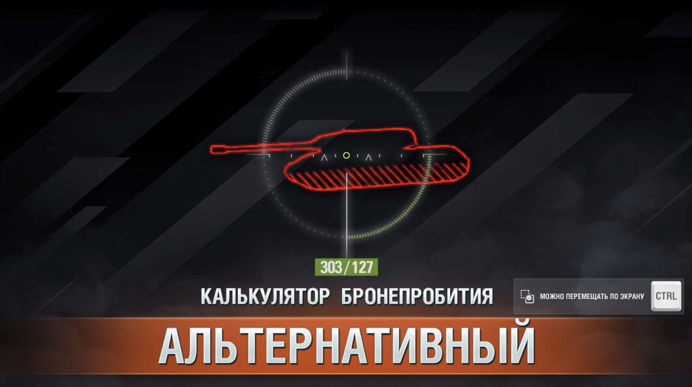

# Первый графический мод {#first-ui-mod}

В этом руководстве мы пройдём все этапы создания реального AS3-мода, в качестве примера, будет повторён мод **калькулятор бронепробития**.

Этот мод повышает информативность игрового "светофора", отображая в прицеле информацию о текущем бронепробитии с учётом расстояния до цели, а также о приведённой броне танка, в точке, в которую вы целитесь.



Мод является крайне полезным и не очень сложным в разработке, что делает его отличным примером для изучения.

## Идея мода {#mod-idea}

Мод должен выводить в прицеле информацию о текущем бронепробитии с учётом расстояния до цели, а также о приведённой броне танка, в точке, в которую вы целитесь.

## Шаги для реализации {#implementation-steps}
- Добавить на экран интерфейс вывода информации (текстовое поле в прицеле)
- В момент перемещения прицела, определять, на какую цель он наведен и сколько брони в этой точке


## Добавление интерфейса {#adding-ui}
Будем делать на основе my.first_mod из обучения по [настройке AS3 окружения](../environment/as3/).

Основная идея состоит в том, чтоб подключится к игре в момент начала боя, найти в иерархии интерфейса `BaseBattlePage` и добавить туда наше `View` которое будет отображать информацию.

Дня начала просто добавим на экран полупрозрачный прямоугольник, чтоб понять, что всё работает. Для этого создайте в вашем проекте файл `as3/src/my/first_mod/PiercingMainView.as`

```actionscript-3 [PiercingMainView.as]
package my.first_mod {
  import flash.display.Sprite;
  import flash.display.DisplayObject;
  import net.wg.infrastructure.base.AbstractView;
  import net.wg.data.constants.generated.LAYER_NAMES;
  import net.wg.gui.components.containers.MainViewContainer;
  import net.wg.gui.battle.views.BaseBattlePage;
  import net.wg.infrastructure.interfaces.IView;

  public class PiercingMainView extends AbstractView {

    private var infoBox:Sprite = new Sprite();

    public function PiercingMainView() {
      super();

      // Закрашиваем прямоугольник 150x20 полупрозрачным зеленым цветом
      infoBox.graphics.beginFill(0x00FF00, 0.5);
      infoBox.graphics.drawRect(0, 0, 150, 20);
      infoBox.graphics.endFill();

      // Двигаем на центр экрана
      infoBox.x = App.appWidth * 0.5 - infoBox.width / 2;
      infoBox.y = App.appHeight * 0.6 - infoBox.height / 2;
    }

    override protected function configUI():void {
      super.configUI();

      // Получаем основной контейнер игры
      var viewContainer:MainViewContainer = App.containerMgr.getContainer(
        LAYER_NAMES.LAYER_ORDER.indexOf(LAYER_NAMES.VIEWS)
      ) as MainViewContainer;

      // Перебираем все дочерние компоненты и ищем BaseBattlePage
      for (var i:int = 0; i < viewContainer.numChildren; i++) {
        var child:DisplayObject = viewContainer.getChildAt(i);
        if (child is BaseBattlePage) {

          // Нашли BaseBattlePage, добавляем в него наш прямоугольник
          (child as IView).addChild(infoBox);
        }
      }
    }
  }
}
```

::: warning Внимание!
Не забудьте **добавить** в `as3/build.bat` строку для компиляции вашего нового файла `PiercingMainView.as`:
```bat [as3/build.bat] {8}
@echo off

rem ==== настройки ====
set "MXML_PATH=C:\apache-royale"

rem ==== компиляция ====
set "MXMLC=%MXML_PATH%\royale-asjs\bin\mxmlc"

call "%MXMLC%" -load-config+=build-config.xml --output=bin/my.first_mod.HelloWorldWindow.swf src/my/first_mod/HelloWorldWindow.as
call "%MXMLC%" -load-config+=build-config.xml --output=bin/my.first_mod.PiercingMainView.swf src/my/first_mod/PiercingMainView.as
```
:::

После компиляции, в `as3/bin` появится файл `my.first_mod.PiercingMainView.swf`.

Теперь создадим контролирующий Python скрипт `.../my_first_mod/PiercingMainView.py`, который будет связан с `SWF`.

```python [my_first_mod/PiercingMainView.py]:
from frameworks.wulf import WindowLayer
from gui.Scaleform.framework.entities.View import View
from gui.Scaleform.framework import g_entitiesFactories, ScopeTemplates, ViewSettings
from gui.shared import events, EVENT_BUS_SCOPE, g_eventBus

MY_FIRST_MOD_PIERCING_MAIN_VIEW = "MY_FIRST_MOD_PIERCING_MAIN_VIEW"

class PiercingMainView(View):
  def __init__(self, *args, **kwargs):
    super(PiercingMainView, self).__init__(*args, **kwargs)

def setup():
  settingsViewSettings = ViewSettings(
    MY_FIRST_MOD_PIERCING_MAIN_VIEW,
    PiercingMainView,
    "my.first_mod.PiercingMainView.swf",
    WindowLayer.TOP_WINDOW,
    None,
    ScopeTemplates.VIEW_SCOPE,
  )
  g_entitiesFactories.addSettings(settingsViewSettings)

  def onAppInitialized(event):
    if event.ns == APP_NAME_SPACE.SF_BATTLE:
      app = ServicesLocator.appLoader.getApp(event.ns) # type: AppEntry
      app.loadView(SFViewLoadParams(MY_FIRST_MOD_PIERCING_MAIN_VIEW))

  g_eventBus.addListener(events.AppLifeCycleEvent.INITIALIZED, onAppInitialized, EVENT_BUS_SCOPE.GLOBAL)
```

В функции `setup()` мы подписываемся на событие инициализации Scaleform приложения, проверяем, что загруженное приложение это боевой интерфейс (`SF_BATTLE`) и загружаем наш `PiercingMainView.swf`.

Теперь в точке входа мода `mod_myFirstMod.py` нужно вызвать `setup()`:

```python [mod_myFirstMod.py]
from .my_first_mod.PiercingMainView import setup as setupPiercingMainView

MOD_VERSION = '{{VERSION}}'

def init():
  setupPiercingMainView()
```

Теперь можно скомпилировать мод и запустить игру.

::: danger Внимание!
Проверяйте моды только в тренировочных комнатах, на тестовых серверах или в режиме "Полигон". Ошибки в модах могут привести к сбоям игры.
:::

::: details Результат

:::

