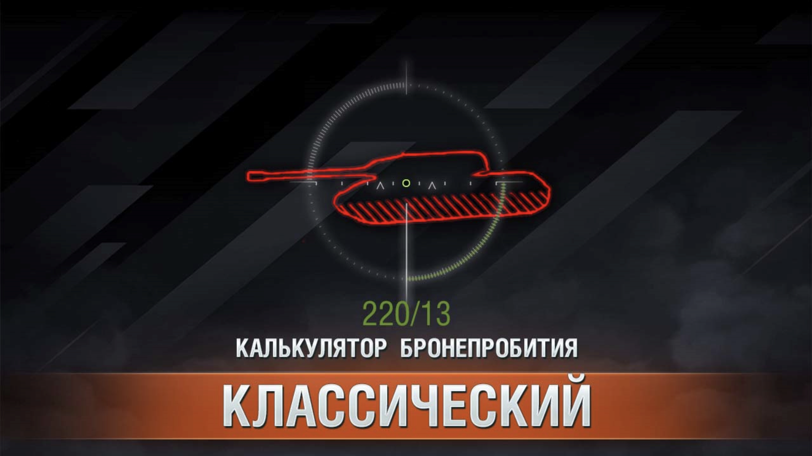

# Первый графический мод {#first-ui-mod}

В этом руководстве мы пройдём все этапы создания реального AS3-мода, в качестве примера, будет повторён мод **калькулятор бронепробития**.

Этот мод повышает информативность игрового "светофора", отображая в прицеле информацию о текущем бронепробитии с учётом расстояния до цели, а также о приведённой броне танка, в точке, в которую вы целитесь.



Мод является крайне полезным и не очень сложным в разработке, что делает его отличным примером для изучения.

## Идея мода {#mod-idea}

Мод должен выводить в прицеле информацию о текущем бронепробитии с учётом расстояния до цели, а также о приведённой броне танка, в точке, в которую вы целитесь.

## Шаги для реализации {#implementation-steps}
- Добавить на экран интерфейс вывода информации (текстовое поле в прицеле)
- В момент перемещения прицела, определять, на какую цель он наведен и сколько брони в этой точке


## Добавление интерфейса {#adding-ui}
Будем делать на основе my.first_mod из обучения по [настройке AS3 окружения](../environment/as3/).

Основная идея состоит в том, чтоб подключится к игре в момент начала боя, найти в иерархии интерфейса `BaseBattlePage` и добавить туда наше `View` которое будет отображать информацию.

Дня начала просто добавим на экран полупрозрачный прямоугольник, чтоб понять, что всё работает. Для этого создайте в вашем проекте файл `as3/src/my/first_mod/PiercingMainView.as`

```actionscript-3 [PiercingMainView.as]
package my.first_mod {
  import flash.display.Sprite;
  import flash.display.DisplayObject;
  import net.wg.infrastructure.base.AbstractView;
  import net.wg.data.constants.generated.LAYER_NAMES;
  import net.wg.gui.components.containers.MainViewContainer;
  import net.wg.gui.battle.views.BaseBattlePage;
  import net.wg.infrastructure.interfaces.IView;

  public class PiercingMainView extends AbstractView {

    private var infoBox:Sprite = new Sprite();

    public function PiercingMainView() {
      super();

      // Закрашиваем прямоугольник 150x20 полупрозрачным зеленым цветом
      infoBox.graphics.beginFill(0x00FF00, 0.5);
      infoBox.graphics.drawRect(0, 0, 150, 20);
      infoBox.graphics.endFill();

      // Двигаем на центр экрана
      infoBox.x = App.appWidth * 0.5 - infoBox.width / 2;
      infoBox.y = App.appHeight * 0.6 - infoBox.height / 2;
    }

    override protected function configUI():void {
      super.configUI();

      // Получаем основной контейнер игры
      var viewContainer:MainViewContainer = App.containerMgr.getContainer(
        LAYER_NAMES.LAYER_ORDER.indexOf(LAYER_NAMES.VIEWS)
      ) as MainViewContainer;

      // Перебираем все дочерние компоненты и ищем BaseBattlePage
      for (var i:int = 0; i < viewContainer.numChildren; i++) {
        var child:DisplayObject = viewContainer.getChildAt(i);
        if (child is BaseBattlePage) {

          // Нашли BaseBattlePage, добавляем в него наш прямоугольник
          (child as IView).addChild(infoBox);
        }
      }
    }
  }
}
```

::: warning Внимание!
Не забудьте **добавить** в `as3/build.bat` строку для компиляции вашего нового файла `PiercingMainView.as`:
```bat [as3/build.bat] {8}
@echo off

rem ==== настройки ====
set "MXML_PATH=C:\apache-royale"

rem ==== компиляция ====
set "MXMLC=%MXML_PATH%\royale-asjs\bin\mxmlc"

call "%MXMLC%" -load-config+=build-config.xml --output=bin/my.first_mod.HelloWorldWindow.swf src/my/first_mod/HelloWorldWindow.as
call "%MXMLC%" -load-config+=build-config.xml --output=bin/my.first_mod.PiercingMainView.swf src/my/first_mod/PiercingMainView.as
```
:::

После компиляции, в `as3/bin` появится файл `my.first_mod.PiercingMainView.swf`.

Теперь создадим контролирующий Python скрипт `.../my_first_mod/PiercingMainView.py`, который будет связан с `SWF`.

```python [my_first_mod/PiercingMainView.py]:
from frameworks.wulf import WindowLayer
from gui.Scaleform.framework.entities.View import View
from gui.Scaleform.framework import g_entitiesFactories, ScopeTemplates, ViewSettings
from gui.shared import events, EVENT_BUS_SCOPE, g_eventBus

MY_FIRST_MOD_PIERCING_MAIN_VIEW = "MY_FIRST_MOD_PIERCING_MAIN_VIEW"

class PiercingMainView(View):
  def __init__(self, *args, **kwargs):
    super(PiercingMainView, self).__init__(*args, **kwargs)

def setup():
  settingsViewSettings = ViewSettings(
    MY_FIRST_MOD_PIERCING_MAIN_VIEW,
    PiercingMainView,
    "my.first_mod.PiercingMainView.swf",
    WindowLayer.TOP_WINDOW,
    None,
    ScopeTemplates.VIEW_SCOPE,
  )
  g_entitiesFactories.addSettings(settingsViewSettings)

  def onAppInitialized(event):
    if event.ns == APP_NAME_SPACE.SF_BATTLE:
      app = ServicesLocator.appLoader.getApp(event.ns) # type: AppEntry
      app.loadView(SFViewLoadParams(MY_FIRST_MOD_PIERCING_MAIN_VIEW))

  g_eventBus.addListener(events.AppLifeCycleEvent.INITIALIZED, onAppInitialized, EVENT_BUS_SCOPE.GLOBAL)
```

В функции `setup()` мы подписываемся на событие инициализации Scaleform приложения, проверяем, что загруженное приложение это боевой интерфейс (`SF_BATTLE`) и загружаем наш `PiercingMainView.swf`.

Теперь в точке входа мода `mod_myFirstMod.py` нужно вызвать `setup()`:

```python [mod_myFirstMod.py]
from .my_first_mod.PiercingMainView import setup as setupPiercingMainView

MOD_VERSION = '{{VERSION}}'

def init():
  setupPiercingMainView()
```

Теперь можно скомпилировать мод и запустить игру.

::: danger Внимание!
Проверяйте моды только в тренировочных комнатах, на тестовых серверах или в режиме "Полигон". Ошибки в модах могут привести к сбоям игры.
:::

::: details Результат

:::

## Вычисление брони и пробития {#calculate-armor-penetration}

Для тестирования функции вычисления брони вам потребуется запустить тренировочную комнату. Позовите друга или воспользуйтесь [мультизапуском](/articles/multilaunch/).

В игре уже реализован механизм вычисления брони в точке прицеливания (цветовая индикация в прицеле о вероятности пробития). Нам нужно воспользоваться этим же механизмом. Реализовано это по средствам класса `_CrosshairShotResults`.

В нём присутствуют функции:
- `_shouldRicochet` — проверяет, отрикошетит ли снаряд от брони
- `getShotResult` - вычисляет о вероятности пробития (низкая, средняя, высокая). В процессе определения вычисления фактическая толщина брони с учётом типа снаряда.
  - `__shotResultModernHE` – для осколочно-фугасных снарядов
  - `__shotResultDefault` – для всех остальных типов снарядов

Нам потребуется реализовать похожий механизм, но с вычислением фактической толщины брони, а не вероятности пробития.

За цветовую индикацию в прицеле отвечает класс `ShotResultIndicatorPlugin`, в нём можно подсмотреть в какой момент происходит перерасчёт брони.
```python [ShotResultIndicatorPlugin.py]
from skeletons.gui.battle_session import IBattleSessionProvider
from helpers import dependency
...
sessionProvider = dependency.descriptor(IBattleSessionProvider)
...
def start(self):
  ...
  ctrl = self.sessionProvider.shared.crosshair
  ctrl.onGunMarkerStateChanged += self.__onGunMarkerStateChanged
...
def __onGunMarkerStateChanged(self, markerType, position, direction, collision):
  ...
```

От сюда мы видим, что необходимо подписаться на событие `onGunMarkerStateChanged` из `IBattleSessionProvider.shared.crosshair`.

### Тестирование через PjOrion {#testing-with-pjorion}
Во время тестов мы будем часто менять код обработчика события, если каждый раз подписываться заново, то будет накапливаться всё больше и больше подписок, что приведёт к множественному срабатыванию обработчика.

Чтоб переопределить обработчик сделаем обёртку:

```python
from skeletons.gui.battle_session import IBattleSessionProvider
from helpers import dependency

sessionProvider = dependency.instance(IBattleSessionProvider) # type: IBattleSessionProvider

def onGunMarkerStateChanged(markerType, hitPoint, direction, collision):
    print("onGunMarkerStateChanged", markerType, hitPoint, direction, collision)

def wrapper(*a, **k):
    onGunMarkerStateChanged(*a, **k)

sessionProvider.shared.crosshair.onGunMarkerStateChanged += wrapper
```

Запустите тренировочную комнату и в `PjOrion` выполните этот код. После этого закомментируйте строку с подпиской.
```python
# sessionProvider.shared.crosshair.onGunMarkerStateChanged += wrapper
```
Теперь вы можете изменить функцию `onGunMarkerStateChanged` и выполнять её в `PjOrion`, не боясь, что будет накапливаться количество подписок.
```python
def onGunMarkerStateChanged(markerType, hitPoint, direction, collision):
    print("onGunMarkerStateChanged_new", markerType, hitPoint, direction, collision)
```

Вместо старой функции теперь будет вызываться новая.

### Реализация вычислений {#calculate-penetration}

Создадим функцию `computeResult(hitPoint, direction, collision)` в которой будет производить все вычисления.

```python
def computeResult(hitPoint, direction, collision):
  print("computeResult", hitPoint, direction, collision)

def onGunMarkerStateChanged(markerType, hitPoint, direction, collision):
    print("onGunMarkerStateChanged_new", markerType, hitPoint, direction, collision) # [!code --]
    computeResult(hitPoint, direction, collision) # [!code ++]
```

Будем работать только с ней. Добавим базовые проверки и получим информацию о снаряде и игроке.

```python
from Vehicle import Vehicle as VehicleEntity
from DestructibleEntity import DestructibleEntity

def computeResult(hitPoint, direction, collision):
    if not collision: return

    entity = collision.entity
    if not isinstance(entity, (VehicleEntity, DestructibleEntity)): return

    player = BigWorld.player()
    if player is None: return

    vDesc = player.getVehicleDescriptor()
    shell = vDesc.shot.shell
    shellKind = shell.kind
    ppDesc = vDesc.shot.piercingPower
    maxDist = vDesc.shot.maxDistance
    dist = (hitPoint - player.getOwnVehiclePosition()).length
```

Получим ссылку на `_CrosshairShotResults` и вызовем его методы для вычисления брони.

```python
from AvatarInputHandler import gun_marker_ctrl
shotResultResolver = gun_marker_ctrl.createShotResultResolver()

def computeResult(hitPoint, direction, collision):
    ...
    # Актуальное пробитие на дистанции
    distPiercingPower = shotResultResolver._computePiercingPowerAtDist(ppDesc, dist, maxDist, 1)

    # Список всех столкновений с колиженом танка
    collisionsDetails = shotResultResolver._getAllCollisionDetails(hitPoint, direction, entity)
    if collisionsDetails is None: return
```

`collisionsDetails` это список всех `EntityCollisionData` на пути снаряда. В каждом из них есть информация о дистанции от референсной `hitPoint`, косинус угла попадания, типе брони и её толщине.

Причём в этом списке будет и входное и выходное столкновение с бронёй танка.

Сделаем функцию, которая будет вычислять суммарную приведённую броню до первого столкновения с танком (`vehicleDamageFactor == 1`). Дополнительно, на каждом шаге будет проверяться, не отрикошетит ли снаряд от брони.

```python
def computeTotalEffectiveArmor(hitPoint, collision, direction, shell):
  # type: (Math.Vector3, typing.Optional[EntityCollisionData], Math.Vector3, Shell) -> (float, Boolean)

  if collision is None: return (0.0, False, False, 0.0)

  entity = collision.entity
  collisionsDetails = shotResultResolver._getAllCollisionDetails(hitPoint, direction, entity) # type: typing.List[SegmentCollisionResultExt]
  if not collisionsDetails: return (0.0, False, False, 0.0)

  totalArmor = 0.0
  ignoredMaterials = set()
  isRicochet = False
  hitArmor = False
  jetStartDist = None
  jetLoss = 0.0
  jetLossPPByDist = shotResultResolver._SHELL_EXTRA_DATA[shell.kind].jetLossPPByDist # сколько теряет кумулятивная струя в воздухе на метр

  for c in collisionsDetails:
    if not shotResultResolver._CrosshairShotResults__isDestructibleComponent(entity, c.compName): break

    material = c.matInfo # type: MaterialInfo
    if material is None or material.armor is None: continue

    key = (c.compName, material.kind)
    if key in ignoredMaterials: continue

    hitAngleCos = c.hitAngleCos if material.useHitAngle else 1.0
    totalArmor += shotResultResolver._computePenetrationArmor(shell, hitAngleCos, material)

    isRicochet |= shotResultResolver._shouldRicochet(shell, hitAngleCos, material)

    if material.collideOnceOnly: ignoredMaterials.add(key)
    if material.vehicleDamageFactor:
      # вычисляем потери кумулятивной струи в воздухе ПЕРЕД основным слоем
      if jetStartDist: jetLoss = (c.dist - jetStartDist) * jetLossPPByDist
      hitArmor = True
      break

    if jetStartDist is None and jetLossPPByDist > 0.0:
      jetStartDist = c.dist + material.armor * 0.001 # точка старта за бронёй

  return (float(totalArmor), isRicochet, hitArmor, jetLoss)
```

Вызовем эту функцию из `computeResult` и выведем результат в консоль.

```python
def computeResult(hitPoint, direction, collision):
    ...
    totalArmor, isRicochet, hitArmor, jetLoss = computeTotalEffectiveArmor(hitPoint, collision, direction, shell)
    print("Result: dist=%.1f distPP=%.1f armor=%.1f ricochet=%s hitArmor=%s jetLoss=%.1f" % (
      dist, distPiercingPower, totalArmor, isRicochet, hitArmor, jetLoss
    ))
```
