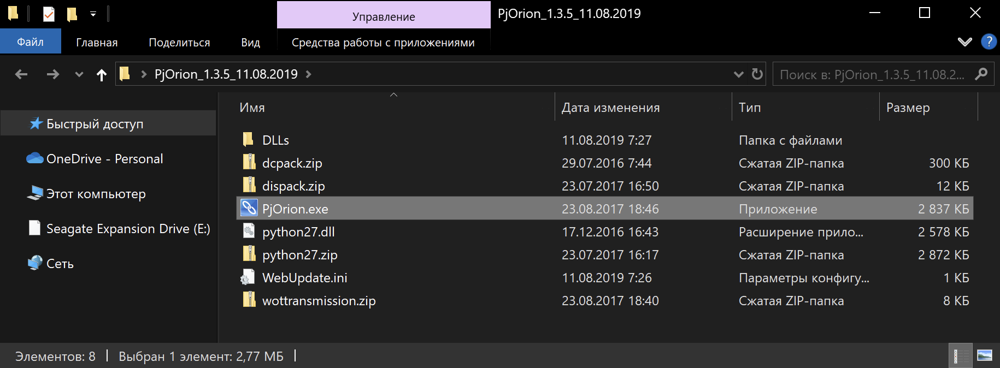
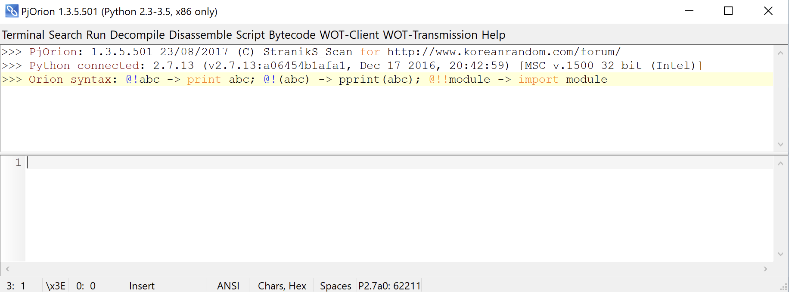
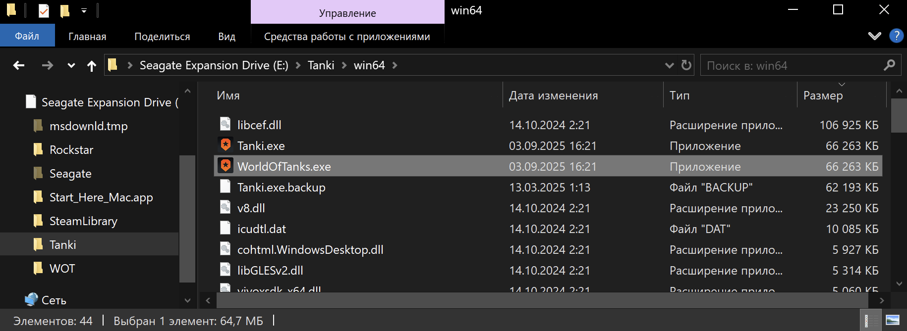
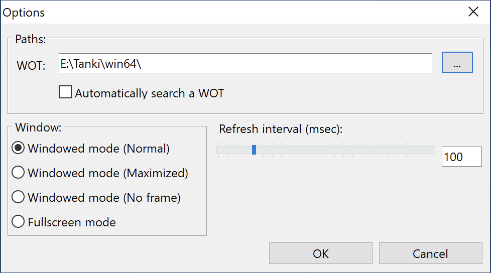
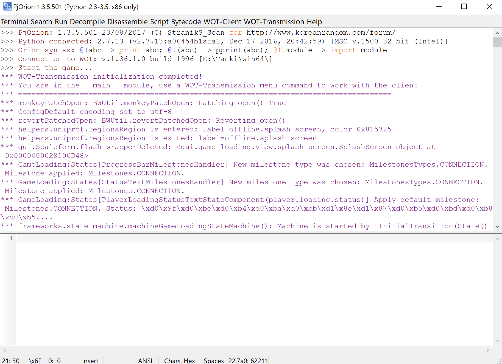
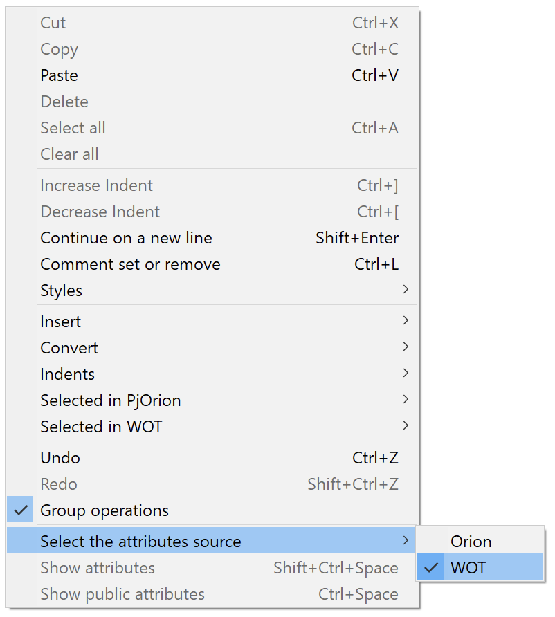
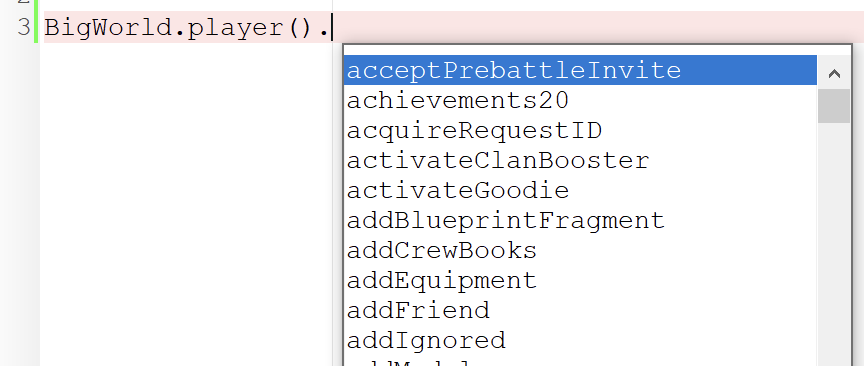
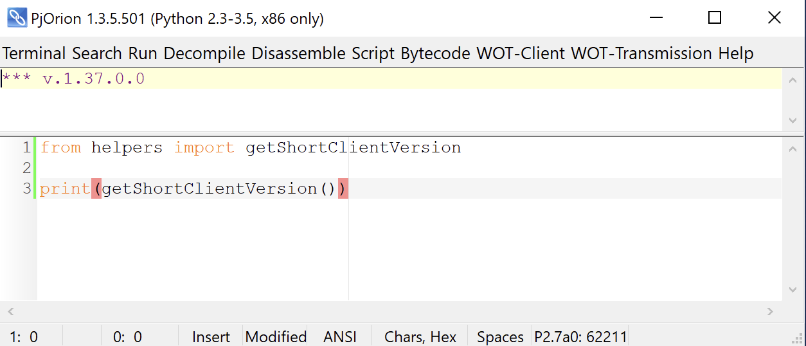
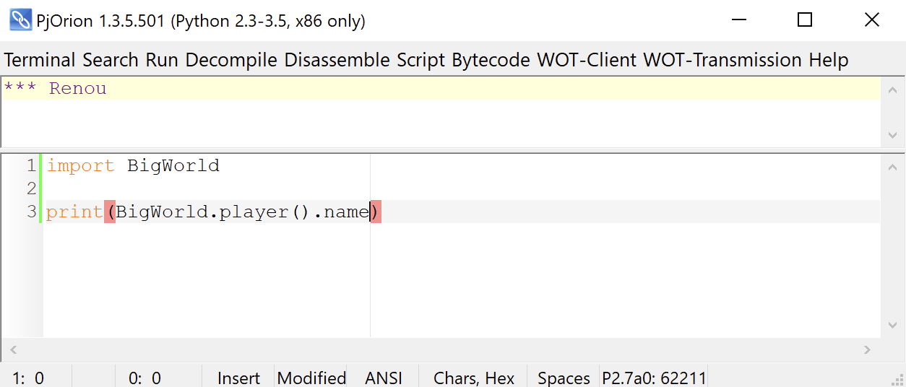

# Знакомство с PjOrion {#pjorion}

Программа `PjOrion` — *Project "ORION"* — это инструмент, упрощающий разработку модификаций для игры «Мир Танков».

Наиболее полезная функция `PjOrion` — `REPL` (Read-Eval-Print Loop) для `Python`‑скриптов игры. Она позволяет в реальном времени изменять и отлаживать скрипты без перезапуска клиента.

## Установка {#installation}
1. Скачайте последнюю версию `PjOrion` из официальной [темы на форуме](https://koreanrandom.com/forum/topic/15280-pjorion-редактирование-компиляция-декомпиляция-обфускация-модов-версия-135-дата-11082019/). Нас интересует архив `PjOrion_1.3.5_11.08.2019.zip (архив с DLL)`.

2. Распакуйте архив в любую папку.
::: details Распакованный архив

:::

3. Запустите `PjOrion.exe`.
::: details Окно программы

:::

4. В папке игры переименуйте `/win64/Tanki.exe` в `/win64/WorldOfTanks.exe`. Это нужно для того, чтобы `PjOrion` мог найти исполняемый файл игры.
::: details Переименованный файл

:::

5. В `PjOrion` нажмите `WOT-Transmission -> Options...`, во всплывающем окне уберите галочку с `Automatically search a WOT`, после чего выберите путь до папки с игрой и подпапки `win64`:
::: details Окно настроек
{width=400}
:::

6. Запустите игру через `PjOrion`, нажав `WOT-Transmission -> Run WOT-Client -> WorldOfTanks`. Игра запустится, а в консоли `PjOrion` должен появиться лог игры:
::: details Консоль `PjOrion`

:::

## Настройка подсказок кода {#suggestions-setup}
В `PjOrion` есть функция подсказок кода непосредственно для объектов игры. Для её активации:
1. Нажмите `ПКМ` (правую кнопку мыши) по окну ввода скриптов
2. Выберите раздел `Select the attributes source`
3. Выберите пункт `WOT`

::: details Меню выбора источника подсказок
{width=400}
:::

После этого в окне ввода скриптов после символа `.` (точка) будут появляться подсказки с атрибутами и методами объектов игры.

::: details Пример подсказок

:::


## Использование {#usage}

Если у вас получилось запустить игру через `PjOrion` и лог игры успешно подхватился, вы готовы к использованию `REPL` — Read-Eval-Print Loop (цикл чтения‑выполнения‑вывода), который позволяет выполнять `Python`‑код в контексте игры.

В нижней части окна `PjOrion` есть поле ввода, в котором можно писать `Python`‑код и выполнять его **внутри запущенной игры**.

В консоли вы можете импортировать любые модули игры, например `BigWorld`, в котором находятся основные функции движка.

Для выполнения кода нажмите `Shift+F5` или `WOT-Transmission -> Exec script in client (for ANSI)`.

### Пример 1: Вывод версии игры {#example-game-version}
Напечатайте в консоли следующий код и выполните его:

```python [PjOrion]
from helpers import getShortClientVersion

print(getShortClientVersion())
```

::: details Результат выполнения кода

:::

### Пример 2: Вывод никнейма игрока {#example-player-name}

Функция `BigWorld.player()` возвращает объект игрока, который в **ангаре** является экземпляром класса [`PlayerAccount`](https://github.com/izeberg/wot-src/blob/709a8c2b9ede8a7515b45b92bdc2d3eacf14f784/sources/res/scripts/client/Account.py#L130). У этого объекта есть атрибут `name`, в котором хранится никнейм игрока.

```python [PjOrion]
import BigWorld

print(BigWorld.player().name)
```

::: details Результат выполнения кода

:::
