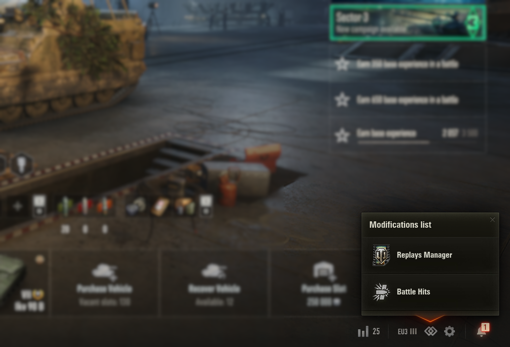

# ModsList – Список модов {#modslist}

[ModsList](https://gitlab.com/wot-public-mods/mods-list) – это мод, который добавляет в ангар список функциональных кнопок для разных модов. Из меню можно вызывать функции других модов, например, открывать окно настроек или перейти в просмотр попаданий.




## Использование {#usage}

Импортируйте модуль `g_modsListApi` в вашем коде и используйте метод `addModification`, чтобы зарегистрировать ваш мод в списке.

```python
try:
  from gui.modsListApi import g_modsListApi

  def callback():
    print('On mod button click')

  g_modsListApi.addModification(
    id="mod_id",
    name='Название мода',
    description='Описание мода',
    icon='gui/maps/my.first_mod/modsListApi.png',
    enabled=True,
    login=False,
    lobby=True,
    callback=callback
  )
except:
  print_log('g_modsListApi not found')
```