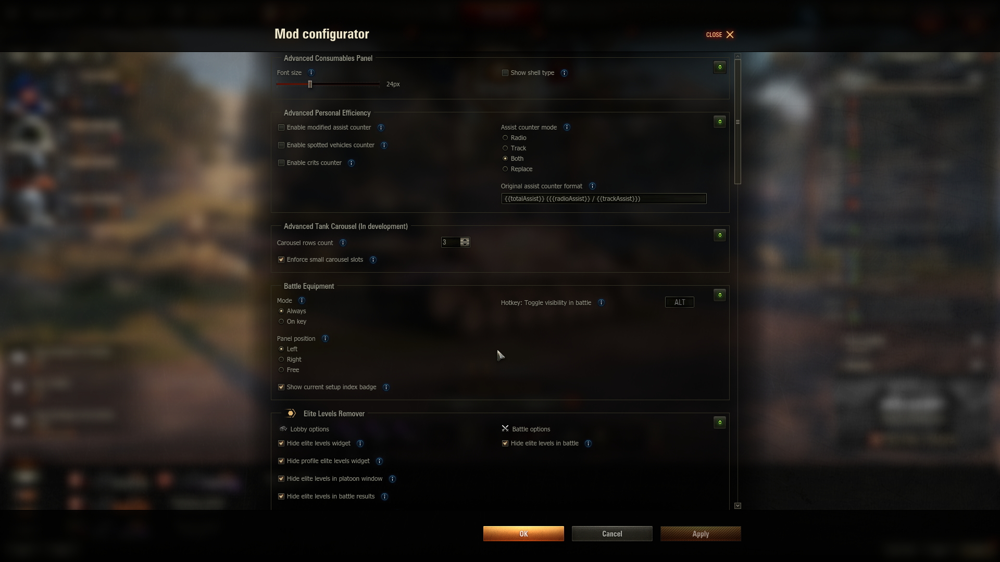

# ModsSettings API – Настройки модов {#modssettings}

Если вам нужно добавить настройки для вашего мода, вы можете использовать готовый мод [ModsSettings API](https://github.com/izeberg/modssettingsapi). Этот мод предоставляет удобный API для создания и управления настройками модов прямо в клиенте игры.



Основные этапы работы модификации заключается в следующем:

1. При загрузке клиента игры `modsSettingsApi` загружает файл сохраненных настроек сторонних модификаций. Если файл отсутствует - будет создан новый.
2. Затем `modsSettingsApi` ожидает подключения к себе сторонних модификаций посредством программного интерфейса.
3. Для генерации меню настроек, сторонняя модификация должна отправить в `modsSettingsApi` шаблон, содержащий в себе описание необходимых для отображения графических элементов.
4. Кроме шаблона сторонняя модификация должна отправить ссылку на функцию, которая будет вызываться при любом изменении настроек стороннего мода. При необходимости обработки нажатия дополнительных кнопок модификация должна отправить ссылку на функцию, которая будет вызывается при нажатии на кнопку с передачей текущего значения.
5. При изменении настроек `modsSettingsApi` будет вызывать переданный модификацией метод с новыми параметрами. При использовании кнопок, `modSettingsAPI` будет вызывать переданный модификацией метод с текущим параметром и его значением.

## Использование {#usage}

```python
# Текстовый идентификатор мода.
# ! ДОЛЖЕН быть уникальным для каждого мода
modLinkage = 'myOwnMod'

# Словарь для хранения настроек мода
settings = { ... }

# Словарь с шаблоном стандартных настроек
template = { ... }

# Функция, которая будет вызываться настройщиком при изменении настроек мода.
# linkage - текстовый идентификатор мода,
# settings - словарь с новыми настройками
def onSettingsChanged(linkage, settings):
  if linkage != modLinkage: return
  # ваш обработчик настроек

# Функция, которая будет вызываться настройщиком при клике по доп кнопкам.
# linkage - текстовый идентификатор мода
# varName - имя параметра
# value текущее значение параметра выбранное в интерфейсе
def onButtonClicked(linkage, varName, value):
  if linkage != modLinkage: return
  # ваш обработчик настроек


try:
  # Попытка импорта общей точки входа настройщика
  from gui.modsSettingsApi import g_modsSettingsApi

  # сначала необходимо запросить у настройщика сохраненные настройки
  savedSettings = g_modsSettingsApi.getModSettings((modLinkage, ), template)

  # если настройки имеются
  if savedSettings:
    settings = savedSettings # Применим их
    # Зарегистрируем функцию-обработчик новых настроек, и функцию-обработчик нажатий (если таковая имеется)
    g_modsSettingsApi.registerCallback((modLinkage, ), onSettingsChanged, onButtonClicked)
  else:
    # Отправим в настройщик шаблон стандартных настроек, функцию-обработчик новых настроек, и функцию-обработчик нажатий (если таковая имеется)
    settings = g_modsSettingsApi.setModTemplate((modLinkage, ), template, onSettingsChanged, onButtonClicked)
except:
  # Если попытка импорта не удалась
  # Используем стандартные настройки мода или загружаем их из самописного конфига
  pass
```

При изменении настроек в функцию-обработчик новых настроек отправляются текстовый идентификатор мода и его новые настройки в виде словаря. Названия переменных `(varName)` указываются в шаблоне.

```python
def onSettingsChanged(linkage, settings)
```

При использовании дополнительного обработчика нажатий в функцию-обработчик будет отправляться текстовый идентификатор мода, название переменной и ее текущее значение. Названия переменных `(varName)` указываются в шаблоне.

```python
def onButtonClicked(linkage, varName, value)
```

## Общие положения при создании шаблона {#template}

Каждый шаблон – это словарь с обязательными полями. В чистом виде он выглядит так:

```python
template = {
  # Отображаемое имя модификации
  'modDisplayName': 'Название модификации',

  # Версия шаблона. При любых изменениях нуждается в изменении
  'settingsVersion': 0,

  # Статус модификации. Активирована она в настройщике или нет
  'enabled': True,

  # Первая колонка отображаемых элементов.
  # Отрисовка графических элементов начинается с X = 0
  'column1': [ ],

  # Вторая колонка отображаемых элементов.
  # Отрисовка графических элементов начинается с X = ШИРИНА_ОКНА / 2
  'column2': [ ]
}
```

Для добавления полей для отображения в списки `'column1'` и `'column2'` добавляются словари, содержащие в себе описания элементов для отображения.
Для добавления динамических кнопок к элементам используются настройки внутри параметра `"button"`. Динамические кнопки можно добавлять только к элементам с пометкой "Возможность добавления кнопки с действием".

Для добавления всплывающих подсказок к элементам используется параметр `"tooltip"`. Всплывающие подсказки можно добавлять только к элементам с пометкой "Возможность добавления подсказки".

## Ручное изменение настроек

Объект `g_modsSettingsApi` имеет метод для ручного обновления настроек (например для возможности модом считывать настройки из своего конфига и хранить их в настройщике). После вызова данного метода новые настройки через callback `(onModSettingsChanged)` вернутся в мод.

```python
g_modsSettingsApi.updateModSettings((modLinkage, ), newSettings)
```

## Templates API {#templates}

Для создания шаблонов настроек можно использовать готовый API `templates`, который содержит в себе функции для создания всех необходимых элементов.

```python
from gui.modsSettingsApi import g_modsSettingsApi, templates
template = {
  'modDisplayName': 'Mod Name',
  'enabled': True,
  'column1': [
    templates.createCheckbox(
      'Demo CheckBox', 
      'var-name-checkbox', 
      True, 
      tooltip='{HEADER}Tooltip{/HEADER}{BODY}text{/BODY}'
    ),

    templates.createDropdown(
      'Demo Dropdown',
      'var-name-dropdown', 
      ['Variant 1', 'Variant 2', 'Variant 3'], 0,
      tooltip='{HEADER}Tooltip{/HEADER}{BODY}text{/BODY}', 
      button=templates.createButton(
        width=30, height=23, offsetTop=0, offsetLeft=0, 
        icon='../maps/icons/buttons/sound.png',
        iconOffsetTop=0, iconOffsetLeft=1
      ),
      width=200
    ),

    templates.createSlider(
      'Demo Slider',
      'var-name-slider',
      5, 1, 15, 1
    ),
    
    templates.createNumericStepper(
      'Demo NumericStepper',
      'var-name-stepper', 5,
      1, 15, 0.1
    ),
      
    templates.createRangeSlider(
      'Demo range slider',
      'var-name-slider',
      [20, 50],
      0, 100, 1, 50, 10, 50,
      ''
    )
  ]
}
```

## С помощью словаря {#dictionary}
Шаблон можно создать и вручную, используя словари.

```python
from gui.modsSettingsApi import g_modsSettingsApi, templates
template = {
  'modDisplayName': 'Mod Name',
  'enabled': True,
  'column1': [
    {
      'type': 'CheckBox',
      'text': 'Demo CheckBox',
      'varName': 'var-name-checkbox',
      'value': True,
      'tooltip': '{HEADER}Tooltip{/HEADER}{BODY}text{/BODY}',
    },

    {
      'type': 'Dropdown',
      'text': 'Demo Dropdown',
      'varName': 'var-name-dropdown',
      'options': [
        { 'label': 'Variant 1' },
        { 'label': 'Variant 2' },
        { 'label': 'Variant 3' }
      ],
      'value': 0,
      'tooltip': '{HEADER}Tooltip{/HEADER}{BODY}text{/BODY}',
      'button': {
        'width': 30, 'height': 23, 'offsetTop': 0, 'offsetLeft': 0,
        'iconSource': '../maps/icons/buttons/sound.png',
        'iconOffsetTop': 0, 'iconOffsetLeft': 1,
      },
      'width': 200
    },

    {
      'type': 'Slider',
      'text': 'Demo Slider',
      'varName': 'var-name-slider',
      'value': 5,
      'minimum': 1,
      'maximum': 15,
      'snapInterval': 1,
      'format': '{{value}}',
    },

    {
      'type': 'NumericStepper',
      'text': 'Demo NumericStepper',
      'varName': 'var-name-stepper',
      'value': 5,
      'minimum': 1,
      'maximum': 15,
      'snapInterval': 0.1,
    },

    {
      'type': 'RangeSlider',
      'text': 'Demo range slider',
      'varName': 'var-name-slider',
      'value': [20, 50],
      'minimum': 0,
      'maximum': 100,
      'snapInterval': 1,
      'divisionLabelStep': 50,
      'minRangeDistance': 10,
      'divisionStep': 50,
      'divisionLabelPostfix': '',
    },
  ]
}
```

## Список элементов для отображения {#elements}

### Надпись {#label}
- Возможность добавления подсказки

```python
{
  'type': 'Label', # Тип элемента
  'text': 'My Label' # Отображаемый текст
}
```

### Флажок {#checkbox}
- Возможность добавления подсказки
- Возможность добавления кнопки с действием

```python
{
  'type': 'CheckBox', # Тип элемента
  'text': 'My CheckBox', # Текст, отображаемый рядом с чекбоксом
  'value': True, # Стандартное значение. True - галочка стоит, False - отсутствует
  'varName': 'CheckBox1' # Имя переменной, соответствующей значению данного элемента
}
```

### Горячая клавиша {#hotkey}
- Возможность добавления подсказки

```python
{
  'type': 'HotKey', # Тип элемента
  'text': 'My HotKey', # Текст, отображаемый слева от элемента ввода
  'value': [Keys.KEY_Q], # Стандартное значение. Число обозначающее кнопку (смотрите дополнение с кнопками)
  'varName': 'HotKey1' # Имя переменной, соответствующей значению данного элемента
}
```

### Ползунок {#slider}
- Возможность добавления подсказки
- Возможность добавления кнопки с действием

```python
{
  'type': 'Slider', # Тип элемента
  'text': 'My Slider', # Заголовок, отображаемый над слайдером
  'minimum': 1, # Минимальное значение слайдера
  'maximum': 15, # Максимальное значение слайдера
  'snapInterval': 1, # Шаг слайдера
  'value': 5, # Стандартное значение. Minimum - ползунок слайдера вначале, Maximum - ползунок слайдера в конце
  'format': '{{{1}}}', # Формат строки, отображаемой рядом со слайдером и показывающей его значение. {{{1}}} - заменяется на значение слайдера
  'varName': 'Slider1' # Имя переменной, соответствующей значению данного элемента
}
```

### Выпадающий список {#dropdown}
- Возможность добавления подсказки
- Возможность добавления кнопки с действием

```python
{
  'type': 'Dropdown', # Тип элемента
  'text': 'My Dropdown', # Заголовок, отображаемый над выпадающим списком

  # Пункты меню
  'options': [
    { 'label': 'Dropdown 1' }, # Пункт меню с индексом 0
    { 'label': 'Dropdown 2' } # Пункт меню с индексом 1
  ],
  'width': 200, # Ширина выпадающего списка
  'value': 0, # Индекс выбранного элемента. 0 - выбран первый элемент списка
  'varName': 'Dropdown1' # Имя переменной, соответствующей значению данного элемента
}
```

### Группа радио-кнопок {#radiobuttongroup}
- Возможность добавления подсказки
- Возможность добавления кнопки с действием

```python
{
  'type': 'RadioButtonGroup', # Тип элемента
  'text': 'My RadioButtonGroup', # Заголовок, отображаемый над группой элементов

  # Список кнопок
  'options': [
    { 'label': 'RadioButton 1' }, # Пункт группы с индексом 0
    { 'label': 'RadioButton 2' } # Пункт группы с индексом 1
  ],
  'value': 0, # Стандартное значение. 0 - выбран первый элемент списка кнопок
  'varName': 'RadioButtonGroup1' # Имя переменной, соответствующей значению данного элемента
}
```

### Поле ввода текста {#textinput}
- Возможность добавления подсказки

```python
{
  'type': 'TextInput', # Тип элемента
  'text': 'My TextInput', # Заголовок, отображаемый над полем ввода
  'width': 200, # Ширина поля ввода
  'value': 'any text', # Стандартное значение. Любой текст
  'varName': 'TextInput1' # Имя переменной, соответствующей значению данного элемента
}
```

### Пустой элемент {#spacer}
- Необходим для логического разделения блоков элементов
- Высота 20 пикселей

```python
{
  'type': 'Spacer' # Тип элемента
}
```


### Динамическая кнопка {#button}
- Прикрепляется к элементам
- По нажатию передает в Python текущее значение элемента
- Может быть как текстовой так и с иконкой
- Поддерживает изменение положения и размера

```python
{
  # Параметры вашего элемента
  ...
  # Динамическая кнопка
  'button': {
    'width': 60, # Ширина кнопки. Можно не указывать. Стандартно 60 пикселей
    'height': 24, # Высота кнопки. Можно не указывать. Стандартно 24 пикселей
    'offsetTop': 0, # Смещение положения по вертикали. Можно не указывать
    'offsetLeft': 0, # Смещение положения по горизонтали. Можно не указывать
    'text': 'Button Text', # Текст кнопки. Если используете иконку оставьте пустым
    'iconSource': '../maps/icons/buttons/sound.png', # Путь к иконке. Если используете текст оставьте пустым
    'iconOffsetTop': 0, # Смещение иконки по вертикали. Можно не указывать
    'iconOffsetLeft': 1 # Смещение иконки по горизонтали. Можно не указывать
  }
}
```

### Всплывающая подсказка {#tooltip}
- Прикрепляется к элементам
- По наведению отображает подсказку

```python
{
  # Параметры вашего элемента
  ...
  # Подсказка (при наведении на иконку)
  'tooltip': '{HEADER}Tooltip header{/HEADER}{BODY}Tooltip body{/BODY}'
}
```

Для корректного отображения всплывающих подсказок `"tooltip"` поля с их текстом должны иметь следующий формат: `{HEADER}Заголовок подсказки{/HEADER}{BODY}Текст подсказки{/BODY}` Для отображения подсказки без заголовка достаточно просто не указывать тег `{HEADER}`, т.е текст подсказки должен выглядеть следующим образом: `{BODY}Текст подсказки{/BODY}`

