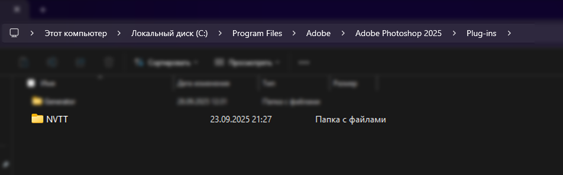
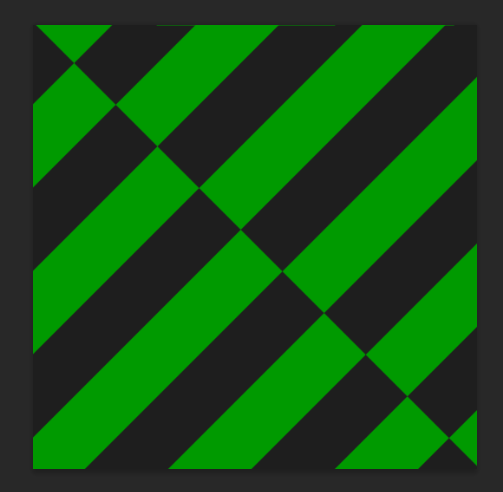
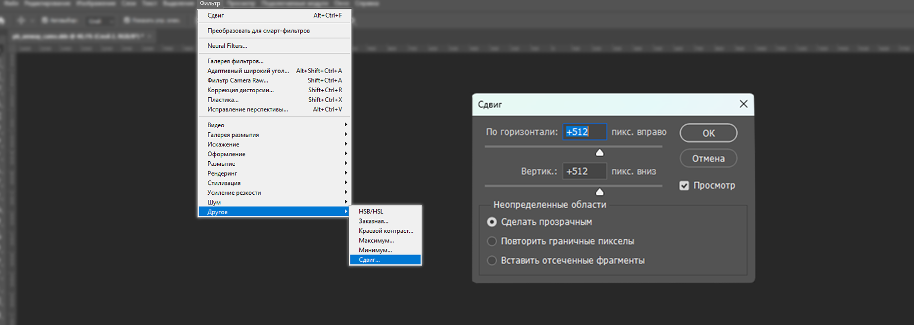
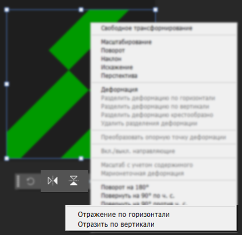
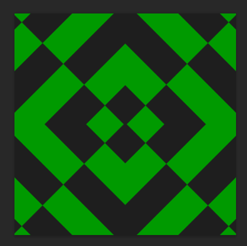
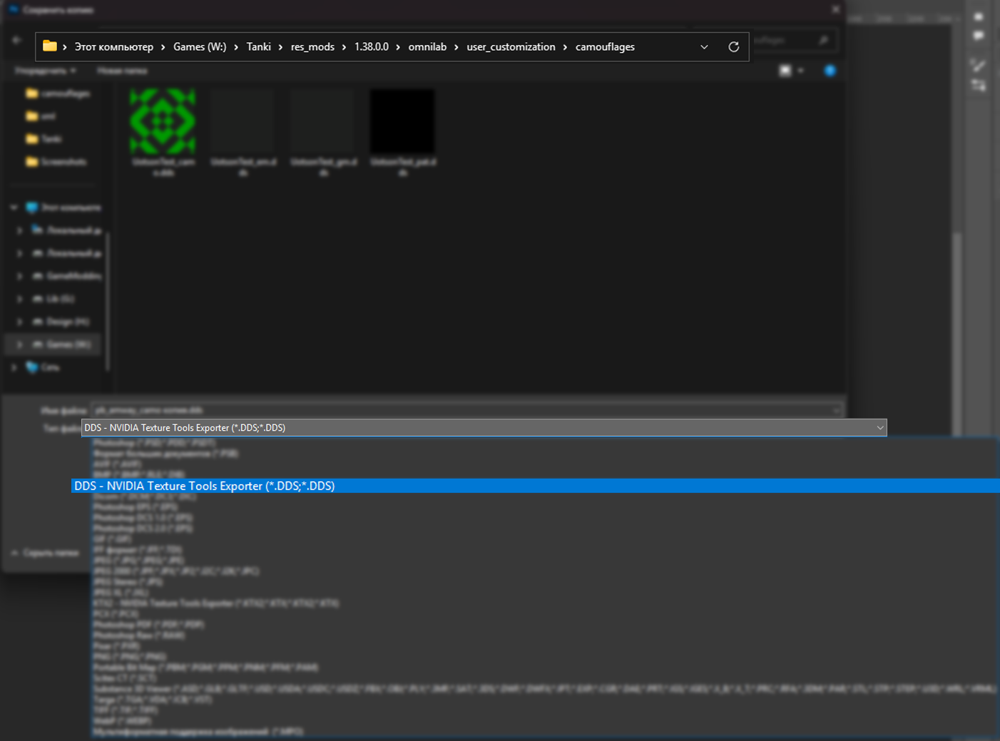

# Агрегатор стилей – интеграция кастомных стилей {#usercustomization}

::: warning Внимание!
Этот раздел документации не завершён, если вы готовы помочь - сообщите об этом [главному разработчику мода](https://t.me/lrvval).
:::

Хотите интегрировать свой камуфляж в игру, не меняя при этом игровые стили? Используйте Агрегатор стилей!


::: tip TODO
Поменять картинку на момент начала публичного тестирования.
::: 


Основные этапы работы модификации заключается в следующем:

1. При загрузке клиента мод читает элементы кастомизации из папки `valberton/user_customization/xml`. В случае ошибки чтения клиент намеренно крашится.
2. В момент подключения игрока к серверу собираются данные о всех стилях (в том числе и интегрированных) с целью оптимизации работы с экраном стилизатора.
3. При нажатии на кнопку `Внешний вид` игрок выбирает, к какому окну кастомизации перейти: стандартному или стилизатору. Если на сервере камуфляжа нет, во время выбора игрока предупреждают об этом.
4. При переходе к окну стилизатора игрок выбирает категорию стиля (по умолчанию: Пользовательский 2D-стиль) и сам камуфляж. Для применения игрок нажимает соответствующую кнопку.

## Интеграция стиля {#style-integration}

Для того, чтобы встроить свой камуфляж в игру нам потребуются:

1. [Текстуры](#style-textures) (камуфляж, надписи, эмблемы и т.д. в формате `.dds`).
2. [Локализация](#style-localization) (название и описание стиля в формате `.mo`).
3. [Скрипты](#style-scripts) (описание элементов стиля в формате `.xml` на каждую группу элементов)

Для 3D-стилей ещё необходимо:

4. [Модели](#style-models) (изменённые модели танка в форматах `.model`, `.primitives`, `.visual`).
5. `При необходимости!` [Префабы](#style-prefabs) (эффекты и двигающиеся части танка в формате `.prefab`).

## Текстуры {#style-textures}

::: warning TODO
Данный раздел не завершён, автор `UotsonDesign` допишет его, как разберётся с делами IRL.
:::

Здесь будет использоваться сложная >_< дизайнерская терминология:

1. `Паттерн (Pattern)` - зацикленный узор .

В камуфляжах существует несколько возможных типов текстур:

1. `AM (AlbedoMap)` - паттерн камуфляжа, выполняется в цвете.
2. `GMM (GlossMetallicMap)` - текcтура металлических отражений, выполняется по определенному алгоритму.
3. `EmmissionMap` - карта свечения, на ней указываются элементы, которые будут излучать свет.
4. `PatternMap` - карта анимации, эта карта показывает игре, какую область "подсвечивать" игре на `EmissionMap`. Работает циклично.

Скорость анимации `PatternMap` и яркость `EmmissionMap` регулируется в [скрипте камуфляжа](#camouflages) cледующими параметрами:

```xml [user_camouflages.xml]
    <forwardEmissionBrightness> 7 </forwardEmissionBrightness>
    <deferredEmissionBrightness> 7 </deferredEmissionBrightness>
    <emissionAnimationSpeed>  0.3 </emissionAnimationSpeed>.
```

### Рисование камуфляжа {#camo-drawing}

#### Подготовка рабочей среды {#workspace-prepare}

Для начала работы вам потребуются следующие программы:
* [Мир Танков](#mt) (обязательно).
* [Photoshop](#photoshop) или [Paint.NET](#paint-net).

##### Мир Танков {#mt}

::: tip TODO
Бебебе с бабаба.
:::

##### Photoshop {#photoshop}

1. После скачивания фотошопа, вам потребуется `DDS-расширение` для создания текстурных файлов с расширением `.dds`. Скачать расширение вы можете с официального сайта `разбработчика(TODO: ДОБАВИТЬ САЙТ NVIDIA И ДОПИСАТЬ ГАЙД ПО УСТАНОВКЕ)`.

2. После установки расширения, в `папке установки Photoshop` у вас должна появится папка `NVTT`:
.
3. Теперь запускаем или перезапускаем, если был запущен, `Photoshop` и создаем файл с размерами с соотношением сторон `1:1`.

:::tip Примеры размеров текстуры для Мира Танков

1. 512x512
2. 1024x1024
3. 2048x2048
4. 4096x4096 (По желанию, трудно рисовать, весят много и могут уменьшать быстродействие игры и вашего компуктера)

:::

##### Paint.NET {#paint-net}

:::tip TODO
Тут должен быть текст.
:::

***
#### AM - Текстура {#albedo}

Создание камуфляжа начинается с рисования основного `паттерна`, AM-текстуры, для создания тектуры можно использовать `Photoshop` или `Paint.NET`. Напишу действия для каждого приложения.

В рисовании узора есть несколько техник:

1. `Прямоугольный узор` - его легко зациклить, не надо прибегать к каким-то сложным методам.
2. `Узор не касается краев` - соответсвенно не надо зацикливать, но надо учесть, что если у вас какая-нибудь голова дракона, `то ее надо рисовать только на одной пловине текстуры`, нижней или верхней и зеркалить по месту.
3. `Узор по диагонали` - его я и буду рассматривать ниже.

:::details Photoshop

1. Создаем основу узора.
> [!IMPORTANT]
> Размер узора должен совпадать с размером квадрата под ним. Как пользоваться инструментом `выделение` можете найти в интернете. 


2. Заходим в контекстное меню, выбираем `Фильтр` -> `Другое` -> `Сдвиг`. Дальше выставляем параметры сдвига `равные половине от ширины и половине от высоты изображения` и галочку на `Сделать прозрачным`. 
> [!TIP]
> У вас файл 1024x1024 => смещение будет равняться 1024x0,5 x 1024x0,5 = 512 x 512.

3. У вас должен получиться кусок узора равный 1/4 от всего холста. Теперь мы его копируем (`CTRL+J`).
4. Нажимаем пкм по копии, выбираем `отразить по горизонтали` (*Или по вертикали, там без разницы*) и тащим отраженную копию в противоположный угол с зажатым `SHIFT`.
5. Повторяем `пункт 4`, но теперь выбираем 2 кусочка, нажимаем `CTRL+J` и теперь `отражаем копию по вертикали`(*Или по горизонтали, смотря какой вариант вы выбрали в 4 пункте*). Результат должен получится таким:
6. Сохраняем получившийся файл в папку `camouflages` по алгоритму: `Файл` -> `Сохранить как...` -> `DDS`. 

:::

:::tip TODO
Надо сделать кнопку создания дефолтных xml скриптов и папок в `res_mods` по шаблону.
:::

## Локализация {#style-localization}

Локализация строк для стиля храниться в файлах формата `.mo`, которые делаются из файлов формата `.po`, которые имею следующий вид:

```po{3,11-17} [user_styles.po]
msgid ""
msgstr ""
"Project-Id-Version: Your Project\n"
"PO-Revision-Date: \n"
"Last-Translator: \n"
"Language-Team: \n"
"MIME-Version: 1.0\n"
"Content-Type: text/plain; charset=utf-8\n"
"Content-Transfer-Encoding: 8bit\n"

msgid "style/title" 
msgstr "Название стиля"

msgid "style/description"
msgstr ""
"Описание стиля\n"
"В нескольких строках"
```

`.po` - это просто текстовые файлы. Чтобы преобразовать его в `.mo` потребуется одно из двух:
* Специальное ПО - [Virtaal](https://virtaal.translatehouse.org/download.html).
* Специальный сайт - [.po в .mo](https://ezgif.com/po-to-mo) или [.mo в .po](https://ezgif.com/mo-to-po).

Рассмотрим важные для изменения строки:

* `Project-Id-Version` - это название проекта, вписывайте сюда всё, что угодно.
* `msgid` - это путь к строке.
* `msgstr` - это сама локализированная строка.

:::details Как делать многострочные строки?
```po{3}
msgid "style/description"
msgstr ""
"Описание стиля\n"
"В нескольких строках"
```
В этом примере перевод строки осуществляется символом `\n`, без него строка "слипнется" в единое целое.
:::

Чтобы использовать локализацию строки, используйте следующее выражение:
```
#<имя_файла_локализации>:<путь_до_строки>
```
* `<имя_файла_локализации>` - это название файла без расширения `.mo`, в котором находится нужная строка. Например `user_styles`.
* `<путь_до_строки>` - это как раз `msgid`. Например, `style/title`.

Таким образом, в нашем примере для получения строки `Название стиля`, ссылка на неё должна быть такой:
```
#user_styles:style/title
```

## Скрипты {#style-scripts}

Скрипты элементов стиля хранятся в формате `.xml` и полностью идентичны по строению с внутриигровыми файлами в папке `scripts/item_defs/customization/<mod_id>_<element_type>.xml`, где
* `mod_id` - уникальный строковый идентификатор мода.
* `element_type` - тип элемента (в объяснениях будет указано, как его именовать).

Например, для камуфляжей прописывайте `user_camouflages.xml`, для отметок - `user_insignias.xml` и т. д.

В одном скрипте может быть описано множество элементов одного типа.

XML - это древовидный язык разметки, поэтому когда будут расписываться секции, имейте в виду, что запись типа `x.y.z` в файле будет выглядеть так:
```xml
<x>
    <y>
        <z> value </z>
    </y>
</x>

где value - абстрактное значение.
```
Ниже приведены пустышки для всех импортируемых элементов кастомизации. Нужные для редактирования строки будут подсвечены.

***
### Общие положения {#styles-general}

* `root.itemGroup.season` - тип карты для определённого типа элемента. В данный момент поддерживается 3 типа карт: 
    * `WINTER` - зимняя.
    * `SUMMER` - летняя.
    * `DESERT` - песчаная.

::: tip Совет
Для разных типов карт можно описать разные камуфляжи, но они должны находиться в разных `itemGroup`.
:::

***
### Камуфляж {#camouflages}
`element_type = camouflages`

```xml{4,12-13,15,19-31,38-45} [user_camouflages.xml]
<root xmlns:china="china" xmlns:czech="czech" xmlns:france="france" xmlns:germany="germany" xmlns:italy="italy" xmlns:japan="japan" xmlns:poland="poland" xmlns:sweden="sweden" xmlns:uk="uk" xmlns:usa="usa" xmlns:ussr="ussr" xmlns:xmlref="http://bwt/xmlref">
    <itemGroup>
        <userString>	#vehicle_customization:camouflage/transparent	</userString>
        <season>	ALL	</season>
        <historical>	true	</historical>
        <tags> questsProgression fullRGB styleOnly </tags>
        <priceGroup>	MT camouflages 50g notInShop	</priceGroup>
        <vehicleFilter>
            <include/>
        </vehicleFilter>
        <camouflage>
            <id>	10000	</id>
            <texture>	valberton/user_customization/camouflages/ous_test_camo.dds	</texture>
            <description>	#vehicle_customization:camouflage/christmas_chinese/description	</description>
            <scales>	1.3 1 0.5	</scales>
            <userString>	#vehicle_customization:camouflage/christmas_chinese/label	</userString>
            <tags> hiddenInUI </tags>
            <invisibilityFactor>	1	</invisibilityFactor>
            <palettes>
                <palette>
                    <c0> 255 0 0 255 </c0>
                    <c1> 0 255 0 255 </c1>
                    <c2> 0 0 255 255 </c2>
                    <c3> 0 0 0 255 </c3>
                </palette>
            </palettes>
			<rotation>
				<HULL> -0.234747 </HULL>
				<TURRET> 1.610764 </TURRET>
				<GUN> -0.234747 </GUN>
			</rotation>
            <tiling/>
            <tilingSettings>
                <type>	relative	</type>
                <factor>	2.574355  2.582175	</factor>
                <offset>	0.000000 0.000000	</offset>
            </tilingSettings>
			<gloss> 0.509 0.509 0.409 0.509 </gloss>
			<metallic> 0.23 0.2 0.19 0.23 </metallic>
            <glossMetallicMap> valberton/user_customization/camouflages/example_gm.dds </glossMetallicMap>
            <emissionMap> valberton/user_customization/camouflages/example_em.dds </emissionMap>
            <emissionPatternMap> valberton/user_customization/camouflages/example_pat.dds </emissionPatternMap>
            <forwardEmissionBrightness> 7 </forwardEmissionBrightness>
            <deferredEmissionBrightness> 7 </deferredEmissionBrightness>
            <emissionAnimationSpeed>  0.3 </emissionAnimationSpeed>
        </camouflage>
    </itemGroup>
</root>
```
Необходимые для редактирования секции:

::: warning Внимание!
Далее описываются секции для типа элемента `camouflage`, которых в одной `itemGroup` может находиться несколько. Точное ограничение не регламентируется.
:::

* `root.itemGroup.camouflage.id` - уникальный числовой идентификатор.
* `root.itemGroup.camouflage.texture` - путь до текстуры.
* `root.itemGroup.camouflage.scales` - масштаб для разных размеров паттернов (см. <ссылка_на_объяснение_стилей>).
* `root.itemGroup.camouflage.palettes` - палитры камуфляжа.
* `root.itemGroup.camouflage.rotation` - угол поворота текстуры.
::: info Необязательные параметры
Для эффекта металла и бликов используйте:

или
* `root.itemGroup.camouflage.gloss` - величина блеска в формате RGBA.
* `root.itemGroup.camouflage.metallic` - величина эффекта металла в формате RGBA.

или
* `root.itemGroup.camouflage.glossMetallicMap` - путь к текстуре `glossMetallicMap` (см. Текстуры).
* `root.itemGroup.camouflage.emissionMap` - путь к текстуре маски свечения (см. Текстуры).
* `root.itemGroup.camouflage.emissionPatternMap` - путь к текстуре паттерна свечения (см. Текстуры).
* `root.itemGroup.camouflage.forwardEmissionBrightness` - интенсивность свечения в стандартном рендере.
* `root.itemGroup.camouflage.deferredEmissionBrightness` - интенсивность свечения в улучшенном рендере.
* `root.itemGroup.camouflage.emissionAnimationSpeed` - скорость анимации свечения.
:::

***
### Декали: эмблемы и надписи {#decals}
`element_type = decals`

Эмблемы и надписи являются одним типом элемента - декалями. Не путайте их с проекционными декалями!

```xml{6,9,11,13,15,21,24,26,28,30} [user_decals.xml]
<?xml version="1.0" encoding="UTF-8"?>
<root xmlns:china="china" xmlns:czech="czech" xmlns:france="france" xmlns:germany="germany" xmlns:italy="italy" xmlns:japan="japan" xmlns:poland="poland" xmlns:sweden="sweden" xmlns:uk="uk" xmlns:usa="usa" xmlns:ussr="ussr" xmlns:xmlref="http://bwt/xmlref">
	<itemGroup>
		<name/>
		<userString/>
		<season>ALL</season>
		<historical>true</historical>
		<priceGroup>MT emblems 25g notInShop</priceGroup>
		<type>EMBLEM</type>
		<decal>
			<id>10000</id>
			<tags> hiddenInUI </tags>
			<texture>valberton/user_customization/decals/example_emblem.dds</texture>
			<userString />
			<mirror>false</mirror>
		</decal>
	</itemGroup>
	<itemGroup>
		<name>user_inscriptions</name>
		<userString> empty </userString>
		<season>ALL</season>
		<historical>true</historical>
		<priceGroup>MT inscriptions 25g notInShop</priceGroup>
		<type>INSCRIPTION</type>
		<decal>
			<id>20000</id>
			<tags> hiddenInUI </tags>
			<texture>valberton/user_customization/decals/example_inscr.dds</texture>
			<userString />
			<mirror>false</mirror>
		</decal>
	</itemGroup>
</root>
```
Необходимые для редактирования секции:

* `root.itemGroup.type` - тип декали. `EMBLEM` - эмблема, `INSCRIPTION` - надпись.

::: warning Внимание!
Далее описываются секции для типа элемента `decal`, которых в одной `itemGroup` может находиться несколько. Точное ограничение не регламентируется.
:::

* `root.itemGroup.decal.id` - уникальный числовой идентификатор.
* `root.itemGroup.decal.texture` - путь до текстуры.
* `root.itemGroup.decal.mirror` - булево значение (истина, ложь), означающее необходимость отразить по горизонтали декаль.
***
### Присоединяемые элементы {#attachments}
`element_type = attachments`

::: warning Внимание!
Полная поддержка этого типа элемента не подтверждена, при попытке её использования могут возникнуть проблемы. Просим сообщить о состоянии поддержки [разработчику](https://t.me/lrvval).
:::

```xml{6,11,13,14} [user_attachments.xml]
<?xml version="1.0" encoding="utf-8"?>
<root xmlns:china="china" xmlns:czech="czech" xmlns:france="france" xmlns:germany="germany" xmlns:italy="italy" xmlns:japan="japan" xmlns:poland="poland" xmlns:sweden="sweden" xmlns:uk="uk" xmlns:usa="usa" xmlns:ussr="ussr" xmlns:xmlref="http://bwt/xmlref">
	<itemGroup>
		<name>attachments</name>
		<userString>#vehicle_customization:attachment/general</userString>
		<season>ALL</season>
		<historical> true </historical>
		<priceGroup>attachments 50g notInShop</priceGroup>
		<tags> hiddenInUI </tags>
		<attachment>
			<id> 10000 </id>
			<name> attachment_01 </name>
			<modelName> content/Hangars/CharacterAnimations/Flag/normal/lod0/shaft_hd.model </modelName>
			<attachmentLogic> flagPart </attachmentLogic>
			<initialVisibility> false </initialVisibility>
		</attachment>
	</itemGroup>
</root>
```
Необходимые для редактирования секции:

::: warning Внимание!
Далее описываются секции для типа элемента `attachment`, которых в одной `itemGroup` может находиться несколько. Точное ограничение не регламентируется.
:::

* `root.itemGroup.attachment.id` - уникальный числовой идентификатор.
* `root.itemGroup.attachment.modelName` - путь до модели/префаба (см. <ссылка_на_объяснение_моделей>).
* `root.itemGroup.attachment.attachmentLogic` - схема логики элемента. На данный момент известно 3 схемы:
    * `flagPart` - флаг
    * `flagAnimation` - анимация флага
    * `prefab` - префаб (см. <ссылка_на_объяснение_моделей>).
***
### Отметки на стволе {#insignias}
`element_type = insignias`

```xml{6,11-14} [user_insignias.xml]
<?xml version="1.0" encoding="utf-8"?>
<root>
    <itemGroup>
		<name/>
		<userString/>
		<season>ALL</season>
		<historical>1</historical>
		<priceGroup>insignias 50g notInShop</priceGroup>
		<tags>hiddenInUI</tags>
		<insignia>
			<id>10000</id>
			<atlas>valberton/user_customization/decals/insignias.dds</atlas>
			<alphabet>valberton/user_customization/decals/insignias.xml</alphabet>
			<texture>valberton/user_customization/decals/insignias.dds</texture>
		</insignia>
	</itemGroup>
</root>
```
Необходимые для редактирования секции:

::: warning Внимание!
Далее описываются секции для типа элемента `insignia`, которых в одной `itemGroup` может находиться несколько. Точное ограничение не регламентируется.
:::

* `root.itemGroup.insignia.id` - уникальный числовой идентификатор.
* `root.itemGroup.insignia.atlas` - путь к атласу (см. <ссылка_на_объяснение_отметок>)
* `root.itemGroup.insignia.alphabet` - путь к "алфавиту".

::: details Пример "алфавита"
"Алфавит" описывает используемые координаты отображение отметок.
На первое время используйте этот пример:

```xml
<?xml version="1.0" encoding="utf-8"?>
<root>
	<glyph>
		<name>*</name>
		<begin> 0.0 0.0 </begin>
		<end> 1.0 1.0 </end>
	</glyph>
</root>
```
где `begin` и `end` - начальные и конечные используемых координат относительно левого верхнего угла изображения в процентах (1.0 = 100%).
:::

* `root.itemGroup.insignia.texture` - путь к текстуре **одной** отметки.
***
### Потёртости {#modifications}
`element_type = modifications`

Этот элемент отвечает за наличие царапин и дополнительного слоя грязи на танке.

```xml{4,11,12,14-23} [user_modifications.xml]
<?xml version="1.0" encoding="utf-8"?>
<root xmlns:xmlref="http://bwt/xmlref">
	<itemGroup>
		<season> ALL </season>
		<historical> 0 </historical>
		<priceGroup> modifications 300g </priceGroup>
		<vehicleFilter>
			<include/>
		</vehicleFilter>
		<modification>
			<id> 10000 </id>
			<texture> gui/maps/vehicles/modifications/effect.png </texture>
			<description> #vehicle_customization:modifications/age_effect_01/description </description>
			<effects>
				<effect>
					<type> paint_age </type>
					<value> 0.3 </value>
				</effect>
				<effect>
					<type> paint_fading </type>
					<value> 0.1 </value>
				</effect>
			</effects>
			<userString> #vehicle_customization:modifications/age_effect_01 </userString>
		</modification>
	</itemGroup>
</root>
```
Необходимые для редактирования секции:

::: warning Внимание!
Далее описываются секции для типа элемента `modification`, которых в одной `itemGroup` может находиться несколько. Точное ограничение не регламентируется.
:::

* `root.itemGroup.modification.id` - уникальный числовой идентификатор.
* `root.itemGroup.modification.texture` - путь к иконке в интерфейсе.
* `root.itemGroup.modification.effects` - применяемые эффекты, могут принимать отрицательные значения:
    * `paint_age` - степень смешивания потёртостей с `detailMap` танка.
    * `paint_fading` - яркость краски.
***
### Краски {#paints}
`element_type = paints`

```xml{6,10-14} [user_paints.xml]
<?xml version="1.0" encoding="UTF-8"?>
<root xmlns:china="china" xmlns:czech="czech" xmlns:france="france" xmlns:germany="germany" xmlns:italy="italy" xmlns:japan="japan" xmlns:poland="poland" xmlns:sweden="sweden" xmlns:uk="uk" xmlns:usa="usa" xmlns:ussr="ussr" xmlns:xmlref="http://bwt/xmlref">
	<itemGroup>
		<name/>
		<userString/>
		<season> ALL </season>
		<historical> false </historical>
		<priceGroup> paints 20g notInShop </priceGroup>
		<paint>
			<id> 10000 </id>
			<texture> valberton/user_customization/paints/example_paint.png </texture>
			<color> 00 00 255 255 </color>
			<gloss> 0.753 </gloss>
			<metallic> 0.576 </metallic>
			<userString> blue paint </userString>
			<tags> hiddenInUI </tags>
		</paint>
		<usages>
			<item>
				<componentType> ALL </componentType>
				<cost> 1 </cost>
			</item>
		</usages>
	</itemGroup>
</root>
```
Необходимые для редактирования секции:

::: warning Внимание!
Далее описываются секции для типа элемента `paint`, которых в одной `itemGroup` может находиться несколько. Точное ограничение не регламентируется.
:::

* `root.itemGroup.paint.id` - уникальный числовой идентификатор.
* `root.itemGroup.paint.texture` - путь к иконке в интерфейсе.
* `root.itemGroup.paint.color` - цвет в формате RGBA.
* `root.itemGroup.paint.gloss` - величина блеска.
* `root.itemGroup.paint.metallic` - величина эффекта металла.

::: tip Совет
Секция `root.itemGroup.paint.userString` хоть и не будет отображаться в клиенте, но может быть использована для удобства ориентирования в коде.
:::
***
### Персональный номер {#personal-numbers}
`element_type = personalnumbers`

::: warning Внимание!
Полная поддержка этого типа элемента не подтверждена, при попытке её использования могут возникнуть проблемы. Просим сообщить о состоянии поддержки [разработчику](https://t.me/lrvval).
:::

::: warning Внимание!
В случае, если вы хотите встроить свой шрифт для персонального номера, вам потребуется сделать это через отдельный элемент - Шрифт.
:::

```xml{5,9-11,14} [user_personalnumbers.xml]
<?xml version="1.0" encoding="utf-8"?>
<root xmlns:china="china" xmlns:czech="czech" xmlns:france="france" xmlns:germany="germany" xmlns:italy="italy" xmlns:japan="japan" xmlns:poland="poland" xmlns:sweden="sweden" xmlns:uk="uk" xmlns:usa="usa" xmlns:ussr="ussr" xmlns:xmlref="http://bwt/xmlref">
	<itemGroup>
		<userString>#vehicle_customization:personal_number/general</userString>
		<season>ALL</season>
		<historical>0</historical>
		<priceGroup>MT personal_numbers 25g notInShop</priceGroup>
		<personal_number>
			<id>14</id>
			<digitsCount>3</digitsCount>
			<texture>gui/maps/vehicles/personal_numbers/font_14.png</texture>
			<preview_texture>gui/maps/vehicles/personal_numbers/font_14_preview.png</preview_texture>
			<userString>#vehicle_customization:personal_number/fonts/font_14</userString>
			<fontId>14</fontId>
			<tags>styleOnly</tags>
		</personal_number>
		<name>Collapsible style numbers</name>
	</itemGroup>
</root>
```
Необходимые для редактирования секции:

::: warning Внимание!
Далее описываются секции для типа элемента `personal_number`, которых в одной `itemGroup` может находиться несколько. Точное ограничение не регламентируется.
:::

* `root.itemGroup.personal_number.id` - уникальный числовой идентификатор.
* `root.itemGroup.personal_number.texture` - путь к иконке в интерфейсе.
* `root.itemGroup.personal_number.fontId` - уникальный числовой идентификатор шрифта.
***
### Шрифт {#fonts}
`element_type = fonts`

Этот элемент нужен в случае, если для персонального номера нужен вид символов, отличный от того, что есть в игре.

::: warning Внимание!
Полная поддержка этого типа элемента не подтверждена, при попытке её использования могут возникнуть проблемы. Просим сообщить о состоянии поддержки [разработчику](https://t.me/lrvval).
:::

```xml{4,6,7}
<?xml version="1.0" encoding="utf-8"?>
<root xmlns:china="china" xmlns:czech="czech" xmlns:france="france" xmlns:germany="germany" xmlns:italy="italy" xmlns:japan="japan" xmlns:poland="poland" xmlns:sweden="sweden" xmlns:uk="uk" xmlns:usa="usa" xmlns:ussr="ussr" xmlns:xmlref="http://bwt/xmlref">
	<font>
		<id>10000</id>
		<name>font_01</name>
		<texture>gui/maps/vehicles/font_maps/font_01.dds</texture>
		<alphabet>gui/maps/vehicles/font_maps/font_01.xml</alphabet>
	</font>
</root>
```
Необходимые для редактирования секции:

::: warning Внимание!
В этом типе элемента нет секции `itemGroup`. В этом файле так же могут быть описаны несколько шрифтов.
:::

* `root.font.id` - уникальный числовой идентификатор.
* `root.font.texture` - путь к текстуре.
* `root.font.alphabet` - путь к "алфавиту".

::: details Пример "алфавита"
В каждом "алфавите" шрифта прописывается:
* `root.glyph.name` - к какой цифре (букве?) относится символ.
* `root.glyph.begin` - начальные координаты символа.
* `root.glyph.end` - конечные координаты символа.

Начальные и конечные координаты указываются в процентах (1.0 = 100%).

```xml
<root>
    <glyph>
        <name>	0	</name>
        <begin>	0.000000 0.000000	</begin>
        <end>	0.121 0.5	</end>
    </glyph>
    <glyph>
        <name>	1	</name>
        <begin>	0.121 0.000000	</begin>
        <end>	0.2089 0.5	</end>
    </glyph>
    <glyph>
        <name>	2	</name>
        <begin>	0.2089 0.000000	</begin>
        <end>	0.33 0.5	</end>
    </glyph>
    <glyph>
        <name>	3	</name>
        <begin>	0.33 0.000000	</begin>
        <end>	0.4492 0.5	</end>
    </glyph>
    <glyph>
        <name>	4	</name>
        <begin>	0.4492 0.000000	</begin>
        <end>	0.5742 0.5	</end>
    </glyph>
    <glyph>
        <name>	5	</name>
        <begin>	0.5742 0.000000	</begin>
        <end>	0.6933 0.5	</end>
    </glyph>
    <glyph>
        <name>	6	</name>
        <begin>	0.6933 0.000000	</begin>
        <end>	0.8144 0.5	</end>
    </glyph>
    <glyph>
        <name>	7	</name>
        <begin>	0.8144 0.000000	</begin>
        <end>	0.9257 0.5	</end>
    </glyph>
    <glyph>
        <name>	8	</name>
        <begin>	0.000000 0.5	</begin>
        <end>	0.1152 1	</end>
    </glyph>
    <glyph>
        <name>	9	</name>
        <begin>	0.1152 0.5	</begin>
        <end>	0.2363 1	</end>
    </glyph>
</root>
```
:::
***
### Проекционные декали {#projection-decals}
`element_type = projectiondecals`

::: warning Внимание!
На момент публичного тестирования мода крайне не рекомендуется использовать этот элемент ввиду его существенной нестабильности.
:::

```xml{5,12,13,16} [user_projectiondecals.xml]
<?xml version="1.0" encoding="utf-8"?>
<root xmlns:china="china" xmlns:czech="czech" xmlns:france="france" xmlns:germany="germany" xmlns:italy="italy" xmlns:japan="japan" xmlns:poland="poland" xmlns:sweden="sweden" xmlns:uk="uk" xmlns:usa="usa" xmlns:ussr="ussr" xmlns:xmlref="http://bwt/xmlref">
	<itemGroup>
		<userString>#vehicle_customization:projection_decals/damage</userString>
		<season>ALL</season>
		<historical>1</historical>
		<priceGroup>MT projection_decals 100g</priceGroup>
		<vehicleFilter>
            <include/>
		</vehicleFilter>
		<projection_decal>
			<id>10000</id>
			<texture>gui/maps/vehicles/decals/projection_decals/damage/projection_decal_01.dds</texture>
			<userString>#vehicle_customization:projection_decals/damage/projection_decal_01</userString>
			<tags>direction_right_to_left formfactor_square</tags>
			<mirror>true</mirror>
		</projection_decal>
		<name/>
	</itemGroup>
</root>
```
Необходимые для редактирования секции:

::: warning Внимание!
Далее описываются секции для типа элемента `projection_decal`, которых в одной `itemGroup` может находиться несколько. Точное ограничение не регламентируется.
:::

* `root.itemGroup.projection_decal.id` - уникальный числовой идентификатор.
* `root.itemGroup.projection_decal.texture` - путь к текстуре.
* `root.itemGroup.projection_decal.mirror` - булево значение (истина, ложь), означающее возможность отразить по горизонтали и по вертикали проекционную декаль.
***
### Стиль {#styles}
`element_type = styles`

Все предыдущие элементы необходимо описывать только для финального действия - соединить их в стиль.

```xml{8-12,14-17,19-58} [user_styles.xml]
<?xml version="1.0" encoding="UTF-8"?>
<root xmlns:china="china" xmlns:czech="czech" xmlns:france="france" xmlns:germany="germany" xmlns:italy="italy" xmlns:japan="japan" xmlns:poland="poland" xmlns:sweden="sweden" xmlns:uk="uk" xmlns:usa="usa" xmlns:ussr="ussr" xmlns:xmlref="http://bwt/xmlref">
  <itemGroup>
    <userString/>
    <season>	ALL	</season>
    <historical>	true	</historical>
    <priceGroup>	MT 2D styles universal 1000g notInShop	</priceGroup>
    <vehicleFilter>
      <exclude>
        <vehicles>	china:Ch01_Type59_Gold	</vehicles>
      </exclude>
    </vehicleFilter>
    <style>
      <id>	10000	</id>
      <texture>	gui/maps/vehicles/styles/example.png	</texture>
      <userString>	#pb_octopus_mod:octopus/styleName	</userString>
      <longDescriptionSpecial>	#vehicle_customization:ny_style/asian_ny_style_01_desc/long	</longDescriptionSpecial>
      <tags> hiddenInUI </tags>
      <alternateItems>
        <camouflage>
            <id>20010 20020</id>
        </camouflage>
        <decal>
            <id>40010 40020 30010 40011</id>
        </decal>
      </alternateItems>
      <outfits>
        <outfit>
          <season>	ALL	</season>
          <camouflages>
            <item>
              <id>	20010	</id>
              <appliedTo>	4368	</appliedTo>
              <patternSize>	1	</patternSize>
              <palette>	0	</palette>
            </item>
          </camouflages>
          <modification>
            <item> 5 </item>
          </modification>
          <insignias>
            <item>
              <id> 10001 </id>
              <appliedTo> 4096 </appliedTo>
            </item>
          </insignias>
          <decals>
            <item>
              <id>	30010	</id>
              <appliedTo>	13104	</appliedTo>
            </item>
            <item>
              <id>	40010	</id>
              <appliedTo>	52416	</appliedTo>
            </item>
          </decals>
        </outfit>
      </outfits>
    </style>
  </itemGroup>
</root>
```
Необходимые для редактирования секции:

* `root.itemGroup.vehicleFilter` - фильтр по технике:

::: details Фильтр по технике
С помощью этой секции вы можете обозначить, на какой танк/нацию можно нанести стиль.

```xml
<vehicleFilter>
    <include>
        <vehicles>	germany:G98_Waffentrager_E100	</vehicles>
    </include>
    <exclude>
        <vehicles>	china:Ch01_Type59_Gold	</vehicles>
    </exclude>
</vehicleFilter>
```

* `vehicleFilter.include` - позволить наносить стиль **только** для определённых танков/нации.
* `vehicleFilter.exclude` - **не наносить** стиль на определённых танках/нации.

Если нужно обозначить всю нацию, замените `vehicleFilter.include.vehicles` или `vehicleFilter.exclude.vehicles` на `vehicleFilter.include.nations` или `vehicleFilter.exclude.nations` соответственно.

В данном примере указывается, что стиль можно нанести только на танк `Waffentrager auf. E 100` и нужно исключить нанесение стиля на танк `Type 59 Gold`. Логически это бесполезно, но это лучше объяснит, как это работает.
:::

::: warning Внимание!
Далее описываются секции для типа элемента `style`, которых в одной `itemGroup` может находиться несколько. Точное ограничение не регламентируется.
:::

* `root.itemGroup.style.id` - уникальный числовой идентификатор.
* `root.itemGroup.style.texture` - путь к иконке в интерфейсе.
* `root.itemGroup.style.userString` - название стиля в интерфейсе.
* `root.itemGroup.style.longDescriptionSpecial` - описание стиля в интерфейсе.

::: tip Совет
Для `userString` и `longDescriptionSpecial` лучше использовать [локализацию](#style-localization) для корректного отображения кириллицы.
:::

* `root.itemGroup.style.alternateItems` - дополнительные элементы стиля.

::: details Дополнительные элементы стиля
В моде есть возможность прописать альтернативные элементы стиля для более гибкой кастомизации.

```xml
<alternateItems>
    <camouflage>
        <id>20010 20020</id>
    </camouflage>
    <decal>
        <id>40010 40020 30010 40011</id>
    </decal>
</alternateItems>
```

* `alternateItems.<element_type>` - перечень альтернативных элементов, где `element_type` - тип элемента так, как вы их назывались в XML'ках. Например, не `paints`, а `paint`. Не `personalnumbers`, а `personal_number`.

* `alternateItems.<element_type>.id` - перечень идентификаторов элементов через пробел. Указывается как исходный элемент, так и альтернативные варианты.
:::

::: warning Внимание!
Далее описываются секции для субэлемента `outfit`, которых в `outfits` может находиться несколько. Точное ограничение не регламентируется.
:::

Далее идёт перечисление основных элементов стиля.

::: details Основные элементы стиля
**Общие положения**
* `id` - числовой идентификатор элемента.
* `appliedTo` - область применения элемента. Каждая такая область имеет своё числовое значение. Этот параметр - сумма этих чисел.
***

**Камуфляж**

```xml
<camouflages>
  <item>
    <id> 20010 </id>
    <appliedTo> 4368 </appliedTo>
    <patternSize> 1 </patternSize>
    <palette> 0 </palette>
  </item>
</camouflages>
```

* Области применения камуфляжа:
    * Орудие - `4096`
    * Башня - `256`
    * Корпус - `16`
* `camouflages.item.patternSize` - порядковый номер паттерна от 0 до 5.
* `camouflages.item.palette` - порядковый номер палитры, которые указаны в файле камуфляжей.

***
**Декали**

```xml
<decals>
    <item>
        <id> 30010</id>
        <appliedTo> 13104 </appliedTo>
    </item>
    <item>
        <id> 40010 </id>
        <appliedTo> 52416 </appliedTo>
    </item>
</decals>
```

Области применения эмблем:
* Орудие - `4096`, `8192`
* Башня - `256`, `512`
* Корпус - `16`, `32`

Области применения надписей:
* Орудие - `16384`, `32768`
* Башня - `1024`, `2048`
* Корпус - `64`, `128`

***
**Присоединяемые объекты**

```xml
<attachments>
	<item>
		<id> 31014 </id>
		<slotId> 18000 </slotId>
	</item>
</attachments>
```

* `attachments.item.slotId` - идентификатор слота аттачмента танка, которые прописываются внутри скрипта танка (`item_defs/vehicles/<нация>/<имя_танка>.xml`).

***
**Отметки по стволе**

```xml
<insignias>
    <item>
        <id> 10000 </id>
        <appliedTo> 4096 </appliedTo>
    </item>
</insignias>
```
Области применения отметок:
* Орудие - `4096`

***
**Потёртости**

```xml
<modification>
    <item> 5 </item>
</modification>
```
* `modification.item` = `id`

***
**Краски**

```xml
<paints>
	<item>
		<id> 256 </id>
		<appliedTo> 30576 </appliedTo>
	</item>
</paints>
```

Области применения красок:
* Орудие - `4096`, `8192`, `16384`
* Башня - `256`, `512`, `1024`
* Корпус - `16`, `32`, `64`
* Гусеницы - `1`, `2`, `4`

***
**Персональный номер**

```xml
<personal_numbers>
	<item>
		<id> 256 </id>
        <number> 111 </number>
		<appliedTo> 52416 </appliedTo>
	</item>
</personal_numbers>
```
Области применения персонального номера такие же, как и у надписей.

***
**Проекционная декаль**

```xml
<projection_decals>
	<item>
		<id> 31312 </id>
		<scaleFactorId> 2 </scaleFactorId>
		<tags> formfactor_square safe left </tags>
	</item>
</projection_decals>
```
* `projection_decals.item.scaleFactorId` - идентификатор фактора масштабирования от 0 до 3.
* В `projection_decals.item.tags` самым важным тэгом является положение декали на танке (`right`, `front`, `left`)

:::