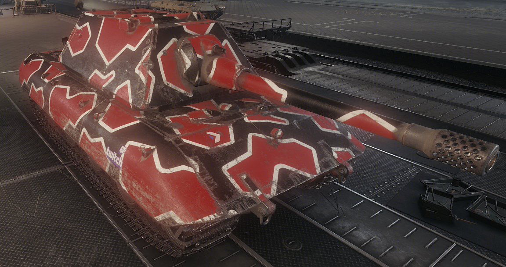
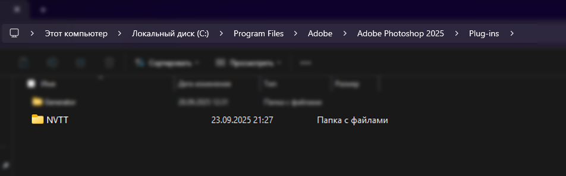
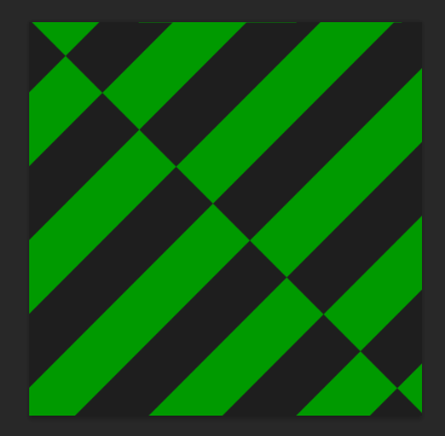
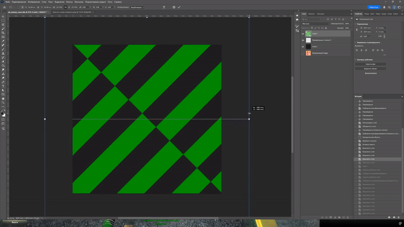
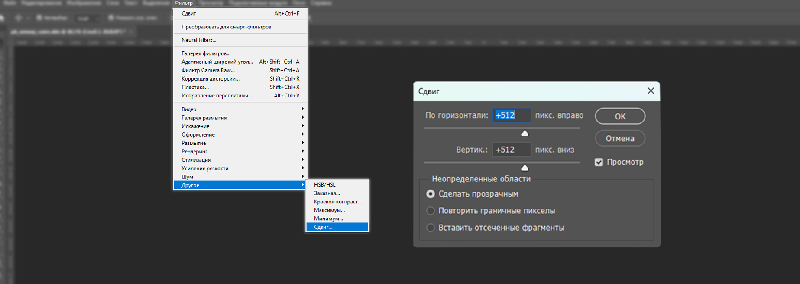
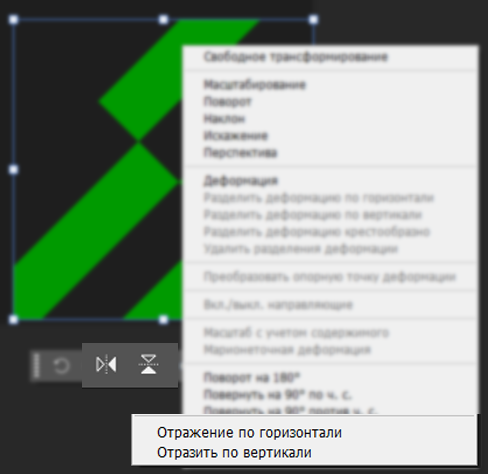
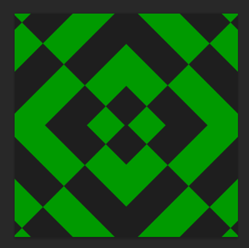
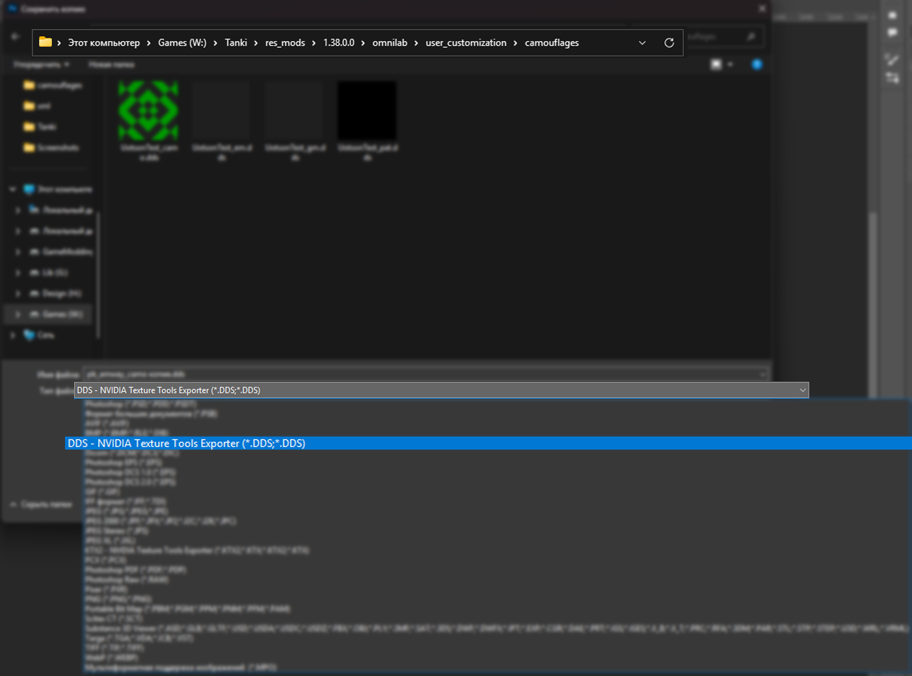
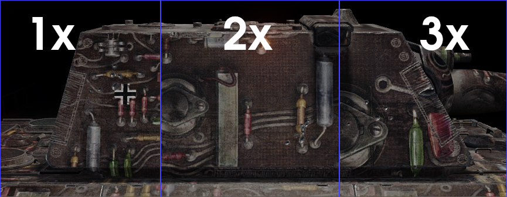

# Агрегатор стилей – интеграция кастомных стилей {#usercustomization}

::: warning Внимание!
Этот раздел документации не завершён. Если вы готовы помочь — сообщите об этом [главному разработчику мода](https://t.me/lrvval).
:::

Хотите интегрировать свой камуфляж в игру, не меняя при этом игровые стили? Используйте Агрегатор стилей (далее — **Агрегатор**)!

Пример интегрированного стиля:



Основные этапы работы модификации заключаются в следующем:

1. При загрузке клиента мод читает элементы кастомизации из JSON-файлов в папке `valberton/user_customization/json`. В случае ошибки чтения клиент намеренно крашится с записью в файл `python.log` в корневой директории игры.
2. В момент подключения игрока к серверу собираются данные о всех стилях, кроме интегрированных, с целью оптимизации работы с экраном Агрегатора.
3. При нажатии на кнопку `Внешний вид`:
    — Если у игрока не был применён стиль на стороне сервера — идёт переход к стандартному экрану внешнего вида с соответствующим уведомлением;
    — Если у игрока был применён стиль на стороне сервера — показывается оверлей, позволяющий выбрать, к какому окну кастомизации перейти: стандартному или Агрегатору.
4. При переходе к окну Агрегатора игрок выбирает категорию стиля (по умолчанию: Пользовательский 2D-стиль) и сам камуфляж. Для применения игрок нажимает соответствующую кнопку. Для стилей с отличительными особенностями предусмотрена более детальная настройка.bbbbbb

## Интеграция стиля {#style-integration}

Для того чтобы встроить свой камуфляж в игру, нам потребуются:

1. [Текстуры](#style-textures) — камуфляж, надписи, эмблемы и т. д. в формате `.dds`.
2. [Конфиг](#style-config) — описание элементов стиля (стилей) в формате `.json` (далее — **JSON-конфиг**).

::: warning Внимание!
Перед началом разработки стиля крайне рекомендуется ознакомиться с принципом работы формата **JSON**, так как он является основным форматом передачи данных мода в игру.

Также стоит учесть, что в этой статье указание путей к файлам происходит от папки `res` в директории игры.
То есть, `scripts/client/path/to/file.py` означает, что искать этот файл нужно по пути `<папка_с_игрой>/res/scripts/client/path/to/file.py` относительно [виртуальной файловой системы](/guide/first-steps/introduction/#vfs).
:::

Для 3D-стилей ещё необходимы:

4. [Модели](#style-models) (изменённые модели танка в форматах `.model`, `.primitives`, `.visual`).
5. *При необходимости!* [Префабы](#style-prefabs) (эффекты и двигающиеся части танка в формате `.prefab`).

## Текстуры {#style-textures}

::: warning Внимание!
Данный раздел не завершён. Автор `UotsonDesign` допишет его, как разберётся с делами IRL.
:::

Здесь будет использоваться следующая терминология:

1. `Паттерн (Pattern)` — зацикленный узор.

В камуфляжах существует несколько возможных типов текстур:

1. `AM (AlbedoMap)` — паттерн камуфляжа, выполняется в цвете.
2. `GMM (GlossMetallicMap)` — текстура металлических отражений, выполняется по определённому алгоритму.
3. `EmissionMap` — карта свечения, на ней указываются элементы, которые будут излучать свет.
4. `PatternMap` — карта анимации, эта карта показывает игре, какую область «подсвечивать» на `EmissionMap`. Работает циклично.

Скорость анимации `PatternMap` и яркость `EmissionMap` регулируются в [секции камуфляжа в JSON-конфиге](#json-camouflages) следующими параметрами:

```json [style.json]
{
  "camouflages": {
    "camouflage_name": {
      "forwardEmissionBrightness" = 7,
      "deferredEmissionBrightness" = 7,
      "emissionAnimationSpeed" = 0.3
    }
  }
}
```

### Рисование камуфляжа {#camo-drawing}

#### Подготовка рабочей среды {#workspace-prepare}

Для начала работы вам потребуются следующие программы:

* [Мир Танков](#mt) (обязательно).
* [Photoshop](#photoshop) или [Paint.NET](#paint-net).

##### Мир Танков {#mt}

_- Текст пока не готов. -_

##### Photoshop {#photoshop}

1. После скачивания Photoshop вам потребуется `DDS-расширение` для создания текстурных файлов с расширением `.dds`. Скачать расширение вы можете [здесь](https://disk.yandex.ru/d/4PXKJhSfBxL3kg). Для установки запустите инсталлер, соответствующий разрядности вашей ОС.
2. После установки расширения в `папке установки Photoshop` у вас должна появиться папка `NVTT`:

   

3. Теперь запускаем или перезапускаем (если он был запущен) `Photoshop` и создаём файл с размерами, имеющими соотношение сторон `1:1`.

:::tip Примеры размеров текстуры для «Мира Танков»

1. 512x512
2. 1024x1024
3. 2048x2048
4. 4096x4096 (по желанию; трудно рисовать, весят много и могут уменьшать быстродействие игры и вашего компьютера)

:::

##### Paint.NET {#paint-net}

_- Текст пока не готов. —_

***

#### AM — текстура {#albedo}

Создание камуфляжа начинается с рисования основного `паттерна` — AM-текстуры. Для создания текстуры можно использовать `Photoshop` или `Paint.NET`. Ниже описаны действия для каждого приложения.

В рисовании узора есть несколько техник:

1. `Прямоугольный узор` — его легко зациклить, не надо прибегать к каким-то сложным методам.
2. `Узор не касается краёв` — соответственно, не надо зацикливать, но нужно учесть, что если у вас какая-нибудь голова дракона, `то её надо рисовать только на одной половине текстуры` — нижней или верхней — и зеркалить по месту.
3. `Узор по диагонали` — его я и буду рассматривать ниже.

:::details Photoshop

1. Создаём основу узора. 
   > [!IMPORTANT]
   > Размер узора должен совпадать с размером квадрата под ним. Как пользоваться инструментом `выделение`, можете найти в интернете. 

2. Заходим в контекстное меню, выбираем `Фильтр` -> `Другое` -> `Сдвиг`. Дальше выставляем параметры сдвига, равные половине от ширины и половине от высоты изображения, и ставим галочку на `Сделать прозрачным`. 
   > [!TIP]
   > У вас файл 1024x1024 => смещение будет равняться 1024x0,5 × 1024x0,5 = 512 × 512.

3. У вас должен получиться кусок узора, равный 1/4 от всего холста. Теперь мы его копируем (`CTRL+J`).
4. Нажимаем ПКМ по копии, выбираем `Отразить по горизонтали` (*или по вертикали, это не принципиально*) и тащим отражённую копию в противоположный угол с зажатым `SHIFT`. 
5. Повторяем пункт 4, но теперь выбираем два кусочка, нажимаем `CTRL+J` и теперь `отражаем копию по вертикали` (*или по горизонтали, смотря какой вариант вы выбрали в 4 пункте*). Результат должен получиться таким: 
6. Сохраняем получившийся файл в папку `camouflages` по алгоритму: `Файл` -> `Сохранить как...` -> `DDS`. 

:::

## Модели {#style-models}

### Анимация модели {#style-sequences}

_- Тексты пока не готовы. -_

## Префабы {#style-prefabs}

_- Текст пока не готов. -_

## JSON-конфиг {#style-config}

Описание элементов стиля содержится в формате `.json`. 

::: tip Как было раньше
До этого в моде использовались файлы формата `.xml`, в которых находилось много лишних записей, которые были важны игре, но путали пользователей и разработчиков стилей. Сейчас же подобные проблемы устранены.
:::

В одном конфиге может быть описано множество элементов (например, стиль, камуфляж, надписи и эмблемы к нему). Также поддерживается описание нескольких стилей в одном файле для простоты раздачи контента.

JSON — это древовидный формат обмена данными, поэтому когда будут расписываться секции, имейте в виду, что запись типа `x.y.z` в файле будет выглядеть так:

```json
{
  "x": {
    "y": {
      "z": "значение"
    }
  }
}
```

Ниже приведены «пустышки» для всех импортируемых элементов кастомизации. Обязательные к указанию параметры будут подсвечены.

***

### Камуфляж {#json-camouflages}

```json{4-10} [template.json]
{
  "camouflages": {
    "template_camo": {
      "texture": "valberton/user_customization/camouflages/template.dds",
      "tilingSettings": {
        "type": "relative",
        "factor": [2.574355, 2.582175],
        "offset": [0, 0]
      },
      "scales": [1.0, 1.3, 0.5],

      "glossMetallicMap": "valberton/user_customization/camouflages/glossMetallicMap.dds",
      "metallic": [0.23, 0.23, 0.23, 0.23],
      "gloss": [0.509, 0.509, 0.509, 0.509],

      "emissionMap": "valberton/user_customization/camouflages/emissionMap.dds",
      "emissionPatternMap": "valberton/user_customization/camouflages/emissionPatternMap.dds",
      "emissionAnimationSpeed": 1.0,
      "forwardEmissionBrightness": 1.0,
      "deferredEmissionBrightness": 1.0,

      "normalMap": "valberton/user_customization/camouflages/normalMap.dds",
      "normalMaxLod": 1,
      "normalMapFactor": 1.0,

      "rotation": {
        "hull": 0.0,
        "turret": 0.0,
        "gun": 0.0
      },

      "palettes": [
        [255, 0, 0, 255],
        [0, 255, 0, 255],
        [0, 0, 255, 255],
        [0, 0, 0, 255]
      ]

    }
  }
}
```

::: warning Внимание!
В данном случае `template_camo` — это строковый идентификатор камуфляжа, называться он может как угодно.

Используйте его для обозначения используемого элемента кастомизации в [стиле](#json-styles).
:::

**Обязательные параметры:**

> * `camouflages.template_camo.texture` — путь до текстуры.
> * `camouflages.template_camo.tilingSettings` — настройки тайлинга.
>
>   ::: details Про тайлинг
>   Это неисследованная тема, рекомендуется пока не указывать этот параметр.
>   :::
>
> * `camouflages.template_camo.scales` — масштаб для разных размеров паттернов.
>   ::: details Про масштаб
>   В игре есть три степени масштабирования камуфляжа/стиля: 1x, 2x и 3x.
>
>   
>
>   Этот параметр позволяет выбрать, какой будет размер камуфляжа при определённом множителе масштабирования.
>   :::

**Необязательные параметры:**
> <u>Для эффекта металла и бликов:</u>
>
> * `camouflages.template_camo.glossMetallicMap` — путь к текстуре `glossMetallicMap` (см. [Текстуры](#style-textures)).
>   * Его необязательно указывать, если нужно просто увеличить эффект.
>
> * `camouflages.template_camo.gloss` — величина блеска в формате RGBA.
> * `camouflages.template_camo.metallic` — величина эффекта металла в формате RGBA.
>
> <u>Для эффекта анимированного стиля:</u>
>
> * `camouflages.template_camo.emissionMap` — путь к текстуре маски свечения (см. [Текстуры](#style-textures)).
> * `camouflages.template_camo.emissionPatternMap` — путь к текстуре паттерна свечения (см. [Текстуры](#style-textures)).
> * `camouflages.template_camo.forwardEmissionBrightness` — интенсивность свечения в стандартном рендере.
> * `camouflages.template_camo.deferredEmissionBrightness` — интенсивность свечения в улучшенном рендере.
> * `camouflages.template_camo.emissionAnimationSpeed` — скорость анимации свечения.
>
> <u>Дополнительные параметры:</u>
>
> * `camouflages.template_camo.palettes` — палитры камуфляжа.
> * `camouflages.template_camo.rotation` — угол поворота текстуры.


***

### Декали: эмблемы и надписи {#json-decals}

Эмблемы и надписи являются одним типом элемента — декалями. **Не путайте их с проекционными декалями!**

```json{4-5,10-11} [template.json]
{
  "decals": {
    "template_emblem": {
      "type": "EMBLEM",
      "texture": "valberton/user_customization/decals/template_emblem.dds",

      "mirror": false
    },
    "template_inscription": {
      "type": "INSCRIPTION",
      "texture": "valberton/user_customization/decals/template_inscription.dds",

      "mirror": false
    }
  }
}
```

::: warning Внимание!
В данном случае `template_emblem` и `template_inscription` — это строковый идентификатор эмблемы и надписи соответственно, называться они могут как угодно. Для простоты объяснения приведём их к единому названию — `template_decal`.

Используйте их для обозначения используемых элементов кастомизации в [стиле](#json-styles).
:::

**Обязательные параметры:**

> * `decals.template_decal.type` — тип декали. `EMBLEM` — эмблема, `INSCRIPTION` — надпись.
> * `decals.template_decal.texture` — путь до текстуры.

**Необязательные параметры:**
> * `decals.template_decal.mirror` — булево значение (истина, ложь), означающее возможность отразить по горизонтали декаль.


***

### Присоединяемые элементы {#json-attachments}

::: warning Внимание!
Полная поддержка этого типа элемента не подтверждена, при попытке его использования могут возникнуть проблемы. Просим сообщить о состоянии поддержки [разработчику](https://t.me/lrvval).
:::

```json{4} [template.json]
{
  "attachments": {
    "template_attachment": {
      "modelName": "valberton/user_customization/prefabs/template.prefab",

      "hangarModelName": "valberton/user_customization/models/template_hangar.prefab",
      "sequenceId": "template_sequence",
      "attachmentLogic": "prefab"
    }
  }
}
```

::: warning Внимание!
В данном случае `template_attachment` — это строковый идентификатор присоединяемого объекта, называться он может как угодно.

Используйте его для обозначения используемого элемента кастомизации в [стиле](#json-styles).
:::

**Обязательные параметры:**

> * `attachments.template_attachment.modelName` — путь до модели/префаба (см. [Модели](#style-models)).

**Необязательные параметры**
> * `attachments.template_attachment.hangarModelName` — путь до отдельной модели/префаба для отображения в ангаре.
> * `attachments.template_attachment.sequenceId` — путь до файла анимации модели (см. [Анимация модели](#style-sequences)).
> * `attachments.template_attachment.attachmentLogic` — схема логики элемента.
>
> На данный момент известно 3 схемы:
> * `flagPart` — флаг.
> * `flagAnimation` — анимация флага.
> * `prefab` — префаб (см. [Префабы](#style-prefabs)).


***

### Отметки на стволе {#json-insignias}

```json{4-6} [template.json]
{
  "insignias": {
    "template_insignia": {
      "atlas": "valberton/user_customization/insignias/template_insignia_atlas.dds",
      "alphabet": "valberton/user_customization/insignias/template_insignia_alphabet.xml",
      "texture": "valberton/user_customization/insignias/template_insignia_single.dds",

      "emissionMap": "valberton/user_customization/camouflages/emissionMap.dds",
      "emissionPatternMap": "valberton/user_customization/camouflages/emissionPatternMap.dds",
      "emissionAnimationSpeed": 1.0,
      "forwardEmissionBrightness": 1.0,
      "deferredEmissionBrightness": 1.0,

      "mirror": false
    }
  }
}
```

::: warning Внимание!
В данном случае `template_insignia` — это строковый идентификатор отметок на стволе, называться он может как угодно.

Используйте его для обозначения используемого элемента кастомизации в [стиле](#json-styles).
:::

**Обязательные параметры:**

> * `insignias.template_insignia.atlas` — путь к атласу (см. `<ссылка_на_объяснение_отметок>`).
> * `insignias.template_insignia.alphabet` — путь к «алфавиту».
>
>   ::: details Пример «алфавита»
>   «Алфавит» описывает используемые координаты отображения отметок.
>   На первое время используйте этот пример:
>
>   ```xml
>   <?xml version="1.0" encoding="utf-8"?>
>   <root>
>     <glyph>
>       <name> * </name>
>       <begin> 0.0 0.0 </begin>
>       <end> 1.0 1.0 </end>
>     </glyph>
>   </root>
>   ```
>
>   где
>   * `<name> * </name>` означает, что эти координаты будут использоваться для всех символов/отметок.
>   * `begin` и `end` — начальные и конечные координаты используемой области относительно левого верхнего угла изображения в процентах (1.0 = 100%).
>   :::
>
> * `insignias.template_insignia.texture` — путь к текстуре **одной** отметки.

**Необязательные параметры**

> <u>Для эффекта анимированных отметок:</u>
>
> * `insignias.template_insignia.emissionMap` — путь к текстуре маски свечения (см. [Текстуры](#style-textures)).
> * `insignias.template_insignia.emissionPatternMap` — путь к текстуре паттерна свечения (см. [Текстуры](#style-textures)).
> * `insignias.template_insignia.forwardEmissionBrightness` — интенсивность свечения в стандартном рендере.
> * `insignias.template_insignia.deferredEmissionBrightness` — интенсивность свечения в улучшенном рендере.
> * `insignias.template_insignia.emissionAnimationSpeed` — скорость анимации свечения.
>
> <u>Дополнительные параметры:</u>
> * `insignias.template_insignia.mirror` — булево значение (истина, ложь), означающее возможность отразить по горизонтали декаль.

***

### Потёртости {#json-modifications}

::: warning Внимание!
От кастомизации этого типа элемента решено было отказаться в виду низкой заинтересованности.
Используйте заранее определённый разработчиками [перечень пресетов](https://github.com/izeberg/wot-src/blob/RU/sources/res/scripts/item_defs/customization/modifications/list.xml).

Строки по типу `<id>1</id>` - это идентификатор, который можно использовать в [стиле](#json-styles).
:::

***

### Краски {#json-paints}

```json{4-5} [template.json]
{
  "paints": {
    "template_paint": {
      "texture": "valberton/user_customization/paints/template_paint_icon.png",
      "color": [255, 255, 255, 255],

      "gloss": [0.509, 0.509, 0.509, 0.509],
      "metallic": [0.23, 0.23, 0.23, 0.23]
    }
  }
}
```

::: warning Внимание!
В данном случае `template_paint` — это строковый идентификатор краски, называться он может как угодно.

Используйте его для обозначения используемого элемента кастомизации в [стиле](#json-styles).
:::

**Обязательные параметры:**

> * `paints.template_paint.texture` — путь к иконке в интерфейсе.
> * `paints.template_paint.color` — цвет в формате RGBA.

**Необязательные параметры:**
> <u>Для эффекта металла и бликов:</u>
>
> * `paints.template_paint.gloss` — величина блеска.
> * `paints.template_paint.metallic` — величина эффекта металла.


***

### Персональный номер {#json-personal-numbers}

::: warning Внимание!
Полная поддержка этого типа элемента не подтверждена, при попытке его использования могут возникнуть проблемы. Просим сообщить о состоянии поддержки [разработчику](https://t.me/lrvval).
:::

::: warning Внимание!
В случае если вы хотите встроить свой шрифт для персонального номера, вам потребуется сделать это через отдельный элемент — [Шрифт](#json-fonts).
:::

```json{4-5} [template.json]
{
  "personal_numbers": {
    "template_personal_number": {
      "texture": "valberton/user_customization/personal_numbers/template_font.png",
      "fontID": "template_font",

      "digitsCount": 3
    }
  }
}
```

::: warning Внимание!
В данном случае `template_personal_number` — это строковый идентификатор персонального номера, называться он может как угодно.

Используйте его для обозначения используемого элемента кастомизации в [стиле](#json-styles).
:::

**Обязательные параметры:**

> * `personal_numbers.template_personal_number.texture` — путь к иконке в интерфейсе.
> * `personal_numbers.template_personal_number.fontId` — уникальный числовой/строковый идентификатор шрифта.

**Необязательные параметры:**

> * `personal_numbers.template_personal_number.digitsCount` — количество символов в номере (по умолчанию — 3).

***

### Шрифт {#json-fonts}

Этот элемент нужен в случае, если для персонального номера нужен вид символов, отличный от того, что есть в игре.

::: warning Внимание!
Полная поддержка этого типа элемента не подтверждена, при попытке его использования могут возникнуть проблемы. Просим сообщить о состоянии поддержки [разработчику](https://t.me/lrvval).
:::

```json{4-5} [template.json]
{
  "fonts": {
    "template_font": {
      "texture": "valberton/user_customization/fonts/template_font.dds",
      "alphabet": "valberton/user_customization/fonts/template_font.xml",

      "mask": ""
    }
  }
}
```

::: warning Внимание!
В данном случае `template_font` — это строковый идентификатор шрифта, называться он может как угодно.

Используйте его для обозначения используемого элемента кастомизации в [персональном номере](#json-personal-numbers).
:::

**Обязательные параметры:**
>
> * `fonts.template_font.texture` — путь к текстуре.
> * `fonts.template_font.alphabet` — путь к «алфавиту».
>
>   ::: details Пример «алфавита»
>   В каждом «алфавите» шрифта прописывается:
>
>   * `root.glyph.name` — к какой цифре (или букве?) относится символ.
>   * `root.glyph.begin` — начальные координаты символа.
>   * `root.glyph.end` — конечные координаты символа.
>
>   Начальные и конечные координаты указываются в процентах (1.0 = 100%).
>
>   ```xml
>   <root>
>     <glyph>
>       <name>	0	</name>
>       <begin>	0.000000 0.000000	</begin>
>       <end>	0.121 0.5	</end>
>     </glyph>
>     <glyph>
>       <name>	1	</name>
>       <begin>	0.121 0.000000	</begin>
>       <end>	0.2089 0.5 </end>
>     </glyph>
>     <glyph>
>       <name>	2	</name>
>       <begin>	0.2089 0.000000	</begin>
>       <end>	0.33 0.5 </end>
>     </glyph>
>     <glyph>
>       <name>	3	</name>
>       <begin>	0.33 0.000000	</begin>
>       <end>	0.4492 0.5 </end>
>     </glyph>
>     <glyph>
>       <name>	4	</name>
>       <begin>	0.4492 0.000000	</begin>
>       <end>	0.5742 0.5 </end>
>     </glyph>
>     <glyph>
>       <name>	5	</name>
>       <begin>	0.5742 0.000000	</begin>
>       <end>	0.6933 0.5 </end>
>     </glyph>
>     <glyph>
>       <name>	6	</name>
>       <begin>	0.6933 0.000000	</begin>
>       <end>	0.8144 0.5 </end>
>     </glyph>
>     <glyph>
>       <name>	7	</name>
>       <begin>	0.8144 0.000000	</begin>
>       <end>	0.9257 0.5 </end>
>     </glyph>
>     <glyph>
>       <name>	8	</name>
>       <begin>	0.000000 0.5 </begin>
>       <end>	0.1152 1 </end>
>     </glyph>
>     <glyph>
>       <name>	9	</name>
>       <begin>	0.1152 0.5 </begin>
>       <end>	0.2363 1 </end>
>     </glyph>
>   </root>
>   ```
>   :::

**Необязательные параметры:**
> * `fonts.template_font.mask` — пока неизвестный параметр, так как разработчиками нигде не используется.

***

### Проекционные декали {#json-projection-decals}

::: warning Внимание!
На момент публичного тестирования мода крайне не рекомендуется использовать этот элемент ввиду его существенной нестабильности.
:::

```json{4} [template.json]
{
  "projection_decals": {
    "template_projection_decal": {
      "texture": "valberton/user_customization/projection_decals/template_projection_decal.dds",

      "glossTexture": "valberton/user_customization/projection_decals/template_projection_decal_gloss.dds",
      "scaleFactorId": 3,
      "mirror": false,

      "emissionMap": "valberton/user_customization/camouflages/emissionMap.dds",
      "emissionPatternMap": "valberton/user_customization/camouflages/emissionPatternMap.dds",
      "emissionAnimationSpeed": 1.0,
      "forwardEmissionBrightness": 1.0,
      "deferredEmissionBrightness": 1.0
    }
  }
}
```

::: warning Внимание!
В данном случае `template_projection_decal` — это строковый идентификатор проекционной декали, называться он может как угодно.

Используйте его для обозначения используемого элемента кастомизации в [стиле](#json-styles).
:::

**Обязательные параметры:**

> * `projection_decals.template_projection_decal.texture` — путь к текстуре.

**Необязательные параметры:**
> <u>Для эффекта бликов:</u>
>
> * `projection_decals.template_projection_decal.glossTexture` — путь к текстуре карты блеска. Если не указано, то используется стандартная логика бликов.
>
> <u>Для эффекта анимированного стиля:</u>
>
> * `projection_decals.template_projection_decal.emissionMap` — путь к текстуре маски свечения (см. [Текстуры](#style-textures)).
> * `projection_decals.template_projection_decal.emissionPatternMap` — путь к текстуре паттерна свечения (см. [Текстуры](#style-textures)).
> * `projection_decals.template_projection_decal.forwardEmissionBrightness` — интенсивность свечения в стандартном рендере.
> * `projection_decals.template_projection_decal.deferredEmissionBrightness` — интенсивность свечения в улучшенном рендере.
> * `projection_decals.template_projection_decal.emissionAnimationSpeed` — скорость анимации свечения.
>
> <u>Дополнительные параметры:</u>
>
> * `projection_decals.template_projection_decal.mirror` — булево значение (истина, ложь), означающее возможность отразить по горизонтали декаль.


***

### Стиль {#json-styles}

Все предыдущие элементы необходимо описывать только для финального действия — соединить их в стиль.

```json{4-22} [template.json]
{
  "styles": {
    "template": {
      "styleIcon": "gui/maps/vehicles/styles/template.png",
      "styleName": "Пример для подражания",
      "outfits": [{
          "season": "ALL",
          "camouflages": [{
            "id": "template_camo1",
            "appliedTo": 4368
          }],
          "decals": [{
              "id": "template_emblem1",
              "appliedTo": 13104
            },
            {
              "id": "template_inscription1",
              "appliedTo": 52416
          }]
      }],
      "is3D": false,
      "modelsSet": "template_3Dst",

      "styleDescription": "Стиль-шаблон для мода \"Агрегатор стилей\"",
      "isWithSerialNumber": false,
      "vehicleFilter": {
        "exclude": {
          "vehicles": ["china:Ch01_Type59_Gold"]
        }
      },
      "alternateItems": {
        "camouflage": [
          "template_camo1",
          "template_camo2"
        ],
        "decal": [
          "template_emblem1",
          "template_emblem2",
          "template_inscription1",
          "template_inscription2"
        ]
      }
    }
  }
}
```

**Обязательные параметры:**
>
> * `styles.template.styleIcon` — путь к иконке в интерфейсе.
> * `styles.template.styleName` — название стиля в интерфейсе.
> * `styles.template.outfit` — описание стиля в интерфейсе.
>
> Для 3D-стилей (если стиль двухмерный - <u>**не указывайте их**</u>):
> * `styles.template.is3D` — булево значение (истина, ложь), обозначающее, является ли стиль трёхмерным. Для этого типа целей всегда ставьте `true`.
> * `styles.template.modelsSet` — строковый идентификатор пресета моделей для стиля из папки `valberton/user_customization/3Dst_json`.
>
> * `styles.template.outfits` — варианты внешнего вида стиля, которых может находиться несколько. При необходимости отображения разного внешнего вида для определённых типов карт - лучше описывать все стандартные: Летний, Зимний и Песчаный типы.
> 
> 
> Теперь перечислим основные элементы стиля, доступные для использования в вышеуказанном параметре.
>
> ::: details Основные элементы стиля
> 
> **Общие положения**
> 
> Каждый такой элемент в конфиге стиля представляет из себя список с перечисленными параметрами используемых  элементов кастомизации. Для простоты объяснения назовём один элемент этого списка как `item`.
> Почти у всех есть следующие значения:
> * `id` —
> строковый или числовой идентификатор элемента стиля. В JSON-конфиге можно использовать одновременно элементы с обоими типами идентификаторов.
> * `appliedTo` — область применения элемента. Каждая такая область имеет своё числовое значение. 
> Чтобы нанести элемент на несколько областей - просто сложите необходимые числа.
> 
> ***
> 
> **Камуфляж**
> 
> ```json
> {
>   "camouflages": [{
>     "id": "template",
>     "appliedTo": 4638,
>     "patternSize": 1,
>     "palette": 0
>   }]
> }
> ```
> 
> * Области применения камуфляжа:
>   * Орудие — `4096`
>   * Башня — `256`
>   * Корпус — `16`
> * `camouflages.item.patternSize` — порядковый номер размера паттерна от 0 до 5.
> * `camouflages.item.palette` — порядковый номер палитры, который указан в конфиге камуфляжа. Если он всего один в списке - используйте `0`.
> 
> ***
> 
> **Декали**
> 
> ```json
> {
>   "decals": [{
>     "id": "template_emblem",
>     "appliedTo": 13104
>     }, {
>       "id": "template_inscription",
>       "appliedTo": 52416
>   }]
> }
> ```
> 
> Области применения эмблем:
> 
> * Орудие — `4096`, `8192`
> * Башня — `256`, `512`
> * Корпус — `16`, `32`
> 
> Области применения надписей:
> 
> * Орудие — `16384`, `32768`
> * Башня — `1024`, `2048`
> * Корпус — `64`, `128`
> 
> ***
> 
> **Присоединяемые объекты**
> 
> ```json
> {
>   "attachments": [{
>     "id": "template_attachment",
>     "slotId": 18000,
>     "position": [0.0, 0.0, 0.0],
>     "rotation": [0.0, 0.0, 0.0]
>   }]
> }
> ```
> 
> * `attachments.item.slotId` — идентификатор слота объекта танка, которые прописываются внутри скрипта танка (`item_defs/vehicles/<нация>/<имя_танка>.xml`). Может быть такое, что данного слота нет на танке. Предположительно, это в будущем можно будет обойти.
> * (Необязательно) `attachments.item.position` — позиция объекта по осям XYZ относительно позиции слота.
> * (Необязательно) `attachments.item.rotation` — поворот объекта по параметрам YPR относительно поворота слота.
> 
> ***
> 
> **Отметки на стволе**
> 
> ```json
> {
>   "insignias": [{
>     "id": "template_insignia",
>     "appliedTo": 4096
>   }]
> }
> ```
> 
> Область применения отметок всегда находится на орудии и ровна `4096`.
> 
> ***
> 
> **Потёртости**
> 
> ```json
> {
>   "modification": 5
> }
> ```
> 
> Значение для этого элемента следуется брать из заранее сделаного разработчиками [перечня](https://github.com/izeberg/wot-src/blob/RU/sources/res/scripts/item_defs/customization/modifications/list.xml), где строка типа `<id>5</id>` означает, что у определённого пресета потёртостей именно этот идентификатор. Его и пишем.
> 
> ***
> 
> **Краски**
> 
> ```json
> {
>   "paints": [{
>     "id": "template_paint",
>     "appliedTo": 30576
>   }]
> }
> ```
> 
> Области применения красок:
> 
> * Орудие — `4096`, `8192`, `16384`
> * Башня — `256`, `512`, `1024`
> * Корпус — `16`, `32`, `64`
> * Гусеницы — `1`, `2`, `4`
> 
> ***
> 
> **Персональный номер**
> 
> ```json
> {
>   "personal_numbers": [{
>     "id": "template_personal_number",
>     "number": "483",
>     "appliedTo": 4096
>   }]
> }
> ```
>
> * `personal_numbers.item.number` — строка с самим персональным номером, то есть то, какое число будет отображаться в игре. Можно оставить пустым.
> 
> 
> Области применения персонального номера такие же, как и у надписей.
> 
> ***
> 
> **Проекционная декаль**
> 
> ```json
> {
>   "projection_decals": [{
>     "id": "template_projection_decal",
>     "scaleFactor": 2,
>     "tags": ["formfactor_square", "safe", "left"]
>   }]
> }
> ```
> 
> * `projection_decals.item.scaleFactorId` — идентификатор фактора масштабирования от 0 до 3.
> * В `projection_decals.item.tags` самым важным тегом является положение декали на танке (`right`, `front`, `left`).
> :::
> 


**Необязательные параметры:**
>
> * `styles.template.styleDescription` — описание стиля во всплывающей подсказке.
> * `styles.template.isWithSerialNumber` — булево значение (истина, ложь), обозначающее, имеет ли стиль серийный номер с табло.
> * `styles.template.vehicleFilter` — фильтр по технике:
>
>   ::: details Фильтр по технике
>   С помощью этой секции вы можете обозначить, на какой танк/нацию можно нанести стиль.
>
>   Нанести только на определённый танк:
>   ```json
>   {
>     "vehicleFilter": {
>         "include": {
>           "vehicles": ["germany:G98_Waffentrager_E100"]
>       }
>     }
>   }
>   ```
>   или **не** наносить на него:
>   ```json
>   {
>     "vehicleFilter": {
>         "exclude": {
>           "vehicles": ["china:Ch01_Type59_Gold"]
>       }
>     }
>   }
>   ```
>
>   Если нужно обозначить всю нацию, замените `vehicleFilter.include.vehicles` или `vehicleFilter.exclude.vehicles` на `vehicleFilter.include.nations` или `vehicleFilter.exclude.nations` соответственно.
>
>   Таким же образом можно сделать и по уровням техники - `levels`.
>   :::
>
> * `styles.template.alternateItems` — дополнительные элементы стиля.
>
>   ::: details Дополнительные элементы стиля
>   В моде есть возможность прописать альтернативные элементы стиля для более гибкой кастомизации.
>
>   ```json
>   {
>     "alternateItems": {
>       "camouflage": [
>         "template_camo1",
>         "template_camo2"
>       ],
>       "decal": [
>         "template_emblem1",
>         "template_emblem2",
>         "template_inscription1",
>         "template_inscription2"
>       ]
>     }
>   }
>   ```
>
>   * `alternateItems.<тип_элемента>` — перечень альтернативных элементов, где `тип_элемента` — тип элемента так, как вы его называли в JSON-конфиге, но в единственном числе. Например, не `paints`, а `paint`. Не `personal_numbers`, а `personal_number`.
>   Значениями в этих перечнях выступают строковые и числовые идентификаторы элементов. Можно одновременно использовать оба типа идентификаторов.
>   :::


