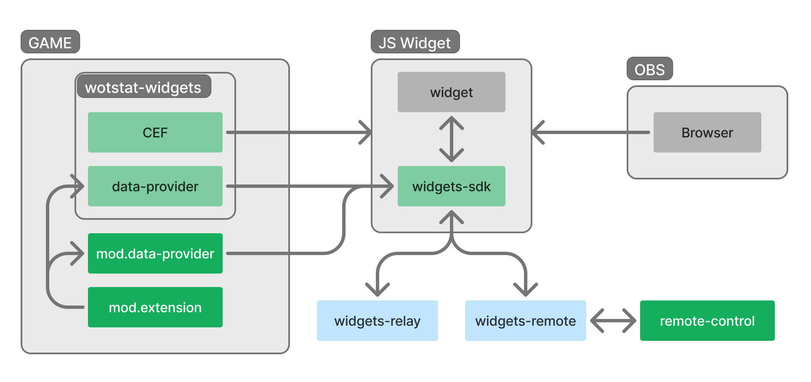

# WotStat Виджеты {#introduction}

WotStat Виджеты — это набор инструментов для создания и отображения виджетов связанных с игрой Мир Танков. 

- `wotstat-widgets` — мод для игры, который позволяет добавлять веб-виджеты прямо в игру.
- `data-provider` — мод для игры, который безопасно передаёт в веб-виджеты данные об игре. Включен в состав `WotStat Widgets`, но может быть установлен и отдельно.
  - Поддерживает моды-расширения, которые могут могут добавлять новые данные для передачи в `widgets-sdk`.
- `widgets-sdk` – библиотека JavaScript, которая облегчает создание виджетов, взаимодействующих с игрой через `Data Provider`.
- `widgets-relay` — сервис, который позволяет передавать данные между виджетами (например для взводной синхронизации).
- `widgets-remote` — сервис, который позволяет удалённо управлять виджетами (в основном для стримов)
- `remote-control` – веб сайт для удалённого управления виджетами через `widgets-remote`.

