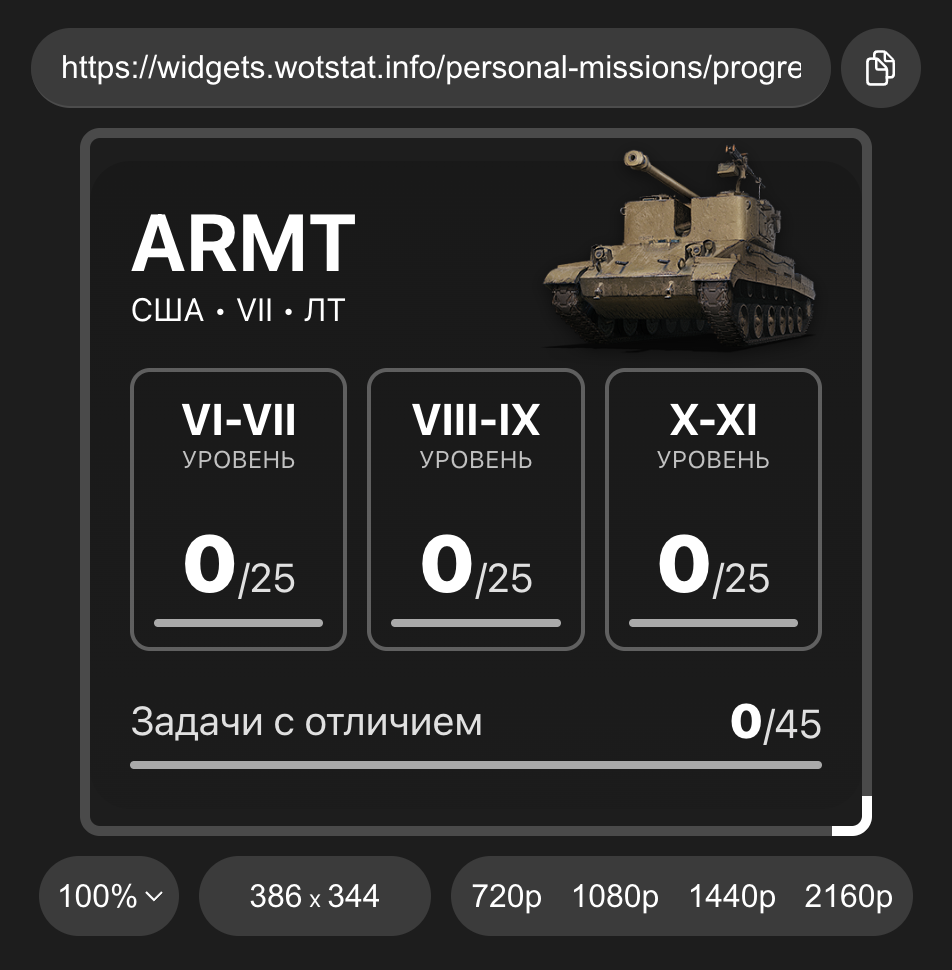
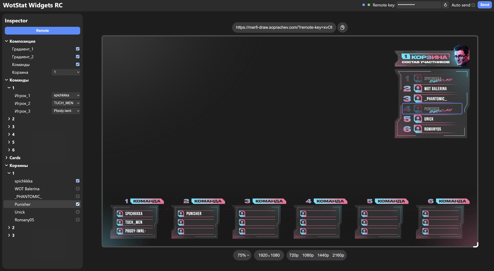

# Виджеты с удалённым управлением {#remote-control}

Виджеты с удалённым управлением позволяют изменять состояние виджета через веб-интерфейс. При этом управлять таким виджетом может другой человек удалённо. В первую очередь это полезно для стримеров, которые могут передать управление виджетами своим модераторам.

Такие виджеты разрабатывать намного проще чем автоматические, так как они не требуют подключения к игре, а значит не ограничиваются возможностями `data-provider`. Вместо этого они используют сервис `widgets-remote`, который позволяет определить произвольный набор параметров изменяемых вручную.

Например виджет показа прогресса по ЛБЗ, `data-provider` не предоставляет текущий прогресс, и делать мод-расширение для такой задачи слишком трудоёмко. Вместо этого можно сделать виджет с удалённым управлением, в котором модератор или сам стример будет вручную указывать текущий прогресс.

> Одним и тем же виджетом может управлять сразу несколько человек, изменения синхронизируются не только для виджета, но и для всех подключённых панелей управления.


## Как это работает {#how-it-works}
У каждого виджета есть связанная пара ключей: 
- `ключ доступа` – с помощью него виджет получает информацию
- `ключ управления` – с его помощью можно изменять состояние

Сервер `widgets-remote` хранит состояния для всех пар ключей, когда виджет загружается, он запрашивает текущее состояние по `ключу доступа` и применяет его. С помощью веб-интерфейса можно изменять состояние по `ключу управления`, и сервер уведомит все подключённые виджеты об изменении.

Для сокращения задержки при обновлении состояния, виджеты используют `Web-Socket` соединение с сервером `widgets-remote`, что позволяет получать обновления практически мгновенно.

Чтобы панель управления узнала, какие именно параметры доступны виджету, в неё необходимо вставить ссылку на этот виджет, после чего, сам виджет сообщает панели управления о своих параметрах. Благодаря этому, одна и та же панель управления может работать с разными в том числе и сторонними виджетами.

Панель управления доступна по адресу: [widgets.wotstat.info/remote-control](https://widgets.wotstat.info/remote-control) и полностью бесплатна для использования.

> Один и тот же виджет может иметь много разных состояний (например для разных стримеров), для этого нужно просто использовать разные пары ключей. Ключей может быть сколько угодно, они не привязаны к аккаунту или каким-либо ограничениям.


## Как пользоваться {#how-to-use}
1. Откройте панель управления по адресу: [widgets.wotstat.info/remote-control](https://widgets.wotstat.info/remote-control)
2. Вставьте ссылку на ваш виджет в поле `Enter widget URL`

> В качестве примера можно использовать `https://widgets.wotstat.info/personal-missions/progress-remote`

### Окно предпросмотра {#preview-window}
В ссылку автоматически допишется параметр `?remote-key=`, а на экране появится предпросмотр виджета

{width=400}

- Вы можете изменить размер окна предпросмотра, перетаскивая правый нижний угол или задать точное разрешение в элементе управления под предпросмотром
- Вы можете изменить масштаб отображения виджета, с помощью элемента управления под предпросмотром
- Над предпросмотром отображается текущий `URL` и кнопка `Скопировать`

### Вкладка инспектора {#inspector-tab}
В левой половине экрана отображается панель `Inspector`

{width=400}

Во вкладке `Remote` отображаются все параметры доступные для управления, учтите, что иногда виджеты регистрируют параметры с задержкой, например, после отображения элемента на экране.

Когда вы наводите курсор на параметр, в предпросмотре подсвечивается область, которая связана с этим параметром *(если виджет такое поддерживает)*.

### Параметры отправки {#parameters}
В правом верхнем углу находятся настройки отправки параметров

{width=600}

- `Зелёная точка` – статус соединения с сервером `widgets-remote`, если точка зелёная, значит соединение установлено и параметры будут синхронизироваться мгновенно
- `Remote Key` – ключ управления, по умолчанию генерируется случайный ключ, но вы можете ввести свой или сгенерировать случайный новый. При изменение `ключа управления`, будет автоматически изменён и `ключ доступа` в ссылке предпросмотра
- `Auto Send` – если включено, то при изменении любого параметра, панель управления автоматически отправит новое значение на сервер
- `Send` – отправка текущих значений всех параметров на сервер вручную

Если у вас есть необходимость сделать комплексное изменение нескольких параметров сразу, то лучше отключить `Auto Send`, внести все изменения и нажать кнопку `Send` для отправки всех изменений одновременно, это сделает обновление виджета более профессиональным.

Так же, например, при вводе текста, можно отключить `Auto Send`, чтобы не отправлять обновление при каждом нажатии клавиши.

## Разработка {#development}

Все виджеты это обычные веб-страницы, что бы добавить поддержку удалённого управления, необходимо подключить [`wotstat-widgets-sdk`](https://www.npmjs.com/package/wotstat-widgets-sdk) и зарегистрировать параметры, которые будут доступны для управления.

### Установка {#installation}
:::code-group

```sh [npm]
$ bun add -D vitepress@next
```


```sh [bun]
$ bun add -D vitepress@next
```

```html [index.html]
<script src="https://unpkg.com/wotstat-widgets-sdk"></script>
```
:::

### Регистрация параметров {#register-parameters}
После подключения `widgets-sdk`, создайте экземпляр `WidgetsRemote`

```js
import { WidgetsRemote } from 'wotstat-widgets-sdk'

const remote = new WidgetsRemote()
```

Ключ доступа берётся из параметра `?remote-key=demo` в URL, или вы можете указать его явно:

```js
const remote = new WidgetsRemote({ channel: 'demo' })
```

После чего, вы можете определять параметры для управления с помощью метода `defineState<T>(key: string, defaultValue: T, meta?: object)`

Поддерживается пять типов состояний:
- `number` - число
- `string` - строка
- `color` - цвет (формат `#RRGGBB`)
- `boolean` - логическое значение
- `select` - выбор из списка (варианты задаются в виде массива)

Для удобства управления, ключи могут быть разделены на группы с помощью символа `/`, например: `simple/number`, `helper/query`. В этом случае, в интерфейсе удалённого управления будет создана иерархия состояний.

В параметре `meta` можно указать дополнительные настройки состояния:
- `type` – тип состояния
- `element` – элемент к которому будет привязано состояние, может быть `HTMLElement`, функция возвращающая `HTMLElement` или `CSS` селектор. Для текстовых, числовых и булевых состояний, оно будет записываться в `element.innerText`. Для всех типов значение будет записываться в `attribute` и `CSS переменную` элемента с префиксом `remote-`.
- `elementHelper` – элемент, который будет обводиться рамкой при наведении курсора на параметр в панели управления, может быть `HTMLElement`, функция возвращающая `HTMLElement` или `CSS` селектор.

С помощью `defineElementHelper(key: string, element: ElementDefinition)` можно определить элемент, который будет обводиться рамкой для группы состояний.

```js
import { WidgetsRemote } from 'wotstat-widgets-sdk'

const remote = new WidgetsRemote()

const number = remote.defineState('simple/number', 0)
const string = remote.defineState('simple/string', 'default')
const color = remote.defineState('simple/color', '#4c8cff', { type: 'color' })
const boolean = remote.defineState('simple/boolean', false)
const select = remote.defineState('simple/select', 'foo', {
  type: {
    type: 'select',
    variants: ['foo', 'bar', 'baz']
  }
})
const selectWithLabels = remote.defineState('simple/select with labels', 'foo', {
  type: {
    type: 'select',
    variants: [{value: 'foo', label: 'Имя foo'}, {value: 'bar', label: 'Имя bar'}]
  }
})

const helperQuery = remote.defineState('helper/query', 0, { element: '#bbox' })
const helperElement = remote.defineState('helper/element', 0, { element: window.bbox })
const helperGetter = remote.defineState('helper/getter', 0, { element: () => window.bbox })
remote.defineElementHelper('simple', '#simple-states')
```

### Отслеживание изменений {#tracking-changes}
В большинстве случаев, достаточно просто передать в `defineState` элемент, в который будет записываться значение состояния. Но иногда требуется выполнить дополнительные действия при изменении состояния. Для этого, у каждого состояния есть метод `watch`, который позволяет подписаться на изменения значения.

```js
const number = remote.defineState('simple/number', 0)

// Подписка на изменение состояния
const unwatch = number.watch((newValue) => {
  console.log('simple/number changed to', newValue)
})

// Получение текущего значения состояния
console.log('Current value of simple/number:', number.value)

// Отписка от изменения состояния
unwatch()
```

Вторым опциональным параметром `watch` можно передать `{ immediate: true }` для немедленного вызова функции с текущим значением состояния. Это полезно для инициализации виджета до первых изменений.

```js
number.watch((newValue) => {
  console.log('Установить значение:', newValue)
}, { immediate: true })
```

## Комплексный пример {#complex-example}
Кроме простых виджетов, с помощью удалённого управления можно создавать и более сложные сцены. Например оверлей жеребьёвки турнира.

Примет такого оверлея можно посмотреть [здесь](https://widgets.wotstat.info/remote-control?widget-url=aHR0cHM6Ly9tZXJmaS1kcmF3LnNvcHJhY2hldi5jb20vP3JlbW90ZS1rZXk9MUk5S0xUSElFUg==&height=1080&width=1920&scale=0.75)



Поддерживается комплексная настройка композиции, всплывающие карточки, переключения между списком корзин. Все переходы анимированы. У каждого состояния есть управляемый элемент, который подсвечивается при наведении курсора на параметр в панели управления.