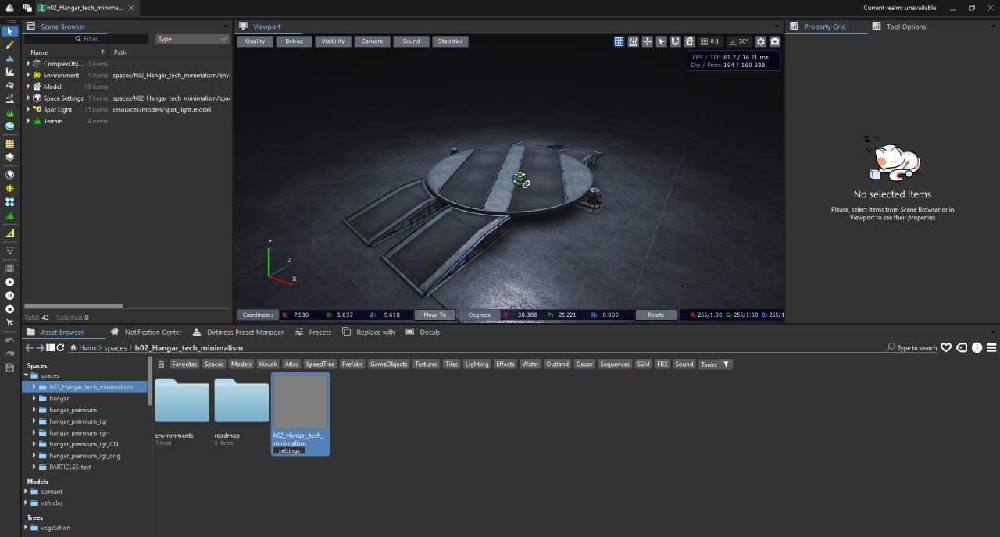

# Знакомство c Unified Editor {#title}

Unified Editor — специальный инструмент для модификации 3D‑игровых ассетов, официально распространяемый Lesta для создания модов. С его помощью можно создавать свои ангары, редактировать существующие карты и визуальные эффекты.

## Официальная тема на форуме {#forum}
## Установка {#installation}
## Проверочный запуск {#first-run}
:::tip TODO
Тут надо описать какой‑нибудь минимальный сценарий добавления чего‑нибудь в игру. Например: добавить кубик в дефолтный ангар (через загрузчики или замену файла) и запустить игру с этим модом.
:::
