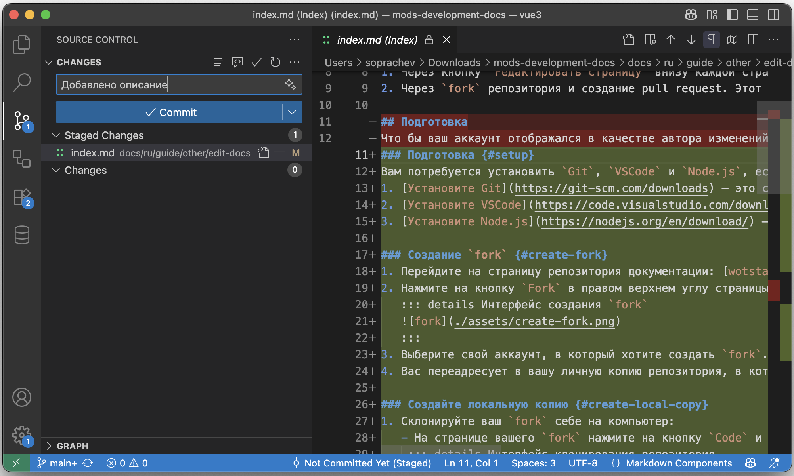

# Инструкция по редактированию документации {#docs-editing}

Эта документация написана с помощью [VitePress](https://vitepress.dev/), и хранится в репозитории на GitHub: [wotstat-25/mods-development-docs](https://github.com/wotstat-25/mods-development-docs)

Для внесения изменений вам необходим аккаунт на GitHub, если у вас его нет, то [зарегистрируйтесь](https://github.com/join), это бесплатно и не займёт много времени.

Есть два способа внести изменения в документацию:
1. Через кнопку `Редактировать страницу` внизу каждой страницы. Это быстрый и простой способ внести небольшие правки, например исправить опечатку или добавить пару строк.
2. Через `fork` репозитория и создание pull request. Этот способ более сложный, но он позволяет вносить более серьёзные изменения, например добавлять новые страницы и статьи.

## Подготовка {#preparation}
Что бы ваш аккаунт отображался в качестве автора изменений внизу страницы, необходимо использовать служебный email адрес GitHub. Для этого:
1. Перейдите в настройки вашего аккаунта на GitHub: [https://github.com/settings/emails](https://github.com/settings/emails)
2. Активируйте опцию `Keep my email address private`

## Редактирование через кнопку `Редактировать страницу` {#edit-via-button}
1. Перейдите на страницу, которую хотите отредактировать.
2. Нажмите на кнопку `Редактировать страницу` внизу страницы.
3. Нажмите на кнопку `Fork this repository` что бы создать локальную копию репозитория.
4. После чего, в открывшемся интерфейсе, вы можете изменить страницу.
::: details Пример интерфейса редактирования

:::
5. После внесения изменений, в верхнем правом углу нажмите на кнопку `Commit changes`.
6. В открывшемся окне введите краткое описание ваших изменений.
::: details Пример окна коммита
{width=400}
:::
7. Нажмите кнопку `Create pull request`.
::: details Пример окна создания `Pull Request`

:::

После этого ваши изменения будут отправлены на рассмотрение, и после проверки, они будут приняты в основную документацию.

## Редактирование через `fork` и `Pull Request` {#fork-pr}
Этот способ является более удобным, потому что позволит вносить изменения через удобный редактор и с возможностью проверки изменений перед отправкой.

### Подготовка {#setup}
Вам потребуется установить `Git`, `VSCode` и `Node.js`, если у вас их нет, то:
1. [Установите Git](https://git-scm.com/downloads) — это система контроля версий, которая позволит вам работать с репозиторием документации.
2. [Установите VSCode](https://code.visualstudio.com/download) — это редактор кода, который мы будем использовать для редактирования документации.
3. [Установите Node.js](https://nodejs.org/en/download/) — это среда выполнения JavaScript, которая необходима для запуска VitePress локально. Необходима версия 24 или новее.

### Создание `fork` {#create-fork}
1. Перейдите на страницу репозитория документации: [wotstat-25/mods-development-docs](https://github.com/wotstat-25/mods-development-docs)
2. Нажмите на кнопку `Fork` в правом верхнем углу страницы.
::: details Интерфейс создания `fork`

:::
3. Выберите свой аккаунт, в который хотите создать `fork`. И нажмите на кнопку `Create fork`.
4. Вас переадресует в вашу личную копию репозитория, в котором вы можете его как угодно редактировать.

### Создайте локальную копию {#create-local-copy}
1. Склонируйте ваш `fork` себе на компьютер:
  - На странице вашего `fork` нажмите на кнопку `Code` и скопируйте ссылку.
::: details Интерфейс клонирования репозитория
{width=400}
:::
- Откройте `VSCode`, и в меню `Source Control` нажмите на кнопку `Clone Repository`.
::: details Интерфейс клонирования репозитория
{width=400}
:::
- Вставьте скопированную ссылку и нажмите `Enter`. Выберите папку, в которую хотите склонировать репозиторий.
- После клонирования, `VSCode` предложит вам открыть склонированный репозиторий, нажмите `Open`.
2. Установите зависимости, для этого в секции `NPM SCRIPTS` нажмите на кнопку запуска на строчке `setup`. У вас откроется терминал, дождитесь окончания установки.
::: details Интерфейс установки зависимостей
{width=300}
:::
3. Запустите локальный сервер для предпросмотра документации, для этого в секции `NPM SCRIPTS` нажмите на кнопку запуска на строчке `dev`. У вас откроется терминал, и после окончания запуска, в терминале будет ссылка на локальный сервер, обычно это [http://localhost:5173/](http://localhost:5173/). Перейдите по этой ссылке в браузере.
::: details Интерфейс запуска локального сервера

:::

### Настройка связанного с GitHub адреса email {#github-email-setup}
Чтобы ваш профиль отображался внизу страницы как автор изменений, необходимо настроить email адрес, связанный с вашим аккаунтом на GitHub. Для этого:
1. Перейдите в настройки вашего аккаунта на GitHub: [https://github.com/settings/emails](https://github.com/settings/emails)
2. Активируйте опцию `Keep my email address private`
3. Скопируйте служебный email адрес, который выглядит как `<username>@users.noreply.github.com`
4. В `VSCode`, внутри проекта, откройте терминал (`` Ctrl+` `` или `Terminal -> New Terminal`) и выполните команду:
```shell
git config user.email "<your-email>"
```
Замените `<your-email>` на скопированный email адрес.

### Внесение изменений {#make-changes}
Теперь вы можете вносить изменения в документацию. Все страницы находятся в папке `docs`, а файлы страниц имеют расширение `.md` (Markdown).

После каждого сохранения файла, в браузере с локальным сервером предпросмотра, страница автоматически обновится и вы сможете увидеть ваши изменения.

Когда вы достигните определённого прогресса, и захотите сохранить ваши изменения в репозиторий, выполните следующие шаги:
1. В `VSCode`, в меню `Source Control` вы увидите список изменённых файлов.
2. Наведите курсор на подраздел `Changes` и нажмите на кнопку `+`, чтобы отметить все изменения.
3. Введите краткое описание ваших изменений в поле ввода сверху.
::: details Интерфейс коммита изменений

:::
4. Нажмите на кнопку `Commit`, чтобы зафиксировать изменения.
5. Нажмите на кнопку `Sync Changes`, чтобы отправить ваши изменения в GitHub.

### Создание `Pull Request` {#create-pr}
1. Перейдите на страницу вашего `fork` на GitHub.
2. Нажмите на кнопку `Contribute` и выберите `Open pull request`.
::: details Интерфейс создания `Pull Request`

:::
3. В интерфейсе создания `Pull Request` введите заголовок и описание ваших изменений.
::: details Интерфейс описания `Pull Request`

:::
4. Если вы уже готовы, нажмите на кнопку `Create pull request`, чтобы отправить ваши изменения на рассмотрение.
  - Если вы хотите продолжить вносить изменения, но уже готовы обсудить текущие, выберите `Create draft pull request`, чтобы создать черновик `Pull Request`.
::: details Смена статуса на черновик
{width=400}
:::

После открытия `Pull Request`, ваши изменения будут рассмотрены, прокомментированы и в случае одобрения, приняты в основную документацию.

При открытом `Pull Request` вы можете продолжать вносить изменения в ваш `fork`, и они автоматически будут добавлены в открытый `Pull Request`. Не забывайте делать `Commit` и `Push` ваших изменений.

## Assets locality {#assets-locality}
В этой документация принято хранить все ассеты связанные с конкретной страницей максимально близко к этой странице. Обычно это папка `assets`, которая лежит рядом с файлом страницы.
```
.../edit-docs/
    ├─ index.md
    └─ assets/
        ├── image.png
        └── code.py

```

## Как работать с Markdown {#markdown}
Документация написана с помощью [VitePress](https://vitepress.dev/), который использует расширенный синтаксис Markdown, все возможности которого описаны в [официальной документации](https://vitepress.dev/guide/markdown).

Из основных возможностей, которые могут пригодиться:
### Заголовки {#md-headers}
```md
# Заголовок 1 уровня
## Заголовок 2 уровня
### Заголовок 3 уровня
```

### Якоря для заголовков {#md-header-anchors}
```md
## Заголовок 2 уровня {#header-2}
```

### Параграфы {#md-paragraphs}
```md
Это первый параграф.

Это второй параграф.
```

### Выделение текста {#md-text-formatting}
```md
**Жирный текст**
*Курсивный текст*
~~Зачёркнутый текст~~
```

**Жирный текст**
*Курсивный текст*
~~Зачёркнутый текст~~

### Ссылки {#md-links}
```md
[Текст ссылки](https://example.com)
```
[Текст ссылки](https://example.com)

### Изображения {#md-images}
```md

```
Изображение должно находиться в папке `assets`, которая лежит рядом с файлом страницы.

#### Размер изображения {#md-image-size}
```md
{width=400}
```

### Блоки кода {#md-code-blocks}
````md
```python
print("Hello, World!")
```
````

```python
print("Hello, World!")
```

### Вставки `кода` {#md-inline-code}
```md
Вставки `кода`
```

### Блоки с подсветкой {#md-blocks-with-highlighting}
```md
::: tip СОВЕТ
Это блок с подсветкой для советов.
:::

::: warning ВНИМАНИЕ
Это блок с подсветкой для предупреждений.
:::

::: details ПОДРОБНЕЕ
Это блок с возможностью сворачивания.
:::

```

::: tip СОВЕТ
Это блок с подсветкой для советов.
:::

::: warning ВНИМАНИЕ
Это блок с подсветкой для предупреждений.
:::

::: details ПОДРОБНЕЕ
Это блок с возможностью сворачивания.
:::

### Списки {#md-lists}
```md
- Пункт списка 1
- Пункт списка 2
  - Вложенный пункт списка
```
- Пункт списка 1
- Пункт списка 2
  - Вложенный пункт списка

### Нумерованные списки {#md-numbered-lists}
```md
1. Первый пункт
2. Второй пункт
```
1. Первый пункт
2. Второй пункт

### Таблицы {#md-tables}
```md
| Заголовок 1 | Заголовок 2 |
| ----------- | ----------- |
| Ячейка 1    | Ячейка 2    |
```
| Заголовок 1 | Заголовок 2 |
| ----------- | ----------- |
| Ячейка 1    | Ячейка 2    |
