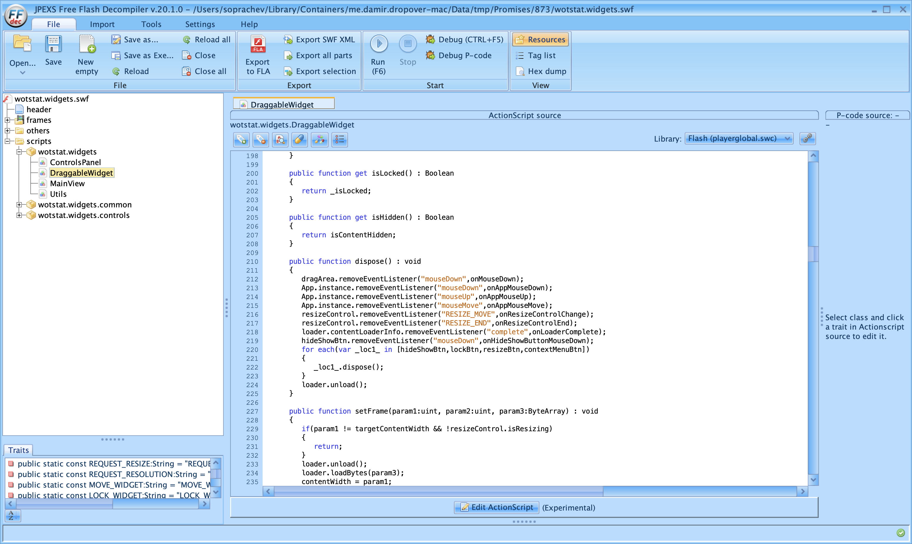

# FFDec – декомпилятор Flash {#ffdec}

Программа позволяет просматривать и извлекать ресурсы из SWF-файлов, а также декомпилировать ActionScript 3.0 в читаемый текстовый формат. Удобно для изучения других модов.

## Использование {#ffdec-usage}

[Скачайте](https://github.com/jindrapetrik/jpexs-decompiler/releases/latest) актуальную версию FFDec для вашей операционной системы. Запустите программу и претащите в окно SWF-файл мода, который хотите изучить.

В левой части окна отображается структура SWF-файла. Вы можете раскрывать папки, чтобы просматривать содержащиеся в них ресурсы. В центральной части окна отображается содержимое выбранного ресурса.
