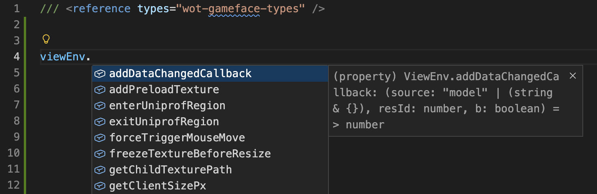

# Теория Gameface модов {#gameface-theory}

Пользовательский интерфейс игры состоит из совокупности окон (`Windows`), которыми управляет движок `wulf`. Сами окна могут быть реализованы на:
- `GF` – Coherent GameFace, это `HTML` + `JavaScript` + `CSS`
- `Unbound` – собственный фреймворк Лесты
- `Scaleform` – это `Flash`, в котором используется язык программирования `ActionScript 3` (AS3)

## Coherent Gameface {#coherent-gameface}

`Coherent Gameface` (GF) — это технология, которая позволяет создавать интерфейсные окна с использованием веб-технологий: `HTML`, `CSS` и `JavaScript`. Такие окна отображаются внутри игры. Движок для отображения этих окон похож на браузер, однако оптимизирован для работы в игровом окружении.

Для выполнения `JavaScript`-кода в окнах GF используется движок `V8`, который также применяется в браузере `Google Chrome`.

Ознакомиться с документацией по `Coherent Gameface` можно на официальном сайте: [https://docs.coherent-labs.com/cpp-gameface/](https://docs.coherent-labs.com/cpp-gameface/), учтите, что игра использует не самую свежую версию `GF`, поэтому некоторые функции могут быть недоступны.

Важными отличиями `GF` от обычного браузера являются:
- Задержка между установкой `CSS` стилей и их применением к элементам страницы (2 кадра)
- Работа с анимациями `CSS` - `GF` предоставляет оптимизированную структуру для выполнения анимаций, прямое манипулирование стилями ухудшает производительность
- Масштабирование реализовано путём установки `font-size: 2px` на корневой элемент страницы, поэтому все размеры на странице должны быть заданы в `em` или `rem` единицах
- В качестве лейаута страницы по умолчанию используется `flexbox`
- Доступны фильтры для взаимодействия с фоном игры, например блюр

## Окна GF в игре {#gf-windows}
Как браузер состоит из разных вкладок, внутри каждой из которых "живёт" своя веб-страница, так и в игре разные компоненты интерфейса реализованы в виде отдельных окон `GF`, каждое из которых загружает свою страницу. Отличием от браузера является то, что на одном экране может находиться сразу несколько окон `GF`. Например ангар на `Lesta` состоит из смеси `GF`-окон и `Scaleform`-окон.


## Обмен данными между Python и JavaScript {#python-javascript-interaction}
Для взаимодействия `JavaScript`-кода страницы с `Python`-скриптами игры использутся реактивная ViewModel система. Окно определяется классом `View(ViewImpl)`, который инициализирует модель данных `Model(ViewModel)`, в которой определяются `значения (properties)` и `команды (commands)`.

- Команды (`JS -> Python`) — это события, которые могут быть вызваны из `JavaScript`-кода страницы и обработаны в `Python`-скриптах.
- Значения (`Python -> JS`) — это реактивные данные, которые могут быть изменены из `Python`-скриптов и прочитаны в `JavaScript`-коде страницы. Когда значение изменяется в `Python`, об этом автоматически уведомляется `JavaScript`-код страницы.

```python [example_view.py]
from frameworks.wulf import ViewModel
from gui.impl.pub import ViewImpl

class ExampleModel(ViewModel):
  def __init__(self, properties=3, commands=1):
    super(ExampleModel, self).__init__(properties=properties, commands=commands)

  def _initialize(self):
    super(ExampleModel, self)._initialize()

    self._addStringProperty('exampleString', '')
    self._addNumberProperty('exampleNumber', 0)
    self._addBoolProperty('exampleBool', False)
    self.exampleCommand = self._addCommand('exampleCommand')


class ExampleView(ViewImpl):
  viewLayoutID = ModDynAccessor('RES_JSON_KEY')
  
  def __init__(self, server, pageName='', pageId=''):
    settings = ViewSettings(ExampleView.viewLayoutID(), flags=ViewFlags.VIEW, model=CDPModel())
    super(ExampleView, self).__init__(settings)
  
  @property
  def viewModel(self):
    return super(ExampleView, self).getViewModel()
```

### Получение значений в JavaScript {#getting-values-in-javascript}
Значения из модели данных доступны в `JavaScript`-коде страницы через глобальную переменную `window.model`. Модель реактивная, за изменениями можно следить подписавшись на событие `viewEnv.onDataChanged`.

```javascript [example.js]

function onModelChanged() {
  console.warn(`exampleString changed to: ${window.model.exampleString},
               exampleNumber changed to: ${window.model.exampleNumber},
               exampleBool changed to: ${window.model.exampleBool}`)
}

engine.whenReady.then(() => {
  engine.on('viewEnv.onDataChanged', onModelChanged)
})
```

Если у вас есть вложенные модели, то необходимо явно указать, что надо следить за изменениями в этих моделях, для этого используется метод `addDataChangedCallback`:

```javascript
engine.whenReady.then(() => {
  viewEnv.addDataChangedCallback('model.child', 0, true)
})
```

После чего, изменение в `child` модели также будет вызывать событие `viewEnv.onDataChanged`.

### Вызов команд из JavaScript {#calling-commands-from-javascript}
Команды из модели данных вызываются в `JavaScript`-коде страницы как методы на объекте `window.model`. Аргументы команды передаются в виде словаря.
```javascript [example.js]
function sendCommandToPython() {
  window.model.exampleCommand({ arg1: 'value1', arg2: 42 });
}
```

В `Python`-коде команды обрабатываются посредством подписки на событие команды:
```python [example_model.py]
class ExampleModel(ViewModel):
  ...

  def _initialize(self):
    ...
    self.exampleCommand += self._onExampleCommand

  def _onExampleCommand(self, args):
    print("exampleCommand called with args: {}".format(args))
```

## Ресурсы игры (res_map.json) {#res-map}
Для использования в Python-скриптах различных ресурсов известных на этапе компиляции игры, Мир Танков использует механизм `DynAccessor` и файл `res_map.json`, на который эти `DynAccessor` ссылаются.

```json [res_map.json]
{
  ...
  "f4": {
    "type": "Layout",
    "path": "coui://gui/gameface/_dist/production/lobby/crew/CrewHeaderTooltipView/CrewHeaderTooltipView.html",
    "parameters": {
      "entrance": "CrewHeaderTooltipView",
      "extension": "",
      "impl": "gameface"
    }
  },
  "10db6": {
    "type": "Image",
    "path": "img://gui/maps/icons/crewWidget/buttonsBar/background.png",
    "parameters": {
      "extension": "",
    }
  },
  ...
}
```

Для взаимодействия с GF-окнами необходимо зарегистрировать ресурсы в `res_map.json`.

## OpenWG.Gameface {#openwg-gameface}
[`OpenWG.Gameface`](https://gitlab.com/openwg/wot.gameface) — это специальный мод, который позволяет упростить регистрацию своих ресурсов в `res_map.json` и предоставляет дополнительные возможности для работы с окнами `GF`. 

Процесс регистрации состоит из перезаписи (путём помещения в папку `res_mods`) файла `res_map.json`, в котором дописываются новые ресурсы и последующим автоматическим перезапуском игры, который нужен только если файл был изменён (например установлен новый мод).

### Пример регистрации ресурсов {#resource-registration}

В пакете мода необходимо создать файл `mods/configs/res_map/*.json` в котором описать используемые ресурсы.

```json [mods/configs/res_map/my_mod.json]
[
  {
    "itemID": "mods/testDialog/title",
    "type": "String",
    "parameters": {
      "key": "Dialog window made with Unbound (WULF)",
      "textdomain": "dialogs",
      "extension": ""
    }
  },
  {
    "itemID": "mods/testTooltip/layoutID",
    "type": "Layout",
    "path": "coui://gui/gameface/mods/testTooltip/TestTooltip.html",
    "parameters": {
      "extension": "",
      "entrance": "TestTooltip",
      "impl": "gameface"
    }
  }
]
```

После чего, в `Python`-коде можно получить доступ к этим ресурсам через `ModDynAccessor`:

```python [my_mod.py]
from openwg_gameface import ModDynAccessor

title = ModDynAccessor('mods/testDialog/title')
```

Или из `JavaScript`-кода окна `GF`:

```javascript [my_mod.js]
const title = R.dialogs.title;
```
> TODO: Проверить такой ли путь

## Пример добавления своего окна {#gf-window-example}

### Регистрация в res_map.json {#res-map-registration}
Для регистрации в `res_map` необходим мод [`OpenWG.Gameface`](https://gitlab.com/openwg/wot.gameface).

```json [mods/configs/res_map/example_mod.json]
[
  {
    "itemID": "EXAMPLE_MOD_WINDOW",
    "type": "Layout",
    "path": "coui://gui/gameface/mods/example_mod/index.html",
    "parameters": {
      "extension": "",
      "entrance": "ExampleMod",
      "impl": "gameface"
    }
  }
]
```

В качестве `itemID` указываем уникальный идентификатор окна, который будет использоваться в `Python`-коде для его создания. В `path` указываем путь к `HTML`-файлу окна (внутри вашего мода). В качестве `type` указываем `Layout`.

### Код окна {#window-code}
Создадим простое `Hello World` окно `GF`.

```html [mods/gui/gameface/mods/example_mod/index.html]
<!doctype html>
<html lang="en">

<head>
  <meta charset="UTF-8" />
  <meta name="viewport" content="width=device-width, initial-scale=1.0" />
  <script type="module" crossorigin src="./index.js"></script>
  <link rel="stylesheet" crossorigin href="./index.css">
</head>

<body>
  <div id="root">
    <h1>Hello, World!</h1>
  </div>
</body>

</html>
```

Для управления окном используется `JavaScript`-код, который можно разместить в файле `index.js`. А для стилизации окна используется файл `index.css`.

### Отображение окна в игре {#displaying-window}

Для создания окна необходимо создать класс окна `WindowImpl`, класс представления `ViewImpl` и модель данных `ViewModel`.

#### Модель данных {#viewmodel}
Используется для определения значений, которые будут переданы в `JavaScript`-код окна, а также команд, которые могут быть вызваны из `JavaScript`.

```python
from gui.impl.pub import ViewModel

class ExampleViewModel(ViewModel):
  
  def __init__(self, properties=1, commands=1):
    # type: (int, int) -> None
    super(ExampleViewModel, self).__init__(properties=properties, commands=commands)
  
  def _initialize(self):
    # type: () -> None
    super(ExampleViewModel, self)._initialize()
    self._addStringProperty('exampleString', 'Hello, World!')
    self._exampleCommand = self._addCommand('exampleCommand')
    
    self._exampleCommand += self._onExampleCommand

  def _onExampleCommand(self, args):
    # type: (dict) -> None
    print("Example command executed with args: {}".format(args))

  @property
  def exampleString(self):
    # type: () -> str
    return self._getString(0)

  @exampleString.setter
  def exampleString(self, value):
    # type: (str) -> None
    self._setString(0, value)
```

#### Представление окна {#viewimpl}
Используется для инициализации модели данных и управления логикой окна.

```python
from gui.impl.pub import ViewImpl
from frameworks.wulf import ViewSettings, ViewFlags
from openwg_gameface import ModDynAccessor

RES_MAP_ITEM_ID = 'EXAMPLE_MOD_WINDOW'

class ExampleView(ViewImpl):
  viewLayoutID = ModDynAccessor(RES_MAP_ITEM_ID)
  
  def __init__(self):
    settings = ViewSettings(ExampleView.viewLayoutID(), flags=ViewFlags.VIEW, model=ExampleViewModel())
    super(ExampleView, self).__init__(settings)

  @property
  def viewModel(self):
    # type: () -> ExampleViewModel
    return super(ExampleView, self).getViewModel()
```

#### Класс окна {#windowimpl}
Используется для создания экземпляра окна и его отображения на экране.

```python
from gui.impl.pub import WindowImpl
from frameworks.wulf import WindowFlags, ViewSettings, ViewFlags

class ExampleWindow(WindowImpl):
  def __init__(self):
    super(ExampleWindow, self).__init__(wndFlags=WindowFlags.WINDOW, content=ExampleView())
```

### Создание и показ окна {#creating-and-showing-window}

```python
from skeletons.gui.impl import IGuiLoader
from helpers import dependency
from openwg_gameface import res_id_by_key

RES_MAP_ITEM_ID = 'EXAMPLE_MOD_WINDOW'

uiLoader = dependency.instance(IGuiLoader) # type: IGuiLoader
view = uiLoader.windowsManager.getViewByLayoutID(res_id_by_key(RES_MAP_ITEM_ID))
ExampleWindow().load()
```

## Пример модификации существующего окна {#modifying-existing-window}
Для модификации существующего окна `GF` необходимо с помощью мода `OpenWG.Gameface` инжектировать свой `JavaScript`-код в страницу окна. 

Для этого можно добавить своё `ViewImpl` в качестве дочернего к существующему окну. При этом новая `HTML`-страница не будет создана, а подключить свой `JavaScript`-код можно будет через `gf_mod_inject`.

```python
from openwg_gameface import ModDynAccessor, gf_mod_inject
from gui.impl.pub import ViewImpl, ViewSettings, ViewFlags
from gui.impl.lobby.crew.hangar_crew_widget import HangarCrewWidget

RES_MAP_ITEM_ID = 'EXAMPLE_MOD_SUBVIEW'

class MyModel(ViewModel):
  def _initialize(self):
    ...
    gf_mod_inject(self, RES_MAP_ITEM_ID, 
      styles=['coui://gui/gameface/mods/example/index.css'], 
      modules=['coui://gui/gameface/mods/example/index.js']
    )

class MyView(ViewImpl):
  viewLayoutID = ModDynAccessor(RES_MAP_ITEM_ID)

  def __init__(self, server, pageName='', pageId=''):
    settings = ViewSettings(MyView.viewLayoutID(), flags=ViewFlags.VIEW, model=MyView())
    super(MyView, self).__init__(settings)

orig_load = HangarCrewWidget._onLoading
def new_load(self, *args, **kwargs):
  orig_load(self, *args, **kwargs)
  self.setChildView(MyView.viewLayoutID(), MyView())

HangarCrewWidget._onLoading = new_load
```

В `res_map.json` необходимо зарегистрировать ваш ресурс, однако в качестве `HTML` файла можно оставить пустую заглушку
```json [mods/configs/res_map/example_mod.json]
[
  {
    "itemID": "EXAMPLE_MOD_SUBVIEW",
    "type": "Layout",
    "path": "coui://gui/gameface/mods/example/index.html",
    "parameters": {
      "extension": "",
      "entrance": "example",
      "impl": "gameface"
    }
  }
]
```

## Управление окном из JavaScript {#javascript-window-interaction}

Для работы подсказок кода вы можете установить библиотеку с типами [`wot-gameface-types`](https://www.npmjs.com/package/wot-gameface-types). После чего подключите референсы типов в ваш `JavaScript`-код:

```javascript [index.js]
/// <reference types="wot-gameface-types" />
```

После чего у вас появится автодополнение для всех доступных в `Gameface` API.


## JavaScript API {#gameface-api}

Тут описаны некоторые из доступных API.

### `engine.whenReady` {#engine-whenready}
Большинство API доступны только после инициализации движка `engine`, которая происходит после загрузки страницы. Для того чтобы дождаться инициализации, используйте promise `engine.whenReady`:

```javascript
engine.whenReady.then(() => {
  console.warn("Engine is ready!");
})
```

> `console.warn` используется вместо `console.log`, так как warning-сообщения видны в логах игры, а обычные сообщения нет.

### `engine.on` {#engine-on}
На некоторые события можно подписаться с помощью метода `on`:

```javascript
engine.on('clientResized', () => console.warn("Client resized"))
engine.on('self.onScaleUpdated', () => console.warn("Scale updated"))
```

### `viewEnv` {#viewenv}
Изменить размер окна можно с помощью метода `resizeViewPx` на объекте `viewEnv`:

```javascript
const { height, width } = viewEnv.getClientSizePx()
viewEnv.resizeViewPx(width, height)
```

Установить интерактивную область окна можно с помощью метода `setHitAreaPaddingsRem` на объекте `viewEnv`:

```javascript
const remTop = viewEnv.pxToRem(top)
const remBottom = viewEnv.pxToRem(bottom)
const remLeft = viewEnv.pxToRem(left)
const remRight = viewEnv.pxToRem(right)

viewEnv.setHitAreaPaddingsRem(remTop, remRight, remBottom, remLeft, 15)
```