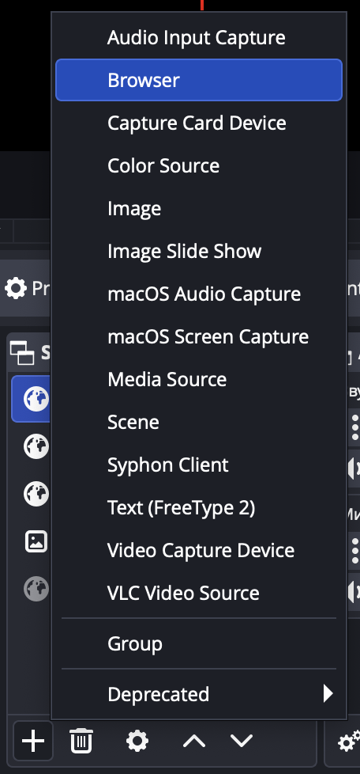
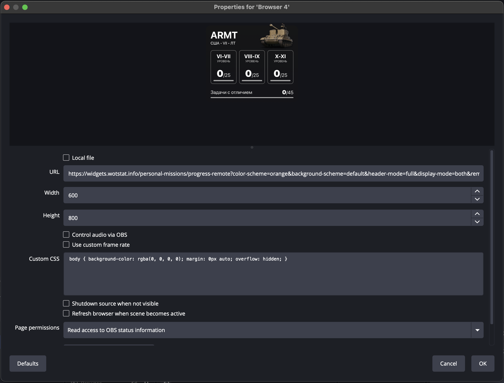
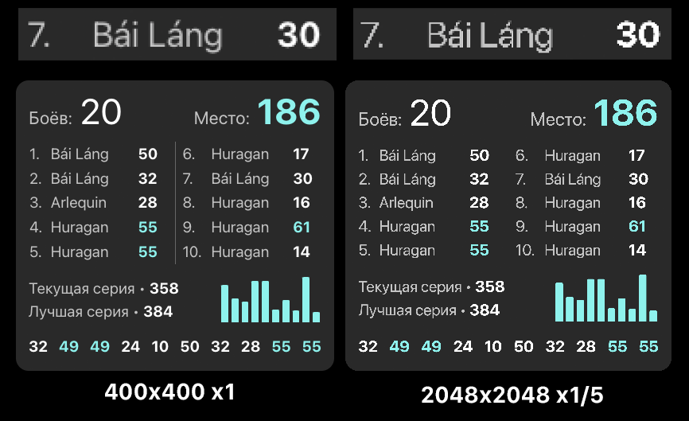
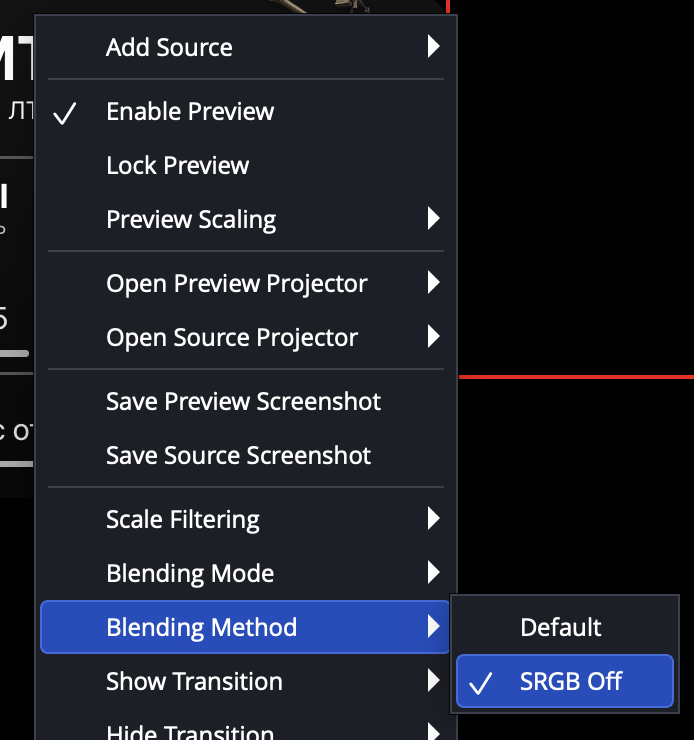

# Виджеты для стримов {#widgets-stream}

Виджеты на стримах являются обычными веб-сайтами с прозрачным фоном, разработка таких виджетов практически не отличается от разработки обычных веб-сайтов.

## Добавление виджетов на стрим {#widget-adding}
Добавляются такие виджеты в [OBS](https://obsproject.com/) через функцию **Браузерный источник** (Browser Source).

::: details Добавление браузерного источника в OBS
{width=200}
:::


После чего, необходимо указать URL виджета, а так же размеры страницы в пикселях.

::: details Настройки браузерного источника

:::

::: tip Рекомендация
Старайтесь использовать такое разрешение страницы, которое вам потом не придётся масштабировать в OBS, любое масштабирование будет приводить к потере качества изображения.

- Если указать разрешение **ниже** целевого и **увеличить** размер, то изображение будет размытым.
- Если указать разрешение **выше** целевого и **уменьшить** размер, то появятся артефакты на границах элементов. (пропадёт сглаживание)

::: details Пример потери качества при масштабировании
{width=400}
:::

В методе смешивания включите `SRGB off`, это связано с некорректным отображением полупрозрачных цветов в OBS при включённом `SRGB`, отслеживать баг можно в [issue#469](https://github.com/obsproject/obs-browser/issues/469).

::: details Изменение метода смешивания
{width=300}
:::

## Разработка виджетов {#widget-development}

По умолчанию, OBS автоматически применяет стиль к `body`, который задаёт прозрачный фон, делает нулевые отступы и скрывает появляющиеся полосы прокрутки. Однако, рекумендуется явно указать эти стили в вашем CSS, чтобы избежать возможных проблем с несовместимостью версий OBS и плагина браузерного источника.

```css
body { 
  background-color: rgba(0, 0, 0, 0);
  margin: 0px auto;
  overflow: hidden; 
}
```

Хорошей практикой будет автоматическое масштабирование виджета под ширину окна браузерного источника, для этого можно использовать следующий CSS:

```css
body {
  font-size: 1vw; /* Устанавливаем размер шрифта в зависимости от ширины окна */
}
```

После чего, все размеры на странице должны быть заданы в `em` или `rem` единицах, чтобы они масштабировались вместе с размером шрифта, а значит и размером страницы.

```css
.container {
  width: 30em; /* Ширина контейнера будет зависеть от ширины окна */
  height: 10em; /* Высота контейнера будет зависеть от ширины окна */
}
```

Подробнее о разработке именно танковых виджетов можно прочитать в разделе [Интеграции -> WotStat виджеты](/guide/integrations/wotstat-widgets/introduction/).